# Implementation Plan

## Overview

This implementation plan follows the bugfix workflow using the bug condition methodology. The tasks are organized into 7 phases based on the implementation checklist from the design document. Each phase builds upon the previous one to systematically standardize the UI/UX across all maintenance module pages.

**Bug Summary**: Modul Maintenance memiliki inkonsistensi desain yang signifikan di 4 halaman utama (index, alerts, schedules, components). Setiap halaman menggunakan pattern yang berbeda untuk cards, tables, buttons, badges, dan styling lainnya.

**Fix Approach**: Membuat design system yang komprehensif dengan standardisasi komponen UI, color palette, typography, dan responsive patterns menggunakan reusable CSS classes.

---

## Exploration & Preservation Tests (BEFORE Implementation)

- [x] 1. Write bug condition exploration test
  - **Property 1: Bug Condition** - UI Inconsistency Across Maintenance Pages
  - **CRITICAL**: This test MUST FAIL on unfixed code - failure confirms the bug exists
  - **DO NOT attempt to fix the test or the code when it fails**
  - **NOTE**: This test encodes the expected behavior - it will validate the fix when it passes after implementation
  - **GOAL**: Surface counterexamples that demonstrate UI inconsistencies exist
  - **Scoped PBT Approach**: For deterministic UI bugs, scope the property to concrete failing cases to ensure reproducibility
  - Test implementation details from Bug Condition in design:
    - For any page in maintenance module (index, alerts, schedules, components)
    - Check if card components use inconsistent styling (border-left, padding, hover effects)
    - Check if table components use inconsistent styling (thead background, font-weight, responsive transformation)
    - Check if badge components use inconsistent colors for same status values
    - Check if button components use inconsistent styling (padding, border-radius, hover states)
    - Check if filter containers use inconsistent layout and styling
  - The test assertions should match the Expected Behavior Properties from design:
    - All pages SHALL use standardized CSS classes (card-metric, table-corporate, badge-corp, btn-action-corp, filter-container)
    - All pages SHALL use consistent colors for same status values (danger, warning, success, info, primary)
    - All pages SHALL use consistent responsive transformation patterns for mobile devices
  - Run test on UNFIXED code
  - **EXPECTED OUTCOME**: Test FAILS (this is correct - it proves the bug exists)
  - Document counterexamples found to understand root cause:
    - Example 1: index.blade.php uses card-metric with border-left-danger, alerts.blade.php uses border-start border-4
    - Example 2: index.blade.php uses table-corporate with custom thead, schedules.blade.php uses table table-hover
    - Example 3: index.blade.php uses badge-corp-warning for critical, schedules.blade.php uses badge bg-danger
    - Example 4: index.blade.php has mobile responsive table transformation, schedules.blade.php overflows horizontally
  - Mark task complete when test is written, run, and failure is documented
  - _Requirements: 2.1, 2.2, 2.3, 2.4, 2.5, 2.6, 2.7, 2.8, 2.9, 2.10_

- [x] 2. Write preservation property tests (BEFORE implementing fix)
  - **Property 2: Preservation** - Functional Behavior Unchanged
  - **IMPORTANT**: Follow observation-first methodology
  - Observe behavior on UNFIXED code for non-buggy inputs (functional operations):
    - Filtering functionality works with query parameters and returns accurate results
    - Form submissions validate data and save to database correctly
    - Action buttons (acknowledge, resolve, complete) update database status correctly
    - Navigation links route to correct pages
    - Health score calculations use VehicleHealthService logic correctly
    - Alert generation uses MaintenanceAlertService logic correctly
    - Pagination works correctly
    - AJAX requests function correctly (component dropdown, vehicle select)
    - Authentication and authorization middleware protect routes
    - CSRF protection validates tokens
    - SweetAlert2 confirmations work for destructive actions
  - Write property-based tests capturing observed behavior patterns from Preservation Requirements:
    - For any filtering operation, result set matches query parameters
    - For any form submission, data is validated and saved with same logic
    - For any action button click, database status is updated correctly
    - For any navigation link click, correct page is loaded
    - For any health score calculation, VehicleHealthService produces same result
    - For any alert generation, MaintenanceAlertService produces same alerts
    - For any pagination click, correct page of data is loaded
    - For any AJAX request, correct response is returned
  - Property-based testing generates many test cases for stronger guarantees
  - Run tests on UNFIXED code
  - **EXPECTED OUTCOME**: Tests PASS (this confirms baseline behavior to preserve)
  - Mark task complete when tests are written, run, and passing on unfixed code
  - _Requirements: 3.1, 3.2, 3.3, 3.4, 3.5, 3.6, 3.7, 3.8, 3.9, 3.10_

---

## Tasks

- [ ] 3. Phase 1: Create Design System Partial

  - [x] 3.1 Create design system partial file
    - Create file: `resources/views/admin/maintenance/partials/_design-system.blade.php`
    - Extract all CSS from `index.blade.php` inline `<style>` tag
    - Organize CSS into logical sections with comments
    - Ensure all CSS variables are defined in `:root` selector
    - **Files Changed**: New file created
    - **Acceptance Criteria**: 
      - File exists at correct path
      - Contains all CSS variables from design document
      - Contains all component classes (card-metric, table-corporate, badge-corp, btn-action-corp, filter-container, progress-corp, empty-state, btn-loading, page-header)
      - Contains mobile responsive styles (@media max-width: 768px)
      - CSS is well-organized with section comments
    - **Estimated Complexity**: Medium (2-3 hours)
    - **Dependencies**: None
    - _Bug_Condition: isBugCondition(input) where input.page IN ['index', 'alerts', 'schedules', 'components'] AND hasInconsistentCardStyling OR hasInconsistentTableStyling OR hasInconsistentButtonStyling OR hasInconsistentBadgeStyling_
    - _Expected_Behavior: expectedBehavior(result) - All pages use standardized CSS classes from centralized design system partial_
    - _Preservation: All functional behavior (filtering, form submission, navigation, data display) remains unchanged_
    - _Requirements: 2.1, 2.2, 2.3, 2.4, 2.5, 2.6, 2.7, 2.8, 2.9, 2.10_

  - [x] 3.2 Add CSS variables for theming
    - Add all CSS variables to `:root` selector in design system partial
    - Variables for typography (font-size-base, font-size-small, font-size-medium, font-weight-normal, font-weight-bold, letter-spacing-wide)
    - Variables for spacing (spacing-xs, spacing-sm, spacing-md, spacing-lg, spacing-xl)
    - Variables for border-radius (border-radius-sm, border-radius-md, border-radius-lg)
    - Variables for transitions (transition-smooth, transition-fast)
    - Variables for colors (danger, warning, success, info, primary, gray shades, borders, shadows)
    - **Files Changed**: `resources/views/admin/maintenance/partials/_design-system.blade.php`
    - **Acceptance Criteria**:
      - All CSS variables from design document are defined
      - Variables use consistent naming convention (kebab-case with category prefix)
      - Color variables include light, border, and text variants
      - Shadow variables include sm, md, lg, xl variants
    - **Estimated Complexity**: Low (1 hour)
    - **Dependencies**: Task 3.1
    - _Requirements: 2.1, 2.5_

  - [x] 3.3 Add card-metric component CSS
    - Add `.card-metric` base class with styling
    - Add `.border-left-{status}` modifier classes (danger, warning, success, primary, info)
    - Add `.metric-value`, `.metric-label`, `.metric-desc`, `.card-icon` child classes
    - Add hover and active states
    - **Files Changed**: `resources/views/admin/maintenance/partials/_design-system.blade.php`
    - **Acceptance Criteria**:
      - Card has border-left 5px colored based on status
      - Card has padding 20px 24px
      - Card has hover effect translateY(-2px) with shadow
      - Card has active state with background color change
      - Icon is positioned absolute top-right with opacity 0.15
    - **Estimated Complexity**: Low (1 hour)
    - **Dependencies**: Task 3.2
    - _Requirements: 2.1_

  - [x] 3.4 Add table-corporate component CSS
    - Add `.table-corporate` base class with styling
    - Add thead styling (background #f8f9fa, uppercase, letter-spacing, border)
    - Add tbody styling (padding, border-bottom, hover effect)
    - Add mobile responsive transformation (@media max-width: 768px)
    - Add data-label pseudo-element for mobile column headers
    - **Files Changed**: `resources/views/admin/maintenance/partials/_design-system.blade.php`
    - **Acceptance Criteria**:
      - Table thead has background #f8f9fa, font-weight 600, font-size 0.75rem, uppercase
      - Table tbody has padding 16px 20px, border-bottom 1px solid #e9ecef
      - Table has hover effect on rows
      - Mobile view hides thead and transforms rows to cards
      - Mobile view shows data labels using ::before pseudo-element
    - **Estimated Complexity**: Medium (2 hours)
    - **Dependencies**: Task 3.2
    - _Requirements: 2.2, 2.6_

  - [x] 3.5 Add badge-corp component CSS
    - Add `.badge-corp` base class with styling
    - Add `.badge-corp-{status}` modifier classes (danger, warning, success, info, primary)
    - Add icon alignment and gap styling
    - **Files Changed**: `resources/views/admin/maintenance/partials/_design-system.blade.php`
    - **Acceptance Criteria**:
      - Badge has padding 6px 12px, border-radius 6px, font-weight 600
      - Badge has inline-flex display with gap 6px for icon
      - Badge has border 1px solid with status-specific colors
      - Danger badge: background #fff5f5, color #c62828, border #ffcdd2
      - Warning badge: background #fffbf0, color #f57f17, border #ffe58f
      - Success badge: background #f6ffed, color #389e0d, border #b7eb8f
      - Info badge: background #e7f7ff, color #0891b2, border #91d5ff
      - Primary badge: background #e6f7ff, color #096dd9, border #40a9ff
    - **Estimated Complexity**: Low (1 hour)
    - **Dependencies**: Task 3.2
    - _Requirements: 2.4, 2.5_

  - [x] 3.6 Add button component CSS
    - Add `.btn-action-corp` class for secondary actions
    - Add `.btn-primary-corp` class for primary actions
    - Add `.btn-danger-corp` class for destructive actions
    - Add hover states and disabled states
    - Add mobile responsive sizing
    - **Files Changed**: `resources/views/admin/maintenance/partials/_design-system.blade.php`
    - **Acceptance Criteria**:
      - btn-action-corp: background white, border #d9d9d9, hover border #40a9ff
      - btn-primary-corp: background #1890ff, hover #40a9ff
      - btn-danger-corp: background #ff4d4f, hover #ff7875
      - All buttons have padding 6px 16px, border-radius 6px, inline-flex with gap 6px
      - Disabled state has opacity 0.6 and cursor not-allowed
      - Mobile view has flex: 1, justify-content center, padding 10px
    - **Estimated Complexity**: Low (1 hour)
    - **Dependencies**: Task 3.2
    - _Requirements: 2.3, 2.6_

  - [x] 3.7 Add filter-container component CSS
    - Add `.filter-container` class with styling
    - Add form label styling
    - Add mobile responsive layout
    - **Files Changed**: `resources/views/admin/maintenance/partials/_design-system.blade.php`
    - **Acceptance Criteria**:
      - Container has background #fbfbfb, border #e5e5e5, padding 16px 24px
      - Form labels are uppercase, font-weight bold, font-size 0.75rem
      - Mobile view has padding 15px, full-width inputs, flex-direction column
    - **Estimated Complexity**: Low (1 hour)
    - **Dependencies**: Task 3.2
    - _Requirements: 2.9, 2.6_

  - [x] 3.8 Add progress-corp component CSS
    - Add `.progress-corp-bg` and `.progress-corp-fill` classes
    - Add mobile responsive width
    - **Files Changed**: `resources/views/admin/maintenance/partials/_design-system.blade.php`
    - **Acceptance Criteria**:
      - progress-corp-bg has background #eee, height 8px, width 100px, border-radius 2px
      - progress-corp-fill has height 100%, transition width 0.2s
      - Mobile view has width 100%
    - **Estimated Complexity**: Low (30 minutes)
    - **Dependencies**: Task 3.2
    - _Requirements: 2.1_

  - [x] 3.9 Add empty-state component CSS
    - Add `.empty-state` class with styling
    - Add icon, heading, and paragraph styling
    - **Files Changed**: `resources/views/admin/maintenance/partials/_design-system.blade.php`
    - **Acceptance Criteria**:
      - Container has text-align center, padding 24px 0
      - Icon has font-size 3rem, opacity 0.25, display block
      - Heading has font-weight 600, color #495057
      - Paragraph has font-size 0.75rem, color #6c757d
    - **Estimated Complexity**: Low (30 minutes)
    - **Dependencies**: Task 3.2
    - _Requirements: 2.8_

  - [x] 3.10 Add loading-state component CSS
    - Add `.btn-loading` class with spinner animation
    - Add page loading state styling
    - **Files Changed**: `resources/views/admin/maintenance/partials/_design-system.blade.php`
    - **Acceptance Criteria**:
      - btn-loading has position relative, pointer-events none
      - btn-loading::after creates spinner with border animation
      - Page loading has centered spinner with text below
    - **Estimated Complexity**: Low (30 minutes)
    - **Dependencies**: Task 3.2
    - _Requirements: 2.7_

  - [x] 3.11 Add page-header component CSS
    - Add `.page-header` class with styling
    - Add mobile responsive layout
    - **Files Changed**: `resources/views/admin/maintenance/partials/_design-system.blade.php`
    - **Acceptance Criteria**:
      - Header has d-flex justify-content-between, margin-bottom 24px
      - Title has font-weight 700, font-size 1.5rem, color #212529
      - Description has font-size 0.85rem, color #6c757d
      - Mobile view has flex-direction column, align-items flex-start
    - **Estimated Complexity**: Low (30 minutes)
    - **Dependencies**: Task 3.2
    - _Requirements: 2.10, 2.6_

  - [ ] 3.12 Test design system partial in isolation
    - Create test page that includes design system partial
    - Verify all CSS classes render correctly
    - Test responsive behavior at all breakpoints
    - Validate CSS variables are applied correctly
    - **Files Changed**: None (testing only)
    - **Acceptance Criteria**:
      - All component classes render with correct styling
      - Mobile responsive styles activate at 768px breakpoint
      - CSS variables are used throughout (no hardcoded values)
      - No CSS conflicts with Bootstrap 5.3.3
    - **Estimated Complexity**: Low (1 hour)
    - **Dependencies**: Tasks 3.1-3.11

---


- [ ] 4. Phase 2: Update index.blade.php with Standardized Components

  - [~] 4.1 Replace inline style with design system partial
    - Remove inline `<style>` tag from index.blade.php
    - Add `@include('admin.maintenance.partials._design-system')` at top of content section
    - Verify all existing CSS classes still work
    - **Files Changed**: `resources/views/admin/maintenance/index.blade.php`
    - **Acceptance Criteria**:
      - Inline `<style>` tag is removed
      - Design system partial is included
      - Page renders identically to before (visual regression test)
      - All CSS classes from inline style are now in design system partial
    - **Estimated Complexity**: Low (30 minutes)
    - **Dependencies**: Phase 1 complete
    - _Preservation: All functional behavior (filtering, health score calculation, action buttons) remains unchanged_
    - _Requirements: 2.1, 2.2, 2.3, 2.4, 2.5, 3.1, 3.2, 3.3, 3.4, 3.5_

  - [~] 4.2 Verify metric cards use standardized classes
    - Ensure all metric cards use `card-metric` class
    - Ensure border-left colors use `border-left-{status}` classes
    - Ensure metric labels, values, descriptions use correct classes
    - Ensure card icons use correct positioning
    - **Files Changed**: `resources/views/admin/maintenance/index.blade.php` (if adjustments needed)
    - **Acceptance Criteria**:
      - All 4 metric cards (Perlu Perhatian, Segera Servis, Kondisi Prima, Total Armada) use card-metric class
      - Border colors match design system (danger, warning, success, primary)
      - Hover effects work correctly
      - Active state works when filter is applied
    - **Estimated Complexity**: Low (30 minutes)
    - **Dependencies**: Task 4.1
    - _Requirements: 2.1_

  - [~] 4.3 Verify table uses table-corporate class
    - Ensure main vehicle table uses `table-corporate` class
    - Ensure thead styling matches design system
    - Ensure tbody styling matches design system
    - Ensure mobile responsive transformation works
    - **Files Changed**: `resources/views/admin/maintenance/index.blade.php` (if adjustments needed)
    - **Acceptance Criteria**:
      - Table uses table-corporate class
      - Table headers are uppercase with correct font-weight and letter-spacing
      - Table rows have hover effect
      - Mobile view transforms table to cards with data labels
    - **Estimated Complexity**: Low (30 minutes)
    - **Dependencies**: Task 4.1
    - _Requirements: 2.2, 2.6_

  - [~] 4.4 Verify badges use badge-corp classes
    - Ensure status badges use `badge-corp badge-corp-{status}` classes
    - Ensure color mapping is consistent (overdue=danger, critical=warning, warning=info, healthy=success)
    - **Files Changed**: `resources/views/admin/maintenance/index.blade.php` (if adjustments needed)
    - **Acceptance Criteria**:
      - All status badges use badge-corp classes
      - Physical issue badge uses badge-corp-danger
      - Critical status badge uses badge-corp-warning
      - Warning status badge uses badge-corp-info
      - Healthy status badge uses badge-corp-success
    - **Estimated Complexity**: Low (30 minutes)
    - **Dependencies**: Task 4.1
    - _Requirements: 2.4, 2.5_

  - [~] 4.5 Verify buttons use standardized classes
    - Ensure action buttons use `btn-action-corp` class
    - Ensure primary buttons use `btn-primary-corp` class
    - Ensure danger buttons use `btn-danger-corp` class
    - **Files Changed**: `resources/views/admin/maintenance/index.blade.php` (if adjustments needed)
    - **Acceptance Criteria**:
      - Komponen, Fisik, Riwayat buttons use btn-action-corp
      - Jadwal button uses btn-primary-corp
      - Selesai button uses btn-danger-corp
      - All buttons have correct hover states
    - **Estimated Complexity**: Low (30 minutes)
    - **Dependencies**: Task 4.1
    - _Requirements: 2.3_

  - [~] 4.6 Verify filter container uses standardized class
    - Ensure filter container uses `filter-container` class
    - Ensure form labels use correct styling
    - Ensure mobile responsive layout works
    - **Files Changed**: `resources/views/admin/maintenance/index.blade.php` (if adjustments needed)
    - **Acceptance Criteria**:
      - Filter container uses filter-container class
      - Form labels are uppercase with correct font-weight
      - Mobile view stacks filters vertically
      - Reset filter button works correctly
    - **Estimated Complexity**: Low (30 minutes)
    - **Dependencies**: Task 4.1
    - _Requirements: 2.9, 2.6_

  - [~] 4.7 Test all functionality on index.blade.php
    - Test filtering by project, type, search
    - Test metric card click filters
    - Test health score calculation
    - Test action buttons (Komponen, Fisik, Riwayat, Jadwal, Selesai)
    - Test mobile responsiveness at all breakpoints
    - Test pagination
    - **Files Changed**: None (testing only)
    - **Acceptance Criteria**:
      - All filtering works correctly
      - Health score displays correctly
      - All action buttons navigate/submit correctly
      - Mobile view is fully functional
      - No JavaScript errors in console
      - No CSS conflicts
    - **Estimated Complexity**: Medium (1-2 hours)
    - **Dependencies**: Tasks 4.1-4.6
    - _Preservation: All functional behavior verified unchanged_
    - _Requirements: 3.1, 3.2, 3.3, 3.4, 3.5, 3.6, 3.7, 3.8, 3.9, 3.10_

---


- [ ] 5. Phase 3: Update alerts.blade.php with Standardized Components

  - [~] 5.1 Include design system partial
    - Add `@include('admin.maintenance.partials._design-system')` at top of content section
    - **Files Changed**: `resources/views/admin/maintenance/alerts.blade.php`
    - **Acceptance Criteria**:
      - Design system partial is included
      - No CSS conflicts with existing styles
    - **Estimated Complexity**: Low (15 minutes)
    - **Dependencies**: Phase 1 complete
    - _Requirements: 2.1, 2.2, 2.3, 2.4, 2.5_

  - [~] 5.2 Replace summary cards with card-metric components
    - Replace existing card structure with card-metric class
    - Update OVERDUE card to use border-left-danger
    - Update CRITICAL card to use border-left-warning
    - Update WARNING card to use border-left-info
    - Update TOTAL ALERTS card to use border-left-primary
    - Add metric-label, metric-value, metric-desc, card-icon classes
    - **Files Changed**: `resources/views/admin/maintenance/alerts.blade.php`
    - **Acceptance Criteria**:
      - All 4 summary cards use card-metric class
      - Border colors match design system
      - Icons are positioned correctly (top-right, opacity 0.15)
      - Hover effects work correctly
      - Card layout matches index.blade.php metric cards
    - **Estimated Complexity**: Medium (1 hour)
    - **Dependencies**: Task 5.1
    - _Requirements: 2.1_

  - [~] 5.3 Convert alert boxes to table-corporate format
    - Remove existing alert box structure (`<div class="alert alert-{type}">`)
    - Create table with table-corporate class
    - Add thead with columns: Vehicle, Component, Alert Type, Message, Triggered, Actions
    - Add tbody with alert data rows
    - Add data-label attributes for mobile responsiveness
    - **Files Changed**: `resources/views/admin/maintenance/alerts.blade.php`
    - **Acceptance Criteria**:
      - Alert boxes are replaced with table-corporate
      - Table has 6 columns with correct headers
      - All alert data is displayed in table rows
      - Mobile view transforms table to cards
      - Data labels show correctly on mobile
    - **Estimated Complexity**: High (2-3 hours)
    - **Dependencies**: Task 5.1
    - _Requirements: 2.2, 2.6_

  - [~] 5.4 Update alert type badges to badge-corp
    - Replace Bootstrap badge classes with badge-corp classes
    - Map alert types to correct badge variants:
      - overdue → badge-corp-danger
      - critical → badge-corp-warning
      - warning → badge-corp-info
    - Add Bootstrap Icons to badges
    - **Files Changed**: `resources/views/admin/maintenance/alerts.blade.php`
    - **Acceptance Criteria**:
      - All alert type badges use badge-corp classes
      - Color mapping is consistent with design system
      - Icons are displayed correctly in badges
      - Badge styling matches other pages
    - **Estimated Complexity**: Low (30 minutes)
    - **Dependencies**: Task 5.3
    - _Requirements: 2.4, 2.5_

  - [~] 5.5 Update vehicle and component badges to badge-corp
    - Replace vehicle plate number badges with badge-corp-primary
    - Replace component name badges with badge-corp-info
    - **Files Changed**: `resources/views/admin/maintenance/alerts.blade.php`
    - **Acceptance Criteria**:
      - Vehicle badges use badge-corp-primary
      - Component badges use badge-corp-info
      - Badges have consistent styling with other pages
    - **Estimated Complexity**: Low (15 minutes)
    - **Dependencies**: Task 5.3
    - _Requirements: 2.4_

  - [~] 5.6 Update action buttons to standardized classes
    - Replace Acknowledge button with btn-action-corp
    - Replace Resolve button with btn-primary-corp
    - Add Bootstrap Icons to buttons
    - **Files Changed**: `resources/views/admin/maintenance/alerts.blade.php`
    - **Acceptance Criteria**:
      - Acknowledge button uses btn-action-corp
      - Resolve button uses btn-primary-corp
      - Buttons have icons with correct gap spacing
      - Hover states work correctly
      - Mobile view displays buttons correctly
    - **Estimated Complexity**: Low (30 minutes)
    - **Dependencies**: Task 5.3
    - _Requirements: 2.3_

  - [~] 5.7 Update filter container to standardized class
    - Replace existing filter card with filter-container class
    - Update form labels to uppercase with correct styling
    - Ensure mobile responsive layout
    - **Files Changed**: `resources/views/admin/maintenance/alerts.blade.php`
    - **Acceptance Criteria**:
      - Filter container uses filter-container class
      - Form labels are uppercase with font-weight bold
      - Mobile view stacks filters vertically
      - Reset filter button uses correct styling
    - **Estimated Complexity**: Low (30 minutes)
    - **Dependencies**: Task 5.1
    - _Requirements: 2.9, 2.6_

  - [~] 5.8 Add loading states to acknowledge/resolve forms
    - Add JavaScript to show spinner on button click
    - Disable button during submission
    - Change button text to "Processing..." or "Resolving..."
    - **Files Changed**: `resources/views/admin/maintenance/alerts.blade.php`
    - **Acceptance Criteria**:
      - Acknowledge button shows spinner when clicked
      - Resolve button shows spinner when clicked
      - Buttons are disabled during submission
      - Button text changes to indicate processing
      - Loading state uses Bootstrap spinner-border-sm
    - **Estimated Complexity**: Low (30 minutes)
    - **Dependencies**: Task 5.6
    - _Requirements: 2.7_

  - [~] 5.9 Update empty state to standardized format
    - Replace existing empty state with empty-state class
    - Use bi-check-circle icon for "no alerts" state
    - Update text to match design system
    - **Files Changed**: `resources/views/admin/maintenance/alerts.blade.php`
    - **Acceptance Criteria**:
      - Empty state uses empty-state class
      - Icon is bi-check-circle with correct size and opacity
      - Text is centered and styled correctly
      - Empty state matches other pages
    - **Estimated Complexity**: Low (15 minutes)
    - **Dependencies**: Task 5.1
    - _Requirements: 2.8_

  - [~] 5.10 Test all functionality on alerts.blade.php
    - Test filtering by status and alert type
    - Test acknowledge action
    - Test resolve action
    - Test pagination
    - Test mobile responsiveness at all breakpoints
    - Verify no functional regressions
    - **Files Changed**: None (testing only)
    - **Acceptance Criteria**:
      - All filtering works correctly
      - Acknowledge action updates status correctly
      - Resolve action updates status correctly
      - Pagination works correctly
      - Mobile view is fully functional
      - No JavaScript errors in console
      - No CSS conflicts
    - **Estimated Complexity**: Medium (1-2 hours)
    - **Dependencies**: Tasks 5.1-5.9
    - _Preservation: All functional behavior verified unchanged_
    - _Requirements: 3.1, 3.2, 3.3, 3.4, 3.5, 3.6, 3.7, 3.8, 3.9, 3.10_

---


- [ ] 6. Phase 4: Update schedules.blade.php with Standardized Components

  - [~] 6.1 Include design system partial
    - Add `@include('admin.maintenance.partials._design-system')` at top of content section
    - **Files Changed**: `resources/views/admin/maintenance/schedules.blade.php`
    - **Acceptance Criteria**:
      - Design system partial is included
      - No CSS conflicts with existing styles
    - **Estimated Complexity**: Low (15 minutes)
    - **Dependencies**: Phase 1 complete
    - _Requirements: 2.1, 2.2, 2.3, 2.4, 2.5_

  - [~] 6.2 Replace stats cards with card-metric components
    - Replace existing card structure with card-metric class
    - Update OVERDUE card to use border-left-danger
    - Update TODAY card to use border-left-warning
    - Update THIS WEEK card to use border-left-info
    - Add metric-label, metric-value, metric-desc, card-icon classes
    - **Files Changed**: `resources/views/admin/maintenance/schedules.blade.php`
    - **Acceptance Criteria**:
      - All 3 stats cards use card-metric class
      - Border colors match design system
      - Icons are positioned correctly (top-right, opacity 0.15)
      - Hover effects work correctly
      - Card layout matches index.blade.php metric cards
    - **Estimated Complexity**: Medium (1 hour)
    - **Dependencies**: Task 6.1
    - _Requirements: 2.1_

  - [~] 6.3 Update table to table-corporate class
    - Replace `table table-hover` with `table-corporate`
    - Ensure thead styling matches design system
    - Ensure tbody styling matches design system
    - Add data-label attributes for mobile responsiveness
    - **Files Changed**: `resources/views/admin/maintenance/schedules.blade.php`
    - **Acceptance Criteria**:
      - Table uses table-corporate class
      - Table headers are uppercase with correct font-weight and letter-spacing
      - Table rows have hover effect
      - Mobile view transforms table to cards with data labels
      - Overdue rows maintain table-danger class for highlighting
    - **Estimated Complexity**: Medium (1 hour)
    - **Dependencies**: Task 6.1
    - _Requirements: 2.2, 2.6_

  - [~] 6.4 Update priority badges to badge-corp with consistent colors
    - Replace Bootstrap badge classes with badge-corp classes
    - Map priority levels to correct badge variants:
      - critical → badge-corp-warning (NOT danger)
      - high → badge-corp-warning
      - medium → badge-corp-info
      - low → badge-corp-success
    - Add Bootstrap Icons to badges
    - **Files Changed**: `resources/views/admin/maintenance/schedules.blade.php`
    - **Acceptance Criteria**:
      - All priority badges use badge-corp classes
      - Critical priority uses badge-corp-warning (consistent with other pages)
      - Color mapping is consistent with design system
      - Icons are displayed correctly in badges
    - **Estimated Complexity**: Low (30 minutes)
    - **Dependencies**: Task 6.3
    - _Requirements: 2.4, 2.5_

  - [~] 6.5 Update status badges to badge-corp
    - Replace Bootstrap badge classes with badge-corp classes
    - Map status values to correct badge variants:
      - completed → badge-corp-success
      - in_progress → badge-corp-info
      - pending → badge-corp-warning
      - cancelled → badge-corp-danger
    - Add Bootstrap Icons to badges
    - **Files Changed**: `resources/views/admin/maintenance/schedules.blade.php`
    - **Acceptance Criteria**:
      - All status badges use badge-corp classes
      - Color mapping is consistent with design system
      - Icons are displayed correctly in badges
      - Badge styling matches other pages
    - **Estimated Complexity**: Low (30 minutes)
    - **Dependencies**: Task 6.3
    - _Requirements: 2.4, 2.5_

  - [~] 6.6 Update type and component badges to badge-corp
    - Replace type badges with badge-corp-info
    - Replace component badges with badge-corp-info
    - **Files Changed**: `resources/views/admin/maintenance/schedules.blade.php`
    - **Acceptance Criteria**:
      - Type badges use badge-corp-info
      - Component badges use badge-corp-info
      - Badges have consistent styling with other pages
    - **Estimated Complexity**: Low (15 minutes)
    - **Dependencies**: Task 6.3
    - _Requirements: 2.4_

  - [~] 6.7 Update action buttons to standardized classes
    - Replace Complete button with btn-primary-corp
    - Add Bootstrap Icons to buttons
    - **Files Changed**: `resources/views/admin/maintenance/schedules.blade.php`
    - **Acceptance Criteria**:
      - Complete button uses btn-primary-corp
      - Button has icon with correct gap spacing
      - Hover state works correctly
      - Mobile view displays button correctly
    - **Estimated Complexity**: Low (15 minutes)
    - **Dependencies**: Task 6.3
    - _Requirements: 2.3_

  - [~] 6.8 Update filter container to standardized class
    - Replace existing filter card with filter-container class
    - Update form labels to uppercase with correct styling
    - Ensure mobile responsive layout
    - **Files Changed**: `resources/views/admin/maintenance/schedules.blade.php`
    - **Acceptance Criteria**:
      - Filter container uses filter-container class
      - Form labels are uppercase with font-weight bold
      - Mobile view stacks filters vertically
      - Reset filter button uses correct styling
    - **Estimated Complexity**: Low (30 minutes)
    - **Dependencies**: Task 6.1
    - _Requirements: 2.9, 2.6_

  - [~] 6.9 Add loading states to form submissions
    - Add JavaScript to show spinner on Complete button click
    - Disable button during submission
    - Change button text to "Processing..."
    - Add loading state to Add Schedule form submission
    - **Files Changed**: `resources/views/admin/maintenance/schedules.blade.php`
    - **Acceptance Criteria**:
      - Complete button shows spinner when clicked
      - Add Schedule button shows spinner when form is submitted
      - Buttons are disabled during submission
      - Button text changes to indicate processing
      - Loading state uses Bootstrap spinner-border-sm
    - **Estimated Complexity**: Low (30 minutes)
    - **Dependencies**: Task 6.7
    - _Requirements: 2.7_

  - [~] 6.10 Update empty state to standardized format
    - Replace existing empty state with empty-state class
    - Use bi-calendar-check icon for "no schedules" state
    - Update text to match design system
    - **Files Changed**: `resources/views/admin/maintenance/schedules.blade.php`
    - **Acceptance Criteria**:
      - Empty state uses empty-state class
      - Icon is bi-calendar-check with correct size and opacity
      - Text is centered and styled correctly
      - Empty state matches other pages
    - **Estimated Complexity**: Low (15 minutes)
    - **Dependencies**: Task 6.1
    - _Requirements: 2.8_

  - [~] 6.11 Update header layout to standardized format
    - Ensure header uses correct d-flex layout
    - Ensure title and description use correct classes
    - Ensure action button (Tambah Jadwal) uses btn-primary
    - Add date badge if not present
    - **Files Changed**: `resources/views/admin/maintenance/schedules.blade.php`
    - **Acceptance Criteria**:
      - Header uses d-flex justify-content-between align-items-center mb-4
      - Title uses fw-bold text-dark mb-1
      - Description uses text-muted mb-0 small
      - Action button is styled correctly
      - Mobile view stacks header elements vertically
    - **Estimated Complexity**: Low (15 minutes)
    - **Dependencies**: Task 6.1
    - _Requirements: 2.10, 2.6_

  - [~] 6.12 Test all functionality on schedules.blade.php
    - Test filtering by status, priority, vehicle
    - Test schedule creation
    - Test schedule completion
    - Test pagination
    - Test mobile responsiveness at all breakpoints
    - Test AJAX component dropdown when vehicle is selected
    - Verify no functional regressions
    - **Files Changed**: None (testing only)
    - **Acceptance Criteria**:
      - All filtering works correctly
      - Schedule creation works correctly
      - Schedule completion works correctly
      - Pagination works correctly
      - AJAX component dropdown works correctly
      - Mobile view is fully functional
      - No JavaScript errors in console
      - No CSS conflicts
    - **Estimated Complexity**: Medium (1-2 hours)
    - **Dependencies**: Tasks 6.1-6.11
    - _Preservation: All functional behavior verified unchanged_
    - _Requirements: 3.1, 3.2, 3.3, 3.4, 3.5, 3.6, 3.7, 3.8, 3.9, 3.10_

---


- [ ] 7. Phase 5: Update components.blade.php with Standardized Components

  - [~] 7.1 Include design system partial
    - Add `@include('admin.maintenance.partials._design-system')` at top of content section
    - **Files Changed**: `resources/views/admin/maintenance/components.blade.php`
    - **Acceptance Criteria**:
      - Design system partial is included
      - No CSS conflicts with existing styles
    - **Estimated Complexity**: Low (15 minutes)
    - **Dependencies**: Phase 1 complete
    - _Requirements: 2.1, 2.2, 2.3, 2.4, 2.5_

  - [~] 7.2 Replace health breakdown cards with card-metric components
    - Replace existing card structure with card-metric class
    - Update Component Health card to use border-left-primary
    - Update Maintenance Compliance card to use border-left-success
    - Update Daily Check Score card to use border-left-info
    - Update Age Factor card to use border-left-warning
    - Add metric-label, metric-value, metric-desc, card-icon classes
    - **Files Changed**: `resources/views/admin/maintenance/components.blade.php`
    - **Acceptance Criteria**:
      - All 4 health breakdown cards use card-metric class
      - Border colors match design system
      - Icons are positioned correctly (top-right, opacity 0.15)
      - Hover effects work correctly
      - Card layout matches index.blade.php metric cards
    - **Estimated Complexity**: Medium (1 hour)
    - **Dependencies**: Task 7.1
    - _Requirements: 2.1_

  - [~] 7.3 Update table to table-corporate class
    - Replace `table table-hover` with `table-corporate`
    - Ensure thead styling matches design system
    - Ensure tbody styling matches design system
    - Add data-label attributes for mobile responsiveness
    - **Files Changed**: `resources/views/admin/maintenance/components.blade.php`
    - **Acceptance Criteria**:
      - Table uses table-corporate class
      - Table headers are uppercase with correct font-weight and letter-spacing
      - Table rows have hover effect
      - Mobile view transforms table to cards with data labels
    - **Estimated Complexity**: Medium (1 hour)
    - **Dependencies**: Task 7.1
    - _Requirements: 2.2, 2.6_

  - [~] 7.4 Update status badges to badge-corp with consistent colors
    - Replace Bootstrap badge classes with badge-corp classes
    - Map status values to correct badge variants:
      - overdue → badge-corp-danger
      - critical → badge-corp-warning
      - warning → badge-corp-info
      - healthy → badge-corp-success
    - Add Bootstrap Icons to badges
    - **Files Changed**: `resources/views/admin/maintenance/components.blade.php`
    - **Acceptance Criteria**:
      - All status badges use badge-corp classes
      - Color mapping is consistent with design system
      - Icons are displayed correctly in badges
      - Badge styling matches other pages
    - **Estimated Complexity**: Low (30 minutes)
    - **Dependencies**: Task 7.3
    - _Requirements: 2.4, 2.5_

  - [~] 7.5 Update category badges to badge-corp
    - Replace category badges with badge-corp-info
    - Add Bootstrap Icons to badges (bi-tag)
    - **Files Changed**: `resources/views/admin/maintenance/components.blade.php`
    - **Acceptance Criteria**:
      - Category badges use badge-corp-info
      - Badges have icon with correct gap spacing
      - Badges have consistent styling with other pages
    - **Estimated Complexity**: Low (15 minutes)
    - **Dependencies**: Task 7.3
    - _Requirements: 2.4_

  - [~] 7.6 Update action buttons to standardized classes
    - Replace Edit button with btn-action-corp
    - Replace Delete button with btn-danger-corp
    - Replace Tambah Komponen button with btn-primary
    - Add Bootstrap Icons to buttons
    - **Files Changed**: `resources/views/admin/maintenance/components.blade.php`
    - **Acceptance Criteria**:
      - Edit button uses btn-action-corp
      - Delete button uses btn-danger-corp
      - Tambah Komponen button uses btn-primary
      - Buttons have icons with correct gap spacing
      - Hover states work correctly
      - Mobile view displays buttons correctly
    - **Estimated Complexity**: Low (30 minutes)
    - **Dependencies**: Task 7.3
    - _Requirements: 2.3_

  - [~] 7.7 Update header layout to standardized format
    - Ensure breadcrumb navigation is styled correctly
    - Ensure vehicle info section is styled correctly
    - Ensure health score badge is styled correctly
    - Add mobile responsive layout
    - **Files Changed**: `resources/views/admin/maintenance/components.blade.php`
    - **Acceptance Criteria**:
      - Breadcrumb uses Bootstrap breadcrumb classes
      - Vehicle info displays plate number, type, project correctly
      - Health score badge uses badge-corp-{status} based on score
      - Mobile view stacks header elements vertically
    - **Estimated Complexity**: Low (30 minutes)
    - **Dependencies**: Task 7.1
    - _Requirements: 2.10, 2.6_

  - [~] 7.8 Add loading states to form submissions
    - Add JavaScript to show spinner on Add Component form submission
    - Add JavaScript to show spinner on Edit Component form submission
    - Add JavaScript to show spinner on Delete Component form submission
    - Disable buttons during submission
    - Change button text to "Processing..."
    - **Files Changed**: `resources/views/admin/maintenance/components.blade.php`
    - **Acceptance Criteria**:
      - Add Component button shows spinner when form is submitted
      - Edit Component button shows spinner when form is submitted
      - Delete Component button shows confirmation dialog before submission
      - Buttons are disabled during submission
      - Button text changes to indicate processing
      - Loading state uses Bootstrap spinner-border-sm
    - **Estimated Complexity**: Low (30 minutes)
    - **Dependencies**: Task 7.6
    - _Requirements: 2.7_

  - [~] 7.9 Update empty state to standardized format
    - Replace existing empty state with empty-state class
    - Use bi-inbox icon for "no components" state
    - Update text to match design system
    - **Files Changed**: `resources/views/admin/maintenance/components.blade.php`
    - **Acceptance Criteria**:
      - Empty state uses empty-state class
      - Icon is bi-inbox with correct size and opacity
      - Text is centered and styled correctly
      - Empty state matches other pages
    - **Estimated Complexity**: Low (15 minutes)
    - **Dependencies**: Task 7.1
    - _Requirements: 2.8_

  - [~] 7.10 Test all functionality on components.blade.php
    - Test component creation
    - Test component editing
    - Test component deletion
    - Test category dropdown population
    - Test preset values population
    - Test mobile responsiveness at all breakpoints
    - Verify health score calculation is unchanged
    - Verify no functional regressions
    - **Files Changed**: None (testing only)
    - **Acceptance Criteria**:
      - Component creation works correctly
      - Component editing works correctly
      - Component deletion works correctly with confirmation
      - Category dropdown populates component dropdown correctly
      - Preset values populate form fields correctly
      - Health score displays correctly
      - Mobile view is fully functional
      - No JavaScript errors in console
      - No CSS conflicts
    - **Estimated Complexity**: Medium (1-2 hours)
    - **Dependencies**: Tasks 7.1-7.9
    - _Preservation: All functional behavior verified unchanged_
    - _Requirements: 3.1, 3.2, 3.3, 3.4, 3.5, 3.6, 3.7, 3.8, 3.9, 3.10_

---


- [ ] 8. Phase 6: Create Reusable Blade Components

  - [~] 8.1 Create metric card blade component
    - Create file: `resources/views/admin/maintenance/partials/_metric-card.blade.php`
    - Accept parameters: status, label, value, description, icon, active (optional)
    - Render card-metric with all styling
    - **Files Changed**: New file created
    - **Acceptance Criteria**:
      - Component accepts all required parameters
      - Component renders card-metric with correct classes
      - Component supports active state
      - Component can be included with `@include` directive
    - **Estimated Complexity**: Low (30 minutes)
    - **Dependencies**: Phase 1 complete
    - _Requirements: 2.1_

  - [~] 8.2 Create empty state blade component
    - Create file: `resources/views/admin/maintenance/partials/_empty-state.blade.php`
    - Accept parameters: icon, title, message
    - Render empty-state with all styling
    - **Files Changed**: New file created
    - **Acceptance Criteria**:
      - Component accepts all required parameters
      - Component renders empty-state with correct classes
      - Component can be included with `@include` directive
    - **Estimated Complexity**: Low (15 minutes)
    - **Dependencies**: Phase 1 complete
    - _Requirements: 2.8_

  - [~] 8.3 Create loading state blade component
    - Create file: `resources/views/admin/maintenance/partials/_loading-state.blade.php`
    - Accept parameters: message (optional)
    - Render loading spinner with text
    - **Files Changed**: New file created
    - **Acceptance Criteria**:
      - Component accepts optional message parameter
      - Component renders spinner with correct classes
      - Component can be included with `@include` directive
    - **Estimated Complexity**: Low (15 minutes)
    - **Dependencies**: Phase 1 complete
    - _Requirements: 2.7_

  - [~] 8.4 Refactor index.blade.php to use reusable components
    - Replace metric card HTML with `@include('admin.maintenance.partials._metric-card')`
    - Replace empty state HTML with `@include('admin.maintenance.partials._empty-state')`
    - Pass correct parameters to components
    - **Files Changed**: `resources/views/admin/maintenance/index.blade.php`
    - **Acceptance Criteria**:
      - All metric cards use _metric-card component
      - Empty state uses _empty-state component
      - Page renders identically to before
      - No functional regressions
    - **Estimated Complexity**: Low (30 minutes)
    - **Dependencies**: Tasks 8.1, 8.2
    - _Requirements: 2.1, 2.8_

  - [~] 8.5 Refactor alerts.blade.php to use reusable components
    - Replace metric card HTML with `@include('admin.maintenance.partials._metric-card')`
    - Replace empty state HTML with `@include('admin.maintenance.partials._empty-state')`
    - Pass correct parameters to components
    - **Files Changed**: `resources/views/admin/maintenance/alerts.blade.php`
    - **Acceptance Criteria**:
      - All metric cards use _metric-card component
      - Empty state uses _empty-state component
      - Page renders identically to before
      - No functional regressions
    - **Estimated Complexity**: Low (30 minutes)
    - **Dependencies**: Tasks 8.1, 8.2
    - _Requirements: 2.1, 2.8_

  - [~] 8.6 Refactor schedules.blade.php to use reusable components
    - Replace metric card HTML with `@include('admin.maintenance.partials._metric-card')`
    - Replace empty state HTML with `@include('admin.maintenance.partials._empty-state')`
    - Pass correct parameters to components
    - **Files Changed**: `resources/views/admin/maintenance/schedules.blade.php`
    - **Acceptance Criteria**:
      - All metric cards use _metric-card component
      - Empty state uses _empty-state component
      - Page renders identically to before
      - No functional regressions
    - **Estimated Complexity**: Low (30 minutes)
    - **Dependencies**: Tasks 8.1, 8.2
    - _Requirements: 2.1, 2.8_

  - [~] 8.7 Refactor components.blade.php to use reusable components
    - Replace metric card HTML with `@include('admin.maintenance.partials._metric-card')`
    - Replace empty state HTML with `@include('admin.maintenance.partials._empty-state')`
    - Pass correct parameters to components
    - **Files Changed**: `resources/views/admin/maintenance/components.blade.php`
    - **Acceptance Criteria**:
      - All metric cards use _metric-card component
      - Empty state uses _empty-state component
      - Page renders identically to before
      - No functional regressions
    - **Estimated Complexity**: Low (30 minutes)
    - **Dependencies**: Tasks 8.1, 8.2
    - _Requirements: 2.1, 2.8_

  - [~] 8.8 Test all pages with reusable components
    - Test all 4 pages render correctly
    - Test all metric cards display correct data
    - Test all empty states display correct messages
    - Test mobile responsiveness
    - Verify no functional regressions
    - **Files Changed**: None (testing only)
    - **Acceptance Criteria**:
      - All pages render identically to before refactoring
      - All metric cards display correct data
      - All empty states display correct messages
      - Mobile view works correctly
      - No JavaScript errors in console
      - No CSS conflicts
    - **Estimated Complexity**: Low (1 hour)
    - **Dependencies**: Tasks 8.4-8.7
    - _Preservation: All functional behavior verified unchanged_
    - _Requirements: 3.1, 3.2, 3.3, 3.4, 3.5_

---


- [ ] 9. Phase 7: Testing & Validation

  - [~] 9.1 Visual regression testing
    - Take screenshots of all 4 pages before fix (from exploration test)
    - Take screenshots of all 4 pages after fix
    - Compare screenshots to verify consistency
    - Document visual changes
    - **Files Changed**: None (testing only)
    - **Acceptance Criteria**:
      - All pages use same card-metric styling
      - All pages use same table-corporate styling
      - All pages use same badge-corp styling
      - All pages use same button styling
      - All pages use same filter-container styling
      - All pages use same empty-state styling
      - All pages use same mobile responsive patterns
    - **Estimated Complexity**: Medium (2 hours)
    - **Dependencies**: Phases 2-6 complete
    - _Requirements: 2.1, 2.2, 2.3, 2.4, 2.5, 2.6, 2.7, 2.8, 2.9, 2.10_

  - [~] 9.2 Functional testing - index.blade.php
    - Test filtering by project, type, search
    - Test metric card click filters
    - Test health score calculation
    - Test action buttons (Komponen, Fisik, Riwayat, Jadwal, Selesai)
    - Test pagination
    - Verify all data displays correctly
    - **Files Changed**: None (testing only)
    - **Acceptance Criteria**:
      - All filtering works correctly
      - Health score displays correctly
      - All action buttons work correctly
      - Pagination works correctly
      - No functional regressions
    - **Estimated Complexity**: Medium (1 hour)
    - **Dependencies**: Phase 2 complete
    - _Preservation: All functional behavior verified unchanged_
    - _Requirements: 3.1, 3.2, 3.3, 3.4, 3.5, 3.6, 3.7, 3.8, 3.9, 3.10_

  - [~] 9.3 Functional testing - alerts.blade.php
    - Test filtering by status and alert type
    - Test acknowledge action
    - Test resolve action
    - Test pagination
    - Verify all data displays correctly
    - **Files Changed**: None (testing only)
    - **Acceptance Criteria**:
      - All filtering works correctly
      - Acknowledge action works correctly
      - Resolve action works correctly
      - Pagination works correctly
      - No functional regressions
    - **Estimated Complexity**: Medium (1 hour)
    - **Dependencies**: Phase 3 complete
    - _Preservation: All functional behavior verified unchanged_
    - _Requirements: 3.1, 3.2, 3.3, 3.4, 3.5, 3.6, 3.7, 3.8, 3.9, 3.10_

  - [~] 9.4 Functional testing - schedules.blade.php
    - Test filtering by status, priority, vehicle
    - Test schedule creation
    - Test schedule completion
    - Test pagination
    - Test AJAX component dropdown
    - Verify all data displays correctly
    - **Files Changed**: None (testing only)
    - **Acceptance Criteria**:
      - All filtering works correctly
      - Schedule creation works correctly
      - Schedule completion works correctly
      - Pagination works correctly
      - AJAX component dropdown works correctly
      - No functional regressions
    - **Estimated Complexity**: Medium (1 hour)
    - **Dependencies**: Phase 4 complete
    - _Preservation: All functional behavior verified unchanged_
    - _Requirements: 3.1, 3.2, 3.3, 3.4, 3.5, 3.6, 3.7, 3.8, 3.9, 3.10_

  - [~] 9.5 Functional testing - components.blade.php
    - Test component creation
    - Test component editing
    - Test component deletion
    - Test category dropdown population
    - Test preset values population
    - Verify health score calculation
    - Verify all data displays correctly
    - **Files Changed**: None (testing only)
    - **Acceptance Criteria**:
      - Component creation works correctly
      - Component editing works correctly
      - Component deletion works correctly
      - Category dropdown works correctly
      - Preset values work correctly
      - Health score displays correctly
      - No functional regressions
    - **Estimated Complexity**: Medium (1 hour)
    - **Dependencies**: Phase 5 complete
    - _Preservation: All functional behavior verified unchanged_
    - _Requirements: 3.1, 3.2, 3.3, 3.4, 3.5, 3.6, 3.7, 3.8, 3.9, 3.10_

  - [~] 9.6 Mobile responsiveness testing
    - Test all 4 pages at xs breakpoint (<576px)
    - Test all 4 pages at sm breakpoint (≥576px)
    - Test all 4 pages at md breakpoint (≥768px)
    - Test all 4 pages at lg breakpoint (≥992px)
    - Test all 4 pages at xl breakpoint (≥1200px)
    - Verify table-to-card transformation works correctly
    - Verify filter container stacks correctly
    - Verify buttons are touch-friendly
    - **Files Changed**: None (testing only)
    - **Acceptance Criteria**:
      - All pages are fully functional at all breakpoints
      - Tables transform to cards at md breakpoint (768px)
      - Filter containers stack vertically at md breakpoint
      - Buttons are touch-friendly (44x44px minimum)
      - No horizontal overflow
      - No layout breaking
    - **Estimated Complexity**: High (2-3 hours)
    - **Dependencies**: Phases 2-6 complete
    - _Requirements: 2.6, 3.4_

  - [~] 9.7 Cross-browser testing
    - Test all 4 pages in Chrome (latest)
    - Test all 4 pages in Firefox (latest)
    - Test all 4 pages in Safari (latest)
    - Test all 4 pages in Edge (latest)
    - Verify CSS compatibility
    - Verify JavaScript compatibility
    - **Files Changed**: None (testing only)
    - **Acceptance Criteria**:
      - All pages render correctly in all browsers
      - All functionality works in all browsers
      - No CSS conflicts or rendering issues
      - No JavaScript errors
    - **Estimated Complexity**: Medium (2 hours)
    - **Dependencies**: Phases 2-6 complete
    - _Requirements: 3.4, 3.9_

  - [~] 9.8 Performance testing
    - Measure page load time before fix
    - Measure page load time after fix
    - Compare load times to ensure no degradation
    - Test with large datasets (100+ records)
    - Verify pagination performance
    - **Files Changed**: None (testing only)
    - **Acceptance Criteria**:
      - Page load time is same or better than before
      - No performance degradation with large datasets
      - Pagination loads quickly
      - No memory leaks
      - No excessive DOM manipulation
    - **Estimated Complexity**: Medium (1-2 hours)
    - **Dependencies**: Phases 2-6 complete
    - _Requirements: 3.5_

  - [~] 9.9 Accessibility testing
    - Test keyboard navigation on all pages
    - Test tab order on all pages
    - Test focus indicators on all interactive elements
    - Test screen reader compatibility (NVDA/JAWS)
    - Verify ARIA labels are present
    - Verify semantic HTML is used
    - **Files Changed**: None (testing only)
    - **Acceptance Criteria**:
      - All interactive elements are keyboard accessible
      - Tab order is logical
      - Focus indicators are visible
      - Screen readers can navigate pages
      - ARIA labels are present where needed
      - Semantic HTML is used (header, nav, main, section, etc.)
    - **Estimated Complexity**: Medium (2 hours)
    - **Dependencies**: Phases 2-6 complete
    - _Requirements: 3.6_

  - [~] 9.10 Security testing
    - Verify CSRF tokens are present on all forms
    - Verify authentication middleware is active
    - Verify authorization checks are in place
    - Test XSS prevention (input sanitization)
    - Test SQL injection prevention (parameterized queries)
    - **Files Changed**: None (testing only)
    - **Acceptance Criteria**:
      - All forms have CSRF tokens
      - Authentication middleware protects routes
      - Authorization checks prevent unauthorized access
      - User input is sanitized
      - Database queries use parameterized statements
    - **Estimated Complexity**: Medium (1-2 hours)
    - **Dependencies**: Phases 2-6 complete
    - _Preservation: All security measures verified unchanged_
    - _Requirements: 3.8_

---

## Validation Tasks (AFTER Implementation)

  - [~] 10. Verify bug condition exploration test now passes
    - **Property 1: Expected Behavior** - UI Consistency Achieved
    - **IMPORTANT**: Re-run the SAME test from task 1 - do NOT write a new test
    - The test from task 1 encodes the expected behavior
    - When this test passes, it confirms the expected behavior is satisfied
    - Run bug condition exploration test from step 1
    - **EXPECTED OUTCOME**: Test PASSES (confirms bug is fixed)
    - Verify all pages use standardized CSS classes:
      - All pages use card-metric with consistent styling
      - All pages use table-corporate with consistent styling
      - All pages use badge-corp with consistent colors
      - All pages use btn-action-corp/btn-primary-corp/btn-danger-corp with consistent styling
      - All pages use filter-container with consistent styling
      - All pages use consistent mobile responsive patterns
    - Document test results
    - _Requirements: 2.1, 2.2, 2.3, 2.4, 2.5, 2.6, 2.7, 2.8, 2.9, 2.10_

  - [~] 11. Verify preservation tests still pass
    - **Property 2: Preservation** - Functional Behavior Unchanged
    - **IMPORTANT**: Re-run the SAME tests from task 2 - do NOT write new tests
    - Run preservation property tests from step 2
    - **EXPECTED OUTCOME**: Tests PASS (confirms no regressions)
    - Verify all functional behavior is unchanged:
      - Filtering functionality works correctly
      - Form submissions work correctly
      - Action buttons work correctly
      - Navigation works correctly
      - Health score calculations work correctly
      - Alert generation works correctly
      - Pagination works correctly
      - AJAX requests work correctly
      - Authentication and authorization work correctly
      - CSRF protection works correctly
      - SweetAlert2 confirmations work correctly
    - Confirm all tests still pass after fix (no regressions)
    - Document test results
    - _Requirements: 3.1, 3.2, 3.3, 3.4, 3.5, 3.6, 3.7, 3.8, 3.9, 3.10_

- [~] 12. Checkpoint - Ensure all tests pass
  - Ensure all exploration tests pass (bug is fixed)
  - Ensure all preservation tests pass (no regressions)
  - Ensure all functional tests pass
  - Ensure all visual regression tests pass
  - Ensure all mobile responsiveness tests pass
  - Ensure all cross-browser tests pass
  - Ensure all performance tests pass
  - Ensure all accessibility tests pass
  - Ensure all security tests pass
  - Ask the user if questions arise

---

## Summary

**Total Estimated Time**: 40-50 hours

**Phase Breakdown**:
- Phase 1 (Design System): 8-10 hours
- Phase 2 (index.blade.php): 3-4 hours
- Phase 3 (alerts.blade.php): 5-6 hours
- Phase 4 (schedules.blade.php): 5-6 hours
- Phase 5 (components.blade.php): 5-6 hours
- Phase 6 (Reusable Components): 3-4 hours
- Phase 7 (Testing & Validation): 11-14 hours

**Critical Success Factors**:
1. Design system partial must be complete and tested before updating pages
2. Each page update must preserve all functional behavior
3. Mobile responsiveness must be tested at all breakpoints
4. Visual consistency must be verified across all pages
5. All tests must pass before considering the fix complete

**Risk Mitigation**:
- Test each phase independently before moving to next phase
- Keep backup of original files before making changes
- Use version control (git) to track changes
- Test on staging environment before deploying to production
- Have rollback plan ready in case of issues

---

## Notes

### Implementation Strategy
This bugfix follows the bug condition methodology with exploration-first testing:
1. **Exploration Phase** (Tasks 1-2): Write tests BEFORE implementing the fix to understand the bug and establish baseline behavior
2. **Implementation Phase** (Tasks 3-8): Apply the fix systematically across all affected pages
3. **Validation Phase** (Tasks 9-12): Verify the fix works and no regressions were introduced

### Key Design Decisions
- **Centralized Design System**: All CSS is consolidated in `_design-system.blade.php` partial to ensure consistency
- **CSS Variables**: Using CSS custom properties for theming enables easy future customization
- **Mobile-First Responsive**: Tables transform to cards at 768px breakpoint for optimal mobile experience
- **Reusable Blade Components**: Metric cards and empty states are extracted as reusable components to reduce duplication
- **Consistent Color Mapping**: Status colors are standardized across all pages (danger=red, warning=yellow, success=green, info=blue, primary=blue)

### Testing Approach
- **Property-Based Testing**: Exploration and preservation tests use property-based testing to generate many test cases automatically
- **Visual Regression Testing**: Screenshots are compared before/after to verify consistency
- **Functional Testing**: Each page is tested independently to ensure no regressions
- **Cross-Browser Testing**: All major browsers are tested to ensure compatibility
- **Accessibility Testing**: Keyboard navigation and screen reader compatibility are verified

### Potential Challenges
1. **CSS Conflicts**: Bootstrap 5.3.3 classes may conflict with custom classes - test thoroughly
2. **JavaScript Dependencies**: Existing JavaScript may rely on specific HTML structure - verify all functionality
3. **Mobile Responsiveness**: Table-to-card transformation requires careful data-label attribute management
4. **Performance**: Adding design system partial to all pages may impact load time - monitor performance
5. **Browser Compatibility**: CSS custom properties may not work in older browsers - consider fallbacks

### Maintenance Considerations
- **Future Pages**: New maintenance pages should include `_design-system.blade.php` and use standardized components
- **Design System Updates**: Changes to design system partial will automatically apply to all pages
- **Component Library**: Consider extracting more reusable components as patterns emerge
- **Documentation**: Document design system classes and usage patterns for future developers

---

## Task Dependency Graph

```mermaid
graph TD
    %% Exploration & Preservation Tests
    T1[Task 1: Bug Condition Exploration Test]
    T2[Task 2: Preservation Property Tests]
    
    %% Phase 1: Design System
    T3[Task 3: Phase 1 - Design System Partial]
    T3_1[Task 3.1: Create design system file]
    T3_2[Task 3.2: Add CSS variables]
    T3_3[Task 3.3: Add card-metric CSS]
    T3_4[Task 3.4: Add table-corporate CSS]
    T3_5[Task 3.5: Add badge-corp CSS]
    T3_6[Task 3.6: Add button CSS]
    T3_7[Task 3.7: Add filter-container CSS]
    T3_8[Task 3.8: Add progress-corp CSS]
    T3_9[Task 3.9: Add empty-state CSS]
    T3_10[Task 3.10: Add loading-state CSS]
    T3_11[Task 3.11: Add page-header CSS]
    T3_12[Task 3.12: Test design system]
    
    %% Phase 2: index.blade.php
    T4[Task 4: Phase 2 - Update index.blade.php]
    T4_1[Task 4.1: Include design system]
    T4_2[Task 4.2: Verify metric cards]
    T4_3[Task 4.3: Verify table]
    T4_4[Task 4.4: Verify badges]
    T4_5[Task 4.5: Verify buttons]
    T4_6[Task 4.6: Verify filter container]
    T4_7[Task 4.7: Test functionality]
    
    %% Phase 3: alerts.blade.php
    T5[Task 5: Phase 3 - Update alerts.blade.php]
    T5_1[Task 5.1: Include design system]
    T5_2[Task 5.2: Replace summary cards]
    T5_3[Task 5.3: Convert to table-corporate]
    T5_4[Task 5.4: Update alert type badges]
    T5_5[Task 5.5: Update vehicle/component badges]
    T5_6[Task 5.6: Update action buttons]
    T5_7[Task 5.7: Update filter container]
    T5_8[Task 5.8: Add loading states]
    T5_9[Task 5.9: Update empty state]
    T5_10[Task 5.10: Test functionality]
    
    %% Phase 4: schedules.blade.php
    T6[Task 6: Phase 4 - Update schedules.blade.php]
    T6_1[Task 6.1: Include design system]
    T6_2[Task 6.2: Replace stats cards]
    T6_3[Task 6.3: Update table]
    T6_4[Task 6.4: Update priority badges]
    T6_5[Task 6.5: Update status badges]
    T6_6[Task 6.6: Update type/component badges]
    T6_7[Task 6.7: Update action buttons]
    T6_8[Task 6.8: Update filter container]
    T6_9[Task 6.9: Add loading states]
    T6_10[Task 6.10: Update empty state]
    T6_11[Task 6.11: Update header layout]
    T6_12[Task 6.12: Test functionality]
    
    %% Phase 5: components.blade.php
    T7[Task 7: Phase 5 - Update components.blade.php]
    T7_1[Task 7.1: Include design system]
    T7_2[Task 7.2: Replace health breakdown cards]
    T7_3[Task 7.3: Update table]
    T7_4[Task 7.4: Update status badges]
    T7_5[Task 7.5: Update category badges]
    T7_6[Task 7.6: Update action buttons]
    T7_7[Task 7.7: Update header layout]
    T7_8[Task 7.8: Add loading states]
    T7_9[Task 7.9: Update empty state]
    T7_10[Task 7.10: Test functionality]
    
    %% Phase 6: Reusable Components
    T8[Task 8: Phase 6 - Reusable Blade Components]
    T8_1[Task 8.1: Create metric card component]
    T8_2[Task 8.2: Create empty state component]
    T8_3[Task 8.3: Create loading state component]
    T8_4[Task 8.4: Refactor index.blade.php]
    T8_5[Task 8.5: Refactor alerts.blade.php]
    T8_6[Task 8.6: Refactor schedules.blade.php]
    T8_7[Task 8.7: Refactor components.blade.php]
    T8_8[Task 8.8: Test all pages]
    
    %% Phase 7: Testing & Validation
    T9[Task 9: Phase 7 - Testing & Validation]
    T9_1[Task 9.1: Visual regression testing]
    T9_2[Task 9.2: Functional testing - index]
    T9_3[Task 9.3: Functional testing - alerts]
    T9_4[Task 9.4: Functional testing - schedules]
    T9_5[Task 9.5: Functional testing - components]
    T9_6[Task 9.6: Mobile responsiveness testing]
    T9_7[Task 9.7: Cross-browser testing]
    T9_8[Task 9.8: Performance testing]
    T9_9[Task 9.9: Accessibility testing]
    T9_10[Task 9.10: Security testing]
    
    %% Validation Tasks
    T10[Task 10: Verify exploration test passes]
    T11[Task 11: Verify preservation tests pass]
    T12[Task 12: Final Checkpoint]
    
    %% Dependencies - Exploration & Preservation
    T1 --> T3
    T2 --> T3
    
    %% Dependencies - Phase 1 (Design System)
    T3 --> T3_1
    T3_1 --> T3_2
    T3_2 --> T3_3
    T3_2 --> T3_4
    T3_2 --> T3_5
    T3_2 --> T3_6
    T3_2 --> T3_7
    T3_2 --> T3_8
    T3_2 --> T3_9
    T3_2 --> T3_10
    T3_2 --> T3_11
    T3_3 --> T3_12
    T3_4 --> T3_12
    T3_5 --> T3_12
    T3_6 --> T3_12
    T3_7 --> T3_12
    T3_8 --> T3_12
    T3_9 --> T3_12
    T3_10 --> T3_12
    T3_11 --> T3_12
    
    %% Dependencies - Phase 2 (index.blade.php)
    T3_12 --> T4
    T4 --> T4_1
    T4_1 --> T4_2
    T4_1 --> T4_3
    T4_1 --> T4_4
    T4_1 --> T4_5
    T4_1 --> T4_6
    T4_2 --> T4_7
    T4_3 --> T4_7
    T4_4 --> T4_7
    T4_5 --> T4_7
    T4_6 --> T4_7
    
    %% Dependencies - Phase 3 (alerts.blade.php)
    T3_12 --> T5
    T5 --> T5_1
    T5_1 --> T5_2
    T5_1 --> T5_3
    T5_1 --> T5_7
    T5_3 --> T5_4
    T5_3 --> T5_5
    T5_3 --> T5_6
    T5_6 --> T5_8
    T5_2 --> T5_10
    T5_4 --> T5_10
    T5_5 --> T5_10
    T5_6 --> T5_10
    T5_7 --> T5_10
    T5_8 --> T5_10
    T5_9 --> T5_10
    
    %% Dependencies - Phase 4 (schedules.blade.php)
    T3_12 --> T6
    T6 --> T6_1
    T6_1 --> T6_2
    T6_1 --> T6_3
    T6_1 --> T6_8
    T6_3 --> T6_4
    T6_3 --> T6_5
    T6_3 --> T6_6
    T6_3 --> T6_7
    T6_7 --> T6_9
    T6_2 --> T6_12
    T6_4 --> T6_12
    T6_5 --> T6_12
    T6_6 --> T6_12
    T6_7 --> T6_12
    T6_8 --> T6_12
    T6_9 --> T6_12
    T6_10 --> T6_12
    T6_11 --> T6_12
    
    %% Dependencies - Phase 5 (components.blade.php)
    T3_12 --> T7
    T7 --> T7_1
    T7_1 --> T7_2
    T7_1 --> T7_3
    T7_1 --> T7_7
    T7_3 --> T7_4
    T7_3 --> T7_5
    T7_3 --> T7_6
    T7_6 --> T7_8
    T7_2 --> T7_10
    T7_4 --> T7_10
    T7_5 --> T7_10
    T7_6 --> T7_10
    T7_7 --> T7_10
    T7_8 --> T7_10
    T7_9 --> T7_10
    
    %% Dependencies - Phase 6 (Reusable Components)
    T3_12 --> T8
    T8 --> T8_1
    T8 --> T8_2
    T8 --> T8_3
    T8_1 --> T8_4
    T8_2 --> T8_4
    T8_1 --> T8_5
    T8_2 --> T8_5
    T8_1 --> T8_6
    T8_2 --> T8_6
    T8_1 --> T8_7
    T8_2 --> T8_7
    T8_4 --> T8_8
    T8_5 --> T8_8
    T8_6 --> T8_8
    T8_7 --> T8_8
    
    %% Dependencies - Phase 7 (Testing & Validation)
    T4_7 --> T9
    T5_10 --> T9
    T6_12 --> T9
    T7_10 --> T9
    T9 --> T9_1
    T9 --> T9_2
    T9 --> T9_3
    T9 --> T9_4
    T9 --> T9_5
    T9 --> T9_6
    T9 --> T9_7
    T9 --> T9_8
    T9 --> T9_9
    T9 --> T9_10
    
    %% Dependencies - Validation Tasks
    T9_1 --> T10
    T9_2 --> T10
    T9_3 --> T10
    T9_4 --> T10
    T9_5 --> T10
    T9_6 --> T10
    T9_7 --> T10
    T9_8 --> T10
    T9_9 --> T10
    T9_10 --> T10
    T10 --> T11
    T11 --> T12
    
    %% Styling
    classDef exploration fill:#fff5f5,stroke:#c62828,stroke-width:2px
    classDef preservation fill:#f6ffed,stroke:#389e0d,stroke-width:2px
    classDef phase1 fill:#e6f7ff,stroke:#096dd9,stroke-width:2px
    classDef phase2 fill:#f0f5ff,stroke:#2f54eb,stroke-width:2px
    classDef phase3 fill:#f9f0ff,stroke:#722ed1,stroke-width:2px
    classDef phase4 fill:#fff0f6,stroke:#c41d7f,stroke-width:2px
    classDef phase5 fill:#fff7e6,stroke:#d46b08,stroke-width:2px
    classDef phase6 fill:#fcffe6,stroke:#7cb305,stroke-width:2px
    classDef phase7 fill:#e7f7ff,stroke:#0891b2,stroke-width:2px
    classDef validation fill:#fffbf0,stroke:#f57f17,stroke-width:2px
    
    class T1 exploration
    class T2 preservation
    class T3,T3_1,T3_2,T3_3,T3_4,T3_5,T3_6,T3_7,T3_8,T3_9,T3_10,T3_11,T3_12 phase1
    class T4,T4_1,T4_2,T4_3,T4_4,T4_5,T4_6,T4_7 phase2
    class T5,T5_1,T5_2,T5_3,T5_4,T5_5,T5_6,T5_7,T5_8,T5_9,T5_10 phase3
    class T6,T6_1,T6_2,T6_3,T6_4,T6_5,T6_6,T6_7,T6_8,T6_9,T6_10,T6_11,T6_12 phase4
    class T7,T7_1,T7_2,T7_3,T7_4,T7_5,T7_6,T7_7,T7_8,T7_9,T7_10 phase5
    class T8,T8_1,T8_2,T8_3,T8_4,T8_5,T8_6,T8_7,T8_8 phase6
    class T9,T9_1,T9_2,T9_3,T9_4,T9_5,T9_6,T9_7,T9_8,T9_9,T9_10 phase7
    class T10,T11,T12 validation
```



### Wave Definitions

The following JSON defines the execution waves for parallel task execution:

```json
{
  "waves": [
    {
      "name": "Wave 1: Exploration & Preservation",
      "tasks": ["1", "2"],
      "description": "Write exploration and preservation tests before implementation"
    },
    {
      "name": "Wave 2: Design System Foundation",
      "tasks": ["3.1", "3.2"],
      "description": "Create design system file and add CSS variables"
    },
    {
      "name": "Wave 3: Design System Components",
      "tasks": ["3.3", "3.4", "3.5", "3.6", "3.7", "3.8", "3.9", "3.10", "3.11"],
      "description": "Add all component CSS classes in parallel"
    },
    {
      "name": "Wave 4: Design System Testing",
      "tasks": ["3.12"],
      "description": "Test design system in isolation"
    },
    {
      "name": "Wave 5: Page Updates - Setup",
      "tasks": ["4.1", "5.1", "6.1", "7.1"],
      "description": "Include design system partial in all pages"
    },
    {
      "name": "Wave 6: Page Updates - Components",
      "tasks": ["4.2", "4.3", "4.4", "4.5", "4.6", "5.2", "5.3", "5.7", "6.2", "6.3", "6.8", "7.2", "7.3", "7.7"],
      "description": "Update page components to use standardized classes"
    },
    {
      "name": "Wave 7: Page Updates - Badges & Buttons",
      "tasks": ["5.4", "5.5", "5.6", "6.4", "6.5", "6.6", "6.7", "7.4", "7.5", "7.6"],
      "description": "Update badges and buttons across all pages"
    },
    {
      "name": "Wave 8: Page Updates - States",
      "tasks": ["5.8", "5.9", "6.9", "6.10", "6.11", "7.8", "7.9"],
      "description": "Add loading and empty states"
    },
    {
      "name": "Wave 9: Page Testing",
      "tasks": ["4.7", "5.10", "6.12", "7.10"],
      "description": "Test all page functionality"
    },
    {
      "name": "Wave 10: Reusable Components - Creation",
      "tasks": ["8.1", "8.2", "8.3"],
      "description": "Create reusable Blade components"
    },
    {
      "name": "Wave 11: Reusable Components - Refactoring",
      "tasks": ["8.4", "8.5", "8.6", "8.7"],
      "description": "Refactor pages to use reusable components"
    },
    {
      "name": "Wave 12: Reusable Components - Testing",
      "tasks": ["8.8"],
      "description": "Test all pages with reusable components"
    },
    {
      "name": "Wave 13: Comprehensive Testing",
      "tasks": ["9.1", "9.2", "9.3", "9.4", "9.5", "9.6", "9.7", "9.8", "9.9", "9.10"],
      "description": "Run all testing suites in parallel"
    },
    {
      "name": "Wave 14: Final Validation",
      "tasks": ["10", "11", "12"],
      "description": "Verify exploration and preservation tests pass"
    }
  ]
}
```

### Dependency Summary

**Sequential Dependencies:**
1. **Exploration & Preservation Tests** (Tasks 1-2) must complete before implementation begins
2. **Phase 1 (Design System)** (Task 3) must complete before any page updates
3. **Phases 2-5** (Tasks 4-7) can run in parallel after Phase 1 completes
4. **Phase 6 (Reusable Components)** (Task 8) requires Phase 1 complete
5. **Phase 7 (Testing)** (Task 9) requires Phases 2-5 complete
6. **Validation Tasks** (Tasks 10-12) require Phase 7 complete

**Parallel Opportunities:**
- Tasks 3.3 through 3.11 can run in parallel after Task 3.2 completes
- Tasks 4.2 through 4.6 can run in parallel after Task 4.1 completes
- Phases 2-5 (Tasks 4-7) can run in parallel after Phase 1 completes
- Tasks 8.1, 8.2, 8.3 can run in parallel
- Tasks 8.4, 8.5, 8.6, 8.7 can run in parallel after Tasks 8.1-8.3 complete
- Tasks 9.1 through 9.10 can run in parallel

**Critical Path:**
The critical path through the dependency graph is:
1. Task 1 (Exploration Test)
2. Task 2 (Preservation Tests)
3. Task 3.1 (Create design system file)
4. Task 3.2 (Add CSS variables)
5. Task 3.3-3.11 (Add component CSS - parallel)
6. Task 3.12 (Test design system)
7. Tasks 4-7 (Update pages - parallel)
8. Task 9 (Testing & Validation - parallel)
9. Task 10 (Verify exploration test passes)
10. Task 11 (Verify preservation tests pass)
11. Task 12 (Final Checkpoint)

**Estimated Timeline:**
- With sequential execution: 40-50 hours
- With parallel execution: 25-30 hours (assuming 2-3 developers working in parallel)
