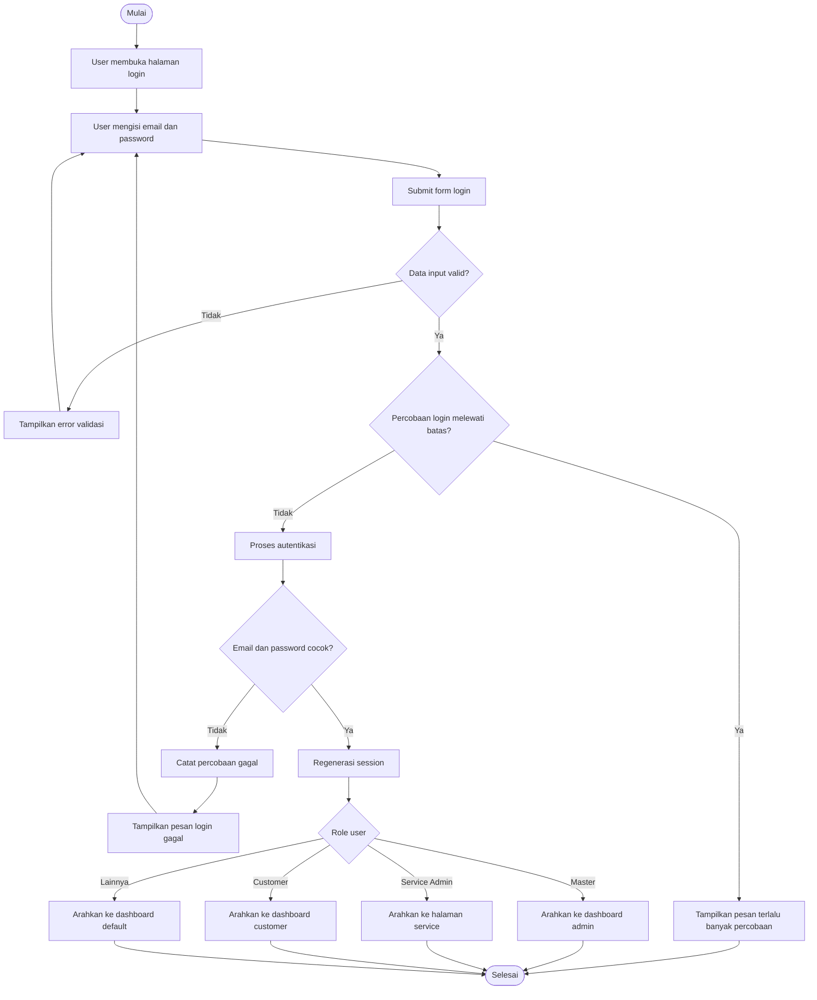
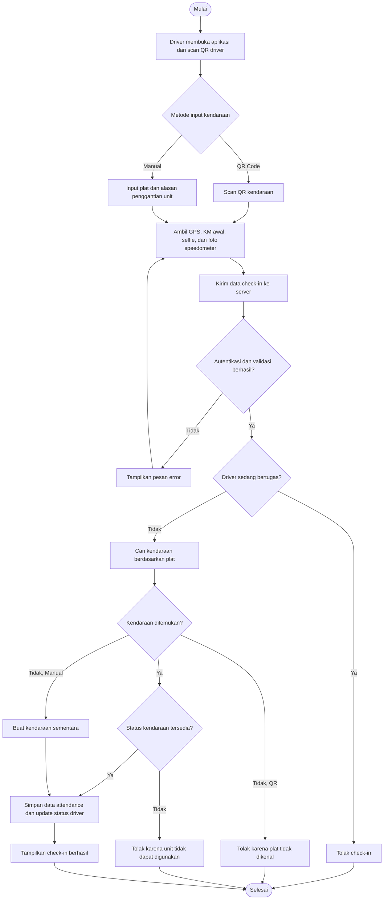
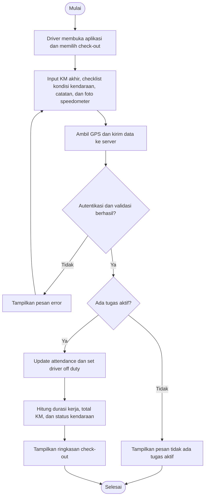
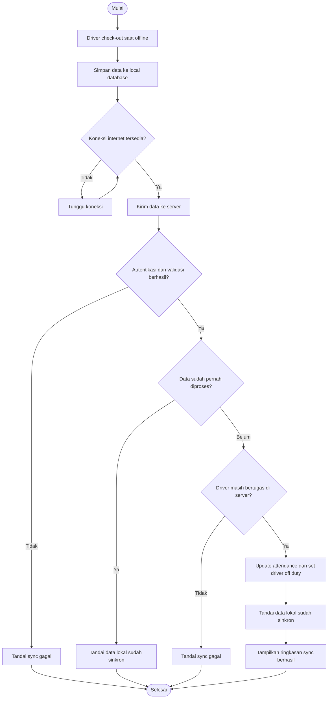
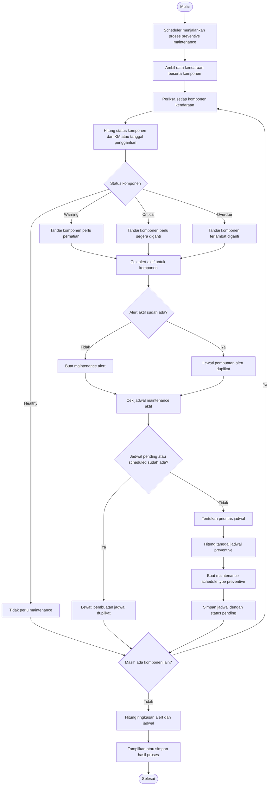

# Activity Diagram Alur Utama Sistem

Dokumen ini berisi activity diagram utama untuk kebutuhan skripsi: login, check-in driver, check-out driver, sinkronisasi offline, dan preventive maintenance.

## 1. Activity Diagram Login

## 2. Activity Diagram Check-In Driver

## 3. Activity Diagram Check-Out Driver

## 4. Activity Diagram Sinkronisasi Offline

## 5. Activity Diagram Preventive Maintenance

## Catatan Implementasi

- Login web diproses oleh `app/Http/Controllers/Auth/AdminLoginController.php`.
- Check-in, check-out, dan sinkronisasi offline diproses oleh `app/Http/Controllers/Api/AttendanceController.php`.
- Preventive maintenance melibatkan `VehicleComponent`, `MaintenanceAlertService`, dan command `maintenance:generate-schedules`.
- Activity diagram ini dibuat sebagai versi ringkas untuk skripsi, sehingga fokus pada keputusan bisnis utama dan tidak menampilkan detail teknis kecil seperti semua field request.
