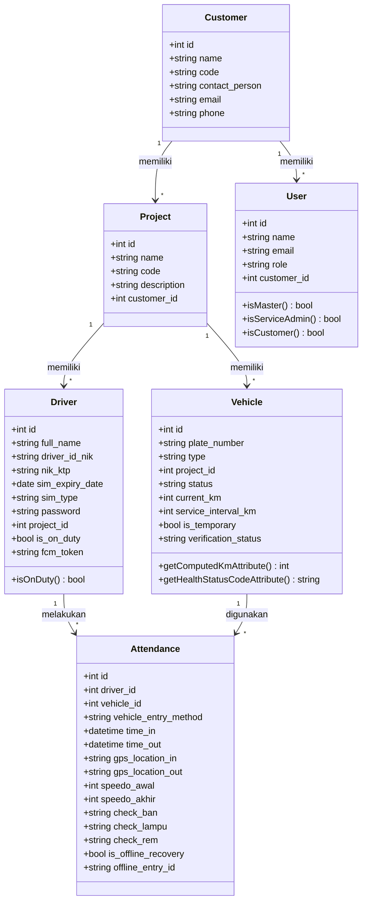
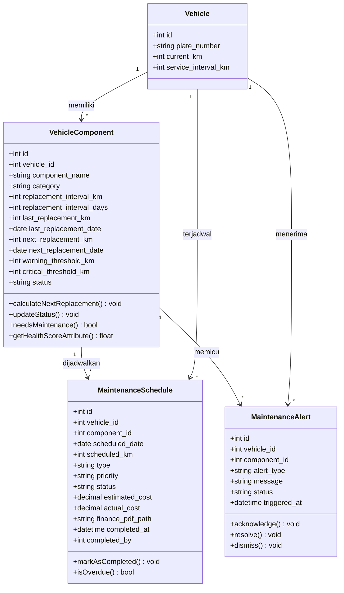
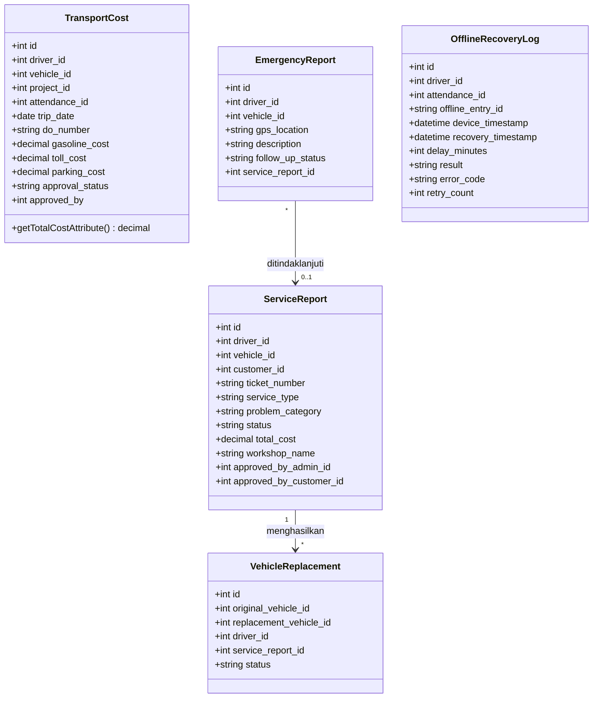

# Class Diagram Sistem Absensi dan Manajemen Armada

Dokumen ini berisi class diagram yang dibuat berdasarkan model aktual di project. Dipecah menjadi 3 bagian agar tidak terlalu besar di Word.

## 1. Class Diagram Domain Absensi (Core)

Menggambarkan kelas-kelas utama yang terlibat dalam proses absensi driver.

## 2. Class Diagram Domain Maintenance

Menggambarkan kelas-kelas yang terlibat dalam preventive maintenance kendaraan.

## 3. Class Diagram Domain Pendukung

Menggambarkan kelas-kelas pendukung: transport cost, service report, laporan darurat, dan offline recovery.

## Catatan

- Class diagram dibuat berdasarkan model di `app/Models/*.php`.
- Untuk skripsi, atribut foto path (selfie_photo_path, dll) tidak ditampilkan agar diagram tetap ringkas.
- Method yang ditampilkan hanya method bisnis utama, bukan getter/setter atau scope Eloquent.
- Relasi antar class ditampilkan dengan multiplicity (1 ke banyak, dll).
