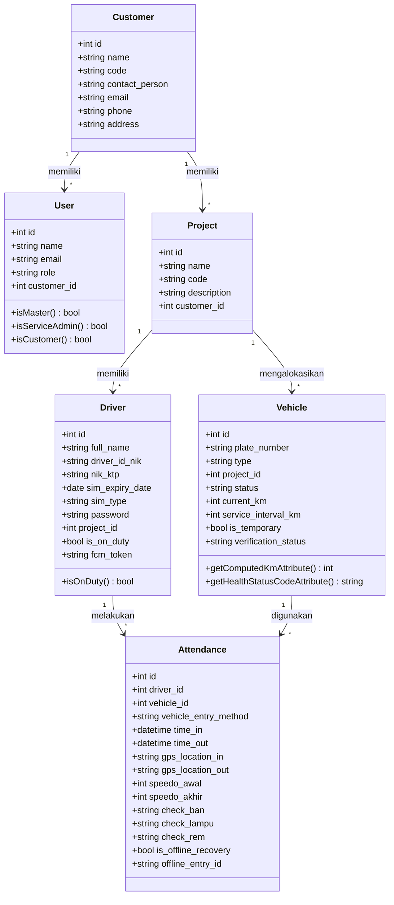
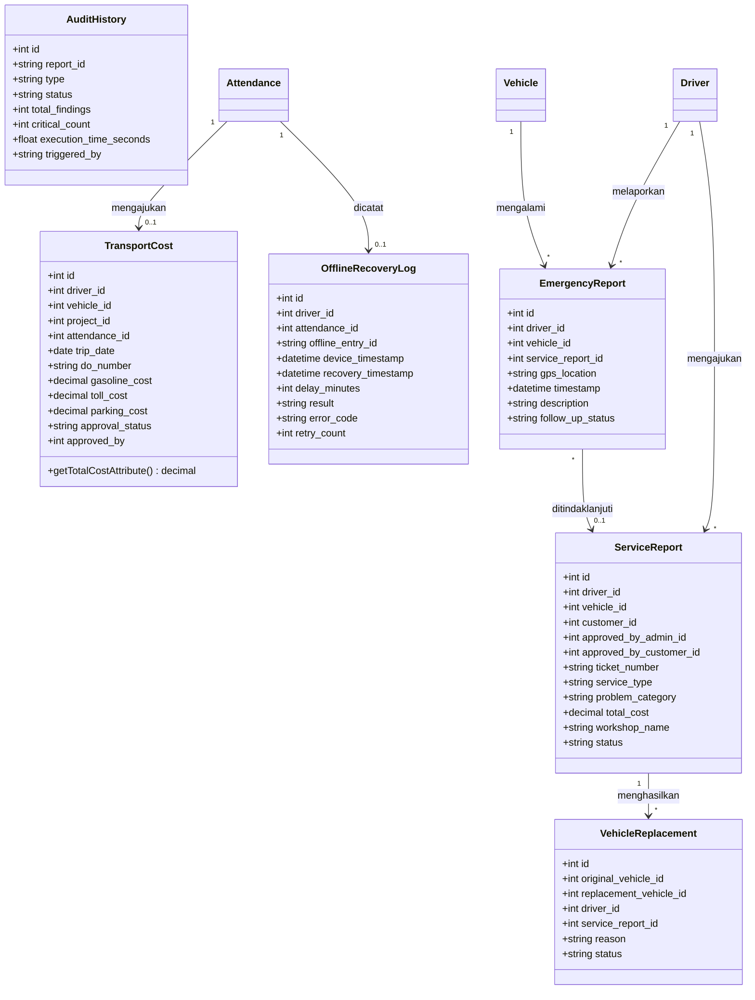
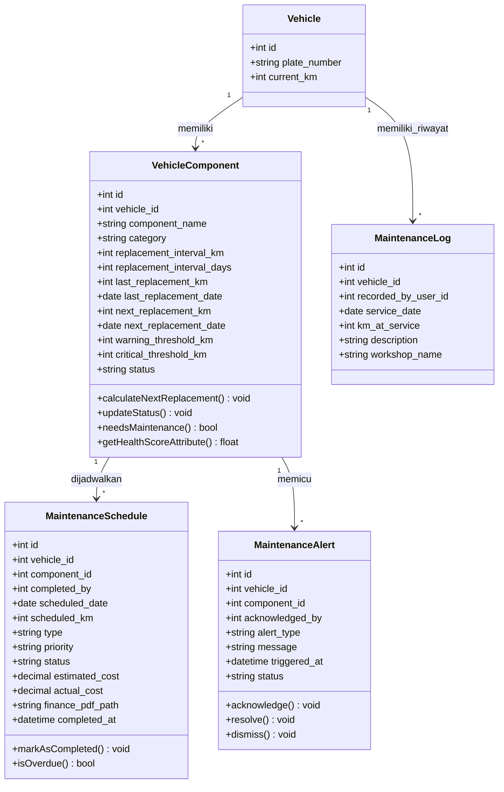

# Class Diagram Sistem Absensi dan Manajemen Armada

Dokumen ini berisi Class Diagram lengkap yang dibuat berdasarkan **16 Model Eloquent** aktual di project backend (`app/Models/*.php`).

Dipecah menjadi 3 domain fungsional agar rapi dan mudah dibaca di dokumen skripsi:

---

## 1. Class Diagram Domain Master & Absensi (Core)

Menggambarkan kelas-kelas utama master data dan proses absensi driver.

---

## 2. Class Diagram Domain Operasional & Layanan

Menggambarkan kelas-kelas operasional: pengajuan biaya, laporan darurat, laporan servis, penggantian kendaraan, audit, dan sinkronisasi offline.

---

## 3. Class Diagram Domain Preventive Maintenance

Menggambarkan kelas-kelas perawatan preventif kendaraan.

---

## Ringkasan 16 Kelas Domain (Model Eloquent)

| No | Nama Kelas (Model) | Fungsi Utama |
|---|---|---|
| 1 | `Customer` | Kelola data pelanggan/klien |
| 2 | `User` | Kelola akun pengguna sistem & hak akses |
| 3 | `Project` | Kelola proyek operasional pelanggan |
| 4 | `Driver` | Kelola data pengemudi/driver |
| 5 | `Vehicle` | Kelola data armada kendaraan |
| 6 | `Attendance` | Catatan absensi & inspeksi awal/akhir driver |
| 7 | `TransportCost` | Pengajuan biaya bensin, tol, & operasional |
| 8 | `EmergencyReport` | Laporan kendala darurat di jalan |
| 9 | `ServiceReport` | Laporan pengajuan servis kendaraan |
| 10 | `VehicleReplacement` | Catatan unit kendaraan pengganti sementara |
| 11 | `AuditHistory` | Rekam riwayat inspeksi & audit otomatis sistem |
| 12 | `OfflineRecoveryLog` | Log sinkronisasi data absensi mode offline |
| 13 | `VehicleComponent` | Tracking komponen & suku cadang armada |
| 14 | `MaintenanceLog` | Riwayat fisik servis & perawatan kendaraan |
| 15 | `MaintenanceSchedule` | Jadwal perawatan preventif berkala |
| 16 | `MaintenanceAlert` | Peringatan otomatis batas KM/servis |
