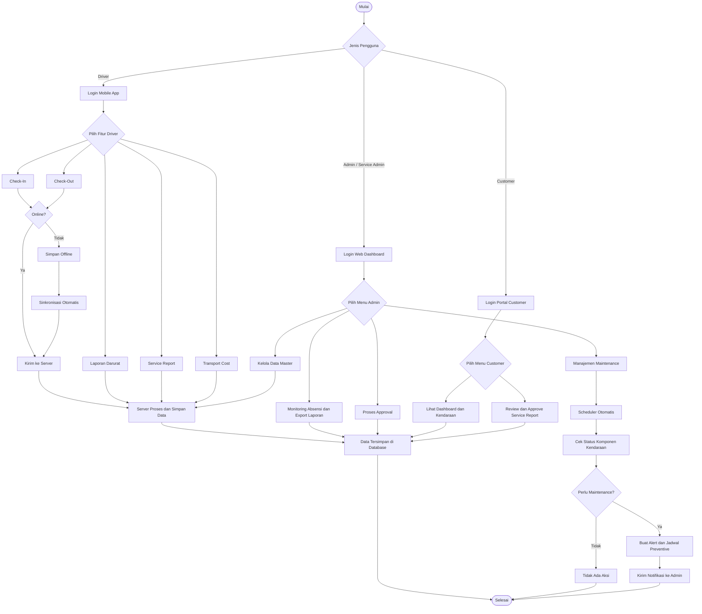
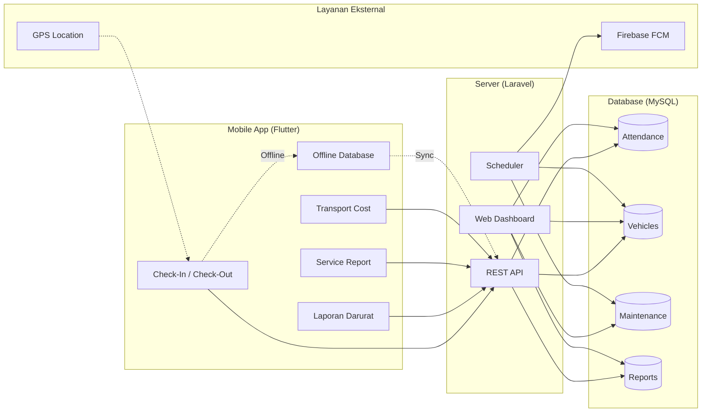

# Flowchart Sistem Absensi dan Manajemen Armada

Dokumen ini berisi flowchart gambaran umum sistem untuk bab awal skripsi.

## 1. Flowchart Alur Sistem Secara Umum

## 2. Flowchart Alur Data Sistem

## Catatan

- Flowchart #1 cocok untuk **Bab 3 (Analisis Sistem)** sebagai gambaran umum sebelum masuk ke activity/sequence diagram.
- Flowchart #2 cocok untuk **Bab 4 (Perancangan)** untuk menjelaskan arsitektur alur data antar komponen.
- Kedua diagram sudah cukup ringkas untuk ditaruh di halaman A4 Word.
