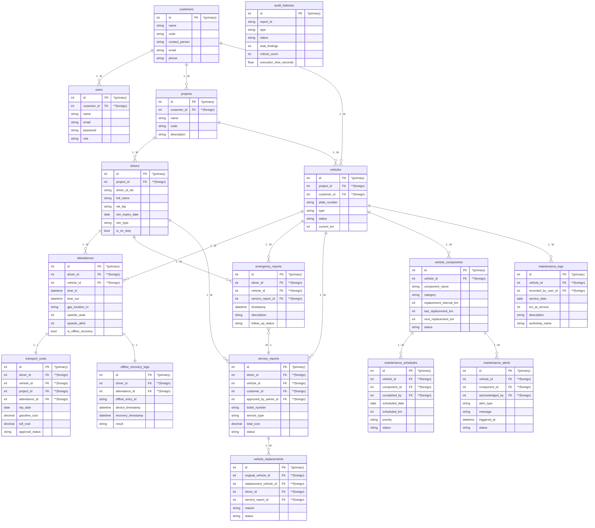

# 4.2.2. Logical Record Structure (LRS)

Dokumen ini berisi struktur **Logical Record Structure (LRS)** untuk **Sistem Absensi dan Manajemen Armada Driver** yang mencakup 16 tabel relasional.

LRS digambarkan dalam bentuk struktur rekaman logika tabel (kotak rekaman) lengkap dengan penanda **Primary Key `*(primary)`**, **Foreign Key `**(foreign)`**, serta kardinalitas relasi **`1`** ke **`M`** (One to Many).

---

## Visualisasi Interactive & Export File
Untuk melihat dan mengunduh format gambar LRS siap cetak A4 Skripsi (Hitam-Putih/B&W):
- Buka file **[docs/lrs_canvas_only.html](file:///c:/Users/ACER/absen_backend/docs/lrs_canvas_only.html)** di browser untuk mengunduh/mencetak dokumen LRS.

---

## 1. Diagram LRS (Mermaid Format)

---

## 2. Rincian Relasi & Kardinalitas LRS

| Tabel Asal (From) | Tabel Tujuan (To) | Kardinalitas | Penjelasan Relasi |
| :--- | :--- | :---: | :--- |
| `customers` | `users` | `1 : M` | Satu customer dapat memiliki banyak pengguna/staf. |
| `customers` | `projects` | `1 : M` | Satu customer dapat memiliki banyak proyek. |
| `customers` | `vehicles` | `1 : M` | Satu customer dapat memiliki banyak unit armada. |
| `projects` | `drivers` | `1 : M` | Satu proyek membawahi banyak pengemudi. |
| `projects` | `vehicles` | `1 : M` | Satu proyek membawahi banyak unit kendaraan. |
| `drivers` | `attendances` | `1 : M` | Satu driver melakukan banyak transaksi absensi. |
| `vehicles` | `attendances` | `1 : M` | Satu kendaraan digunakan dalam banyak transaksi absensi. |
| `attendances` | `transport_costs` | `1 : 1` | Satu absensi dapat menghasilkan 1 klaim biaya perjalanan. |
| `drivers` | `emergency_reports` | `1 : M` | Satu driver dapat melaporkan banyak kejadian darurat. |
| `vehicles` | `emergency_reports` | `1 : M` | Satu kendaraan dapat terlibat banyak laporan darurat. |
| `drivers` | `service_reports` | `1 : M` | Satu driver dapat mengajukan banyak perbaikan servis. |
| `vehicles` | `service_reports` | `1 : M` | Satu kendaraan dapat menjalani banyak perbaikan servis. |
| `emergency_reports` | `service_reports` | `M : 1` | Banyak laporan darurat dapat ditindaklanjuti ke 1 laporan servis. |
| `service_reports` | `vehicle_replacements` | `1 : M` | Satu laporan servis dapat membutuhkan penggantian kendaraan. |
| `attendances` | `offline_recovery_logs` | `1 : 1` | Satu absensi offline memiliki 1 catatan log pemulihan data. |
| `vehicles` | `vehicle_components` | `1 : M` | Satu kendaraan memiliki banyak komponen yang dipantau. |
| `vehicle_components` | `maintenance_schedules` | `1 : M` | Satu komponen memiliki banyak jadwal pemeliharaan. |
| `vehicle_components` | `maintenance_alerts` | `1 : M` | Satu komponen dapat memicu banyak peringatan servis. |
| `vehicles` | `maintenance_logs` | `1 : M` | Satu kendaraan memiliki banyak riwayat pencatatan servis. |
