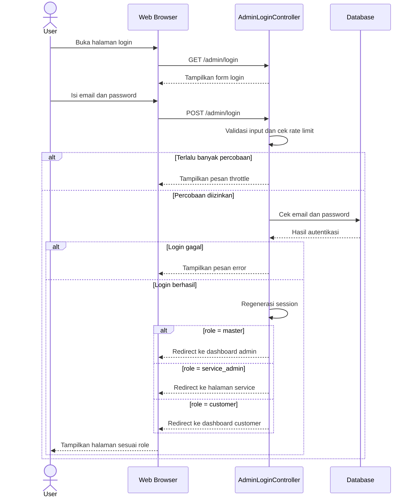
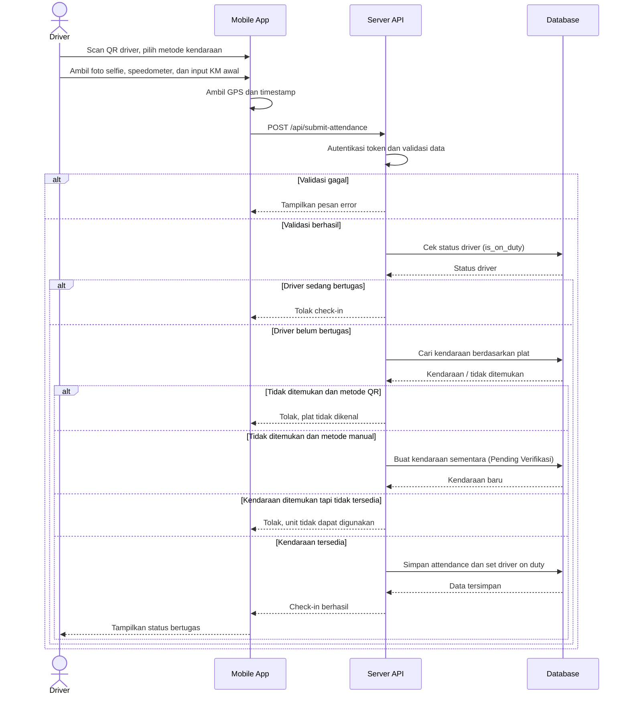
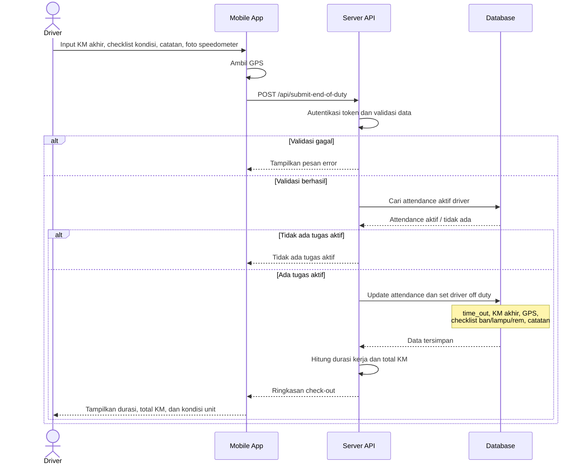

# Sequence Diagram Alur Inti Absensi

Dokumen ini berisi sequence diagram utama untuk deskripsi sistem: login, check-in driver, check-out driver, dan sinkronisasi offline.

## 1. Login dan Role Redirect

Diagram ini menggambarkan alur login web. Role pengguna menentukan halaman tujuan setelah autentikasi berhasil.

Catatan: login driver mobile memakai endpoint `POST /api/login`, menghasilkan token Sanctum, dan tidak melakukan redirect halaman.

## 2. Check-In Driver

Diagram ini menggambarkan alur driver melakukan check-in melalui aplikasi mobile. Sistem mendukung input kendaraan dari QR maupun manual.

## 3. Check-Out Driver

Diagram ini menggambarkan alur driver mengakhiri tugas. Data KM akhir dan checklist kondisi kendaraan disimpan sebagai laporan akhir tugas.

## 4. Sinkronisasi Offline

Diagram ini menggambarkan alur check-out yang disimpan di perangkat saat offline, lalu dikirim ke server setelah koneksi tersedia.

```mermaid
sequenceDiagram
    actor Driver
    participant App as Mobile App
    participant LocalDB as Local Database
    participant API as Server API
    participant DB as Database

    Driver->>App: Check-out saat offline
    App->>LocalDB: Simpan data check-out lokal
    Note over LocalDB: offline_entry_id, timestamp,<br/>KM akhir, checklist, GPS, foto

    App->>App: Tunggu koneksi internet tersedia
    App->>API: POST /api/clock-out-offline
    API->>API: Autentikasi token dan validasi data

    alt Validasi gagal
        API-->>App: Tampilkan error
        App->>LocalDB: Tandai perlu retry
    else Validasi berhasil
        API->>DB: Cek offline_entry_id sudah pernah diproses?
        DB-->>API: Hasil pengecekan

        alt Sudah pernah diproses
            API-->>App: Data sudah tersimpan (idempotent)
            App->>LocalDB: Tandai sudah sinkron
        else Belum pernah diproses
            API->>DB: Cek driver masih bertugas di server?
            DB-->>API: Status tugas driver

            alt Driver tidak bertugas
                API-->>App: Sync gagal
                App->>LocalDB: Tandai gagal
            else Driver masih bertugas
                API->>DB: Update attendance dan set driver off duty
                Note over DB: time_out dari device,<br/>tandai sebagai offline recovery
                DB-->>API: Data tersimpan
                API-->>App: Sinkronisasi berhasil
                App->>LocalDB: Tandai sudah sinkron
                App-->>Driver: Tampilkan ringkasan check-out
            end
        end
    end
```

## Catatan Implementasi

- Login web diproses oleh `app/Http/Controllers/Auth/AdminLoginController.php`.
- Login driver mobile diproses oleh `app/Http/Controllers/Api/AuthController.php` dan menghasilkan token Sanctum.
- Check-in, check-out, dan sinkronisasi offline diproses oleh `app/Http/Controllers/Api/AttendanceController.php`.
- Data offline recovery disimpan pada kolom metadata di `attendances` dan dicatat di tabel `offline_recovery_logs`.
- Nilai KM kendaraan tidak selalu disimpan ulang ke `vehicles.current_km`; accessor `Vehicle::computed_km` mengambil prioritas dari `latestAttendance.speedo_akhir`, lalu `speedo_awal`, lalu `current_km`.
