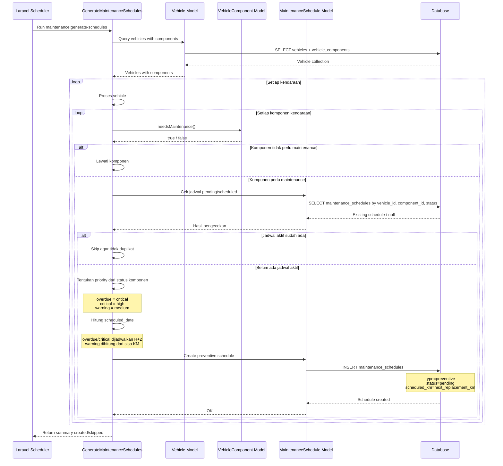
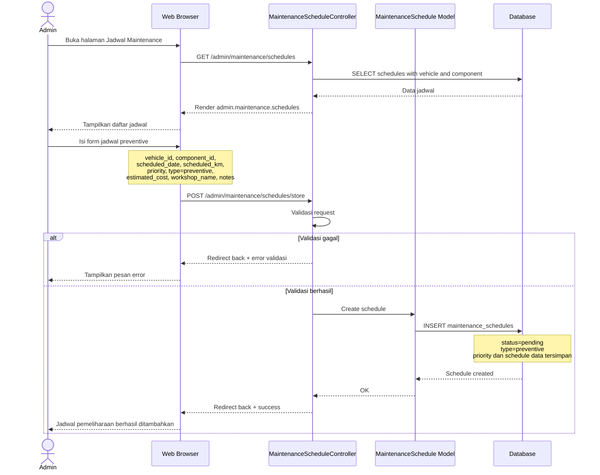
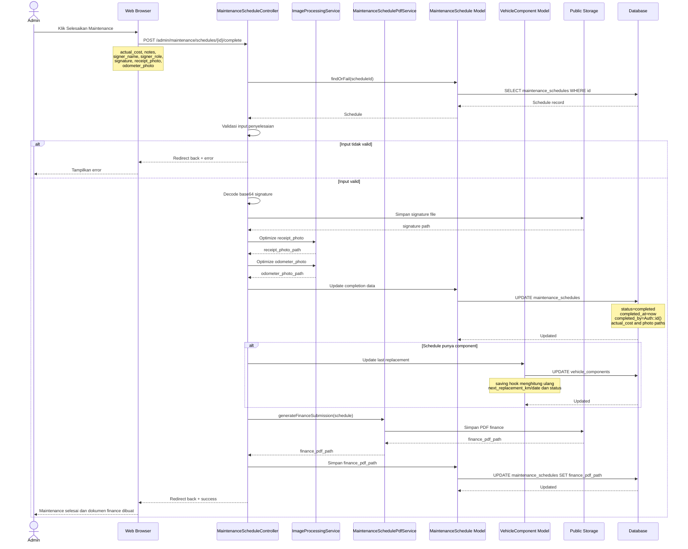

# Sequence Diagram Preventive Maintenance

Dokumen ini berisi sequence diagram untuk alur preventive maintenance pada modul maintenance kendaraan.

## 1. Generate Jadwal Preventive Otomatis

Diagram ini menggambarkan alur command `maintenance:generate-schedules` saat sistem membuat jadwal preventive berdasarkan status komponen kendaraan.

## 2. Buat Jadwal Preventive Manual

Diagram ini menggambarkan alur admin ketika menambahkan jadwal preventive dari halaman maintenance schedule.

## 3. Selesaikan Preventive Maintenance

Diagram ini menggambarkan alur penyelesaian jadwal preventive. Setelah selesai, sistem memperbarui schedule, mengubah data penggantian komponen, dan membuat dokumen PDF finance.

## Catatan Implementasi

- Jadwal otomatis dibuat oleh `app/Console/Commands/GenerateMaintenanceSchedules.php`.
- Jadwal manual dan penyelesaian jadwal diproses oleh `app/Http/Controllers/MaintenanceScheduleController.php`.
- Status komponen dihitung di `app/Models/VehicleComponent.php` melalui `needsMaintenance()`, `updateStatus()`, dan hook `saving`.
- Setelah jadwal selesai, alert maintenance tidak otomatis di-resolve oleh controller ini; resolve alert dilakukan melalui endpoint alert terpisah.
- Controller mengisi `created_by` saat membuat jadwal manual, tetapi schema/model yang terbaca di project ini belum menyimpan kolom tersebut pada `maintenance_schedules`.
