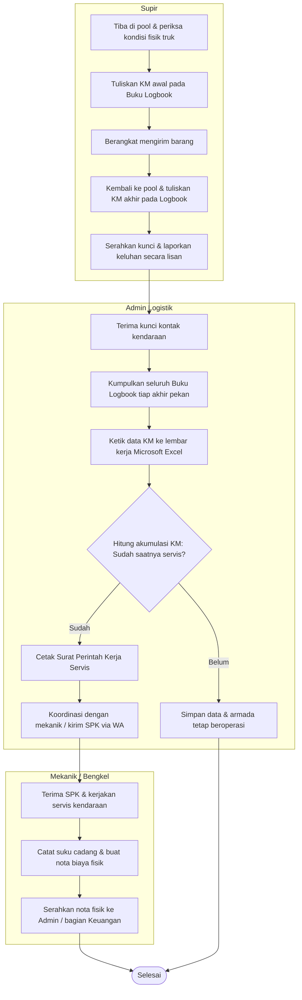

# BAB III
# ANALISIS SISTEM BERJALAN

## 3.1 Tinjauan Perusahaan

### 3.1.1 Sejarah Perusahaan
PT Hamada Global Jaya merupakan perusahaan yang berdiri sejak tahun 2015 dan berdomisili di Jakarta. Bidang usaha utama perusahaan ini meliputi penyediaan jasa angkutan logistik, pendistribusian barang, serta pengelolaan rantai pasok (*supply chain management*). Pada awal beroperasi, perusahaan hanya mengawali kegiatan usahanya dengan menggunakan 10 unit truk box. Seiring bertambahnya permintaan pengangkutan produk industri yang mencakup wilayah Pulau Jawa dan Sumatra, kapasitas operasional perusahaan terus mengalami pertumbuhan. Hingga tahun 2026, PT Hamada Global Jaya telah mengoperasikan lebih dari 150 unit armada yang terdiri dari berbagai tipe kendaraan seperti truk engkel, truk double, dan tronton, serta telah mempekerjakan lebih dari 200 pengemudi guna melayani beragam pelanggan korporat yang berasal dari sektor manufaktur, perdagangan ritel, maupun perdagangan elektronik (*e-commerce*).

### 3.1.2 Visi dan Misi Perusahaan
**Visi:**
Menjadi penyedia layanan transportasi logistik yang terkemuka dan dipercaya di Indonesia, dengan keunggulan pada aspek keselamatan kerja operasional, pengelolaan pemeliharaan armada yang efisien, serta keandalan pelayanan yang ditopang oleh penerapan teknologi informasi terkini.

**Misi:**
1. Menghadirkan jasa pengiriman barang logistik secara aman, terjadwal, dan bermutu tinggi demi menunjang keberlangsungan usaha para pelanggan.
2. Melaksanakan strategi perawatan armada berbasis pendekatan preventif dan proaktif untuk meminimalkan kemungkinan terjadinya kerusakan kendaraan di tengah perjalanan (*breakdown*) sekaligus mengoptimalkan masa pakai aset kendaraan.
3. Menyajikan informasi operasional dan kondisi kesehatan armada secara transparan kepada pelanggan melalui sistem digital yang saling terintegrasi.
4. Membangun kapabilitas, mendorong kedisiplinan, dan meningkatkan kesejahteraan para pengemudi (*driver*) selaku sumber daya utama dalam pelaksanaan operasional perusahaan.

### 3.1.3 Struktur Organisasi dan Fungsi
Susunan organisasi di PT Hamada Global Jaya dibentuk dengan pendekatan fungsional yang bertujuan menjamin kelancaran koordinasi antara jajaran manajemen pusat, tim operasional lapangan, dan divisi pemeliharaan kendaraan. Adapun uraian fungsi dari setiap jabatan yang berkaitan langsung dengan operasional dan pengelolaan armada dijabarkan sebagai berikut:

1. **Direktur Utama (*Chief Executive Officer*):**
   Memegang tanggung jawab penuh terhadap penetapan arah strategis perusahaan, ekspansi bisnis, serta pengambilan keputusan terkait investasi jangka panjang termasuk dalam hal pengadaan armada kendaraan baru.

2. **Manajer Operasional (*Operations Manager*):**
   Memastikan kelancaran proses distribusi logistik, mengatur jadwal pengiriman, memonitor kepatuhan terhadap waktu pengiriman sesuai kesepakatan layanan (*SLA*), serta mengoordinasikan berbagai proyek logistik yang beroperasi secara bersamaan.

3. **Manajer Logistik & Armada (*Fleet Manager*):**
   Mengemban tanggung jawab atas efisiensi penggunaan seluruh unit kendaraan, keabsahan dokumen legal kendaraan seperti STNK dan KIR, penempatan pengemudi pada unit yang sesuai, pengawasan pemakaian bahan bakar, serta pengendalian biaya operasional perjalanan.

4. **Admin Logistik / Dispatcher:**
   Bertugas mendokumentasikan kehadiran (*absensi*) driver, memverifikasi kesesuaian nomor plat kendaraan yang digunakan, mengumpulkan serta memasukkan data odometer perjalanan ke dalam sistem pencatatan perusahaan, dan menjaga komunikasi dengan pengemudi selama masa tugas.

5. **Mekanik / Tim Maintenance:**
   Menjalankan aktivitas inspeksi fisik, perawatan berkala seperti penggantian oli mesin, filter udara, dan ban, serta melakukan perbaikan terhadap unit armada yang mengalami kerusakan, baik di pool internal perusahaan maupun melalui kerja sama dengan bengkel mitra eksternal.

6. **Customer:**
   Merujuk pada pihak korporat yang menyewa armada kendaraan dari perusahaan. Customer membutuhkan akses pemantauan secara langsung terhadap unit armada yang sedang bertugas dan memiliki wewenang untuk memberikan persetujuan (*approval*) secara digital terhadap laporan pemeliharaan kendaraan yang diperuntukkan bagi proyek mereka.

7. **Supir (*Driver*):**
   Memikul tanggung jawab dalam mengoperasikan kendaraan secara aman, mengisi data odometer pada saat keberangkatan maupun kepulangan secara akurat, melakukan pemeriksaan fisik terhadap kondisi kendaraan sebelum dan sesudah menjalankan tugas, serta melaporkan setiap insiden darurat atau kebutuhan perbaikan kepada pihak terkait.

---

## 3.2 Prosedur Sistem Berjalan

Mekanisme yang sedang berlaku di PT Hamada Global Jaya untuk keperluan pemantauan kegiatan operasional pengemudi serta perawatan armada kendaraan masih bertumpu pada proses pencatatan secara semi-manual. Berikut ini adalah uraian tahapan dari masing-masing prosedur operasional tersebut:

1. **Prosedur Penerimaan Kunci dan Pencatatan Awal:**
   Sebelum berangkat menjalankan tugas pengiriman, pengemudi (*driver*) terlebih dahulu menuju ke pos Admin Logistik di area pool kendaraan untuk mengambil kunci kontak serta dokumen surat jalan. Setelah itu, pengemudi melaksanakan pengecekan visual terhadap kondisi fisik truk secara menyeluruh (seperti memeriksa adanya kebocoran oli dan keadaan ban). Selanjutnya, pengemudi membaca angka pada *speedometer* fisik kendaraan dan mencatatkan nilai odometer awal tersebut ke dalam Buku Logbook Odometer yang tersimpan pada laci dashboard masing-masing truk.

2. **Prosedur Penanganan Insiden Darurat Selama Perjalanan:**
   Bilamana kendaraan mengalami gangguan teknis di perjalanan, seperti mogok mendadak, pecah ban, ataupun kecelakaan lalu lintas, pengemudi diharuskan segera menghentikan kendaraan pada lokasi yang aman. Selanjutnya pengemudi menginformasikan kronologi kejadian kepada Admin Logistik melalui panggilan telepon ataupun pesan instan WhatsApp. Admin kemudian menindaklanjuti laporan tersebut dengan menghubungi Mekanik atau mengidentifikasi bengkel terdekat di sepanjang rute yang dilalui. Proses ini kerap mengalami kendala karena posisi koordinat GPS pengemudi tidak dapat diketahui secara presisi.

3. **Prosedur Pengembalian Kunci dan Pencatatan Akhir:**
   Sesudah menuntaskan seluruh kegiatan pengiriman barang dan kembali ke area pool, pengemudi memarkir kendaraan terlebih dahulu. Pengemudi kemudian membaca kembali angka odometer fisik dan menuliskan angka kilometer akhir tersebut ke dalam Buku Logbook Odometer. Kunci kontak diserahkan kembali kepada Admin Logistik. Apabila selama perjalanan pengemudi mendeteksi adanya gangguan mekanis, seperti rem yang terasa kurang responsif atau lampu indikator yang tidak berfungsi, informasi tersebut disampaikan secara verbal kepada Admin Logistik.

4. **Prosedur Kompilasi Data dan Perencanaan Servis Rutin:**
   Pada setiap akhir pekan, Admin Logistik menghimpun seluruh Buku Logbook Odometer dari tiap unit kendaraan. Admin kemudian memasukkan angka kilometer awal dan akhir secara manual ke dalam lembar kerja (*spreadsheet*) Microsoft Excel yang tersimpan pada komputer kantor. Perhitungan selisih jarak tempuh (*total KM*) dilakukan menggunakan formula pada Excel, kemudian hasilnya dibandingkan dengan batas jarak tempuh wajib servis yang telah ditetapkan (contohnya: penggantian oli mesin setiap kelipatan 10.000 KM sejak servis terakhir).

5. **Prosedur Pelaksanaan Kegiatan Pemeliharaan (Servis):**
   Manakala Admin Logistik mengidentifikasi unit kendaraan yang telah melewati atau mendekati ambang batas odometer servis, Admin akan mempersiapkan dan mencetak Surat Perintah Kerja (SPK) Servis. Dokumen SPK tersebut diserahkan kepada Mekanik internal atau dikirimkan melalui aplikasi WhatsApp ke bengkel rekanan. Mekanik selanjutnya melaksanakan pekerjaan servis, melakukan pembelian suku cadang yang diperlukan, dan mencatat seluruh rincian biaya pada nota fisik. Kumpulan nota fisik tersebut nantinya disetorkan secara bulanan ke bagian Keuangan untuk diproses pembayarannya (*reimbursement*).

---

## 3.3 Activity Diagram Sistem Berjalan

Mengacu pada uraian prosedur di atas, pola interaksi antara Supir, Admin Logistik, dan Mekanik dalam sistem yang sedang berjalan saat ini divisualisasikan melalui Activity Diagram berikut:

---

## 3.4 Spesifikasi Dokumen Sistem Berjalan

Spesifikasi dokumen ini memuat perincian mengenai dokumen-dokumen yang dipergunakan dalam alur kerja sistem berjalan di PT Hamada Global Jaya. Dokumen tersebut dikelompokkan ke dalam dua kategori, yaitu Dokumen Masukan (Input) dan Dokumen Keluaran (Output).

### 3.4.1 Dokumen Masukan (Input Document)
1. **Nama Dokumen:** Buku Logbook Odometer Driver
   - **Fungsi:** Merekam angka kilometer (KM) awal serta KM akhir setiap perjalanan pengemudi sebagai dasar pelacakan jarak tempuh kendaraan.
   - **Sumber:** Supir (*Driver*).
   - **Tujuan:** Admin Logistik.
   - **Media:** Buku catatan kertas yang disimpan dalam laci dashboard truk.
   - **Jumlah:** Satu buku untuk setiap unit kendaraan.
   - **Frekuensi:** Diisi pada saat sebelum berangkat dan sesudah kembali dari tugas pengiriman.
   - **Keterangan:** Terdiri atas kolom Tanggal, Nama Pengemudi, Plat Nomor, KM Awal, KM Akhir, serta kolom Tanda Tangan.

2. **Nama Dokumen:** Formulir Checklist Kondisi Fisik Kendaraan Manual
   - **Fungsi:** Mendokumentasikan hasil inspeksi visual kondisi fisik kendaraan sebelum memulai tugas.
   - **Sumber:** Supir (*Driver*).
   - **Tujuan:** Admin Logistik.
   - **Media:** Formulir kertas tercetak.
   - **Jumlah:** Satu lembar untuk setiap perjalanan.
   - **Frekuensi:** Diisi setiap kali pengemudi akan memulai tugasnya.
   - **Keterangan:** Memuat item pengecekan meliputi kondisi ban, lampu, rem, air radiator, serta oli mesin.

### 3.4.2 Dokumen Keluaran (Output Document)
1. **Nama Dokumen:** Laporan Rekapitulasi Odometer & Perjalanan Bulanan
   - **Fungsi:** Mengolah dan menganalisis data akumulasi jarak tempuh armada setiap bulannya serta dijadikan sebagai acuan penentuan jadwal servis berkala.
   - **Sumber:** Admin Logistik.
   - **Tujuan:** Manajer Logistik & Armada.
   - **Media:** Berkas *spreadsheet* Microsoft Excel.
   - **Jumlah:** Satu berkas laporan per bulan.
   - **Frekuensi:** Disusun pada setiap awal bulan berikutnya.
   - **Keterangan:** Berisi rangkuman data dari keseluruhan logbook mingguan seluruh unit kendaraan.

2. **Nama Dokumen:** Surat Perintah Kerja (SPK) Servis
   - **Fungsi:** Memberikan instruksi resmi kepada mekanik internal ataupun bengkel mitra eksternal untuk melaksanakan kegiatan pemeliharaan pada unit kendaraan tertentu.
   - **Sumber:** Admin Logistik.
   - **Tujuan:** Mekanik / Bengkel Mitra.
   - **Media:** Dokumen cetak kertas atau berkas PDF yang dikirimkan melalui WhatsApp.
   - **Jumlah:** Satu dokumen untuk setiap pengajuan servis.
   - **Frekuensi:** Diterbitkan sewaktu-waktu ketika suatu unit kendaraan teridentifikasi telah melampaui batas KM servis.
   - **Keterangan:** Memuat informasi plat nomor kendaraan, uraian kerusakan atau keluhan, daftar komponen suku cadang yang perlu diganti, serta tanda tangan persetujuan dari manajer armada.

---

## 3.5 Permasalahan Pokok

Berdasarkan hasil analisis terhadap prosedur kerja serta arus dokumen pada sistem berjalan di PT Hamada Global Jaya, teridentifikasi sejumlah permasalahan mendasar sebagai berikut:

1. **Tertundanya Pemutakhiran Data Jarak Tempuh (*Odometer Lag*):**
   Pencatatan angka kilometer secara tulisan tangan pada buku logbook fisik rentan mengalami berbagai kendala, antara lain tulisan yang tidak terbaca dengan jelas (*illegible*), halaman yang rusak akibat terkena tumpahan cairan seperti oli, ataupun buku yang hilang. Ditambah lagi, proses perekapan data ke dalam Excel oleh Admin Logistik baru dilaksanakan satu kali setiap pekan. Kondisi ini mengakibatkan informasi jarak tempuh kendaraan tidak dapat dipantau secara real-time oleh pihak manajemen.

2. **Tingginya Risiko Kerusakan Kendaraan Secara Mendadak (*Vehicle Breakdown*):**
   Sebagai dampak dari keterlambatan pembaruan data odometer, sejumlah kendaraan tetap dioperasikan meskipun telah melampaui batas kilometer wajib servis untuk penggantian oli maupun filter (contohnya, jarak tempuh melebihi 3.000 KM dari batas yang seharusnya). Ketiadaan sistem alarm atau notifikasi otomatis menjadikan tim pemeliharaan menerapkan pendekatan yang bersifat reaktif — yakni baru melakukan perbaikan setelah kerusakan terjadi. Kondisi ini berimplikasi pada meningkatnya biaya derek, hilangnya waktu operasional (*downtime*) pengiriman, dan bertambahnya keluhan dari pelanggan.

3. **Lemahnya Mekanisme Verifikasi Kendaraan dan Pengemudi:**
   Proses pencocokan antara unit kendaraan dengan pengemudi yang ditugaskan masih bergantung pada pelaporan lisan dari supir. Tidak jarang terjadi kondisi di mana pengemudi saling bertukar kendaraan di lapangan tanpa menginformasikan hal tersebut kepada Admin Logistik. Situasi ini menyulitkan proses penelusuran apabila terjadi pelanggaran lalu lintas, pengajuan klaim asuransi, ataupun kasus kehilangan muatan.

4. **Minimnya Transparansi Informasi Pemeliharaan bagi Pelanggan (*Customer*):**
   Pelanggan korporat yang menyewa armada secara eksklusif dalam kontrak bulanan kerap menginginkan jaminan bahwa unit yang dialokasikan untuk kepentingan operasional mereka senantiasa berada dalam kondisi prima. Namun demikian, sistem manual yang berjalan saat ini tidak mampu menyajikan laporan riwayat pemeliharaan (*maintenance history*) yang dapat diakses secara mandiri oleh customer. Kondisi ini berpotensi menurunkan tingkat kepercayaan dan kepuasan pelanggan terhadap layanan perusahaan.

---

## 3.6 Pemecahan Masalah

Guna mengatasi serangkaian permasalahan pokok yang telah diuraikan sebelumnya, diajukan sebuah solusi berupa pengembangan sistem berjudul **Integrasi Sistem Tracking Operasional Sebagai Basis Managemen Pemeliharaan Preventif Armada di PT Hamada Global Jaya**. Implementasi solusi ini dilakukan melalui dua platform yang saling terintegrasi, yakni Aplikasi Mobile berbasis Flutter (digunakan oleh Driver di lapangan) dan Dashboard Web berbasis Laravel (digunakan oleh Admin, Tim Maintenance, serta Customer).

Adapun pokok-pokok pemecahan masalah yang ditawarkan melalui sistem usulan ini adalah sebagai berikut:

1. **Digitalisasi Pencatatan Odometer Melalui Mekanisme Check-In & Check-Out pada Aplikasi Mobile:**
   Pengemudi tidak lagi perlu mencatatkan angka odometer pada buku logbook kertas. Sebagai gantinya, pengemudi memasukkan angka kilometer secara langsung melalui aplikasi mobile Flutter pada saat memulai tugas (check-in) maupun mengakhiri tugas (check-out), disertai dengan kewajiban **mengunggah foto fisik panel odometer/speedometer** sebagai bukti validasi digital. Seluruh data tersebut langsung dikirimkan secara instan ke server API Laravel tanpa ada jeda waktu.

2. **Verifikasi Kendaraan Melalui Pemindaian QR Code:**
   Sebagai upaya pencegahan terhadap kesalahan pemasukan plat nomor maupun pertukaran kendaraan secara sepihak di lapangan, pengemudi diwajibkan memindai (*scan*) QR Code yang ditempelkan secara permanen pada bagian kaca depan setiap kendaraan. Apabila plat nomor kendaraan tidak terdaftar dalam basis data atau unit kendaraan sedang berstatus dalam perbaikan, maka sistem secara otomatis akan menolak proses check-in pengemudi pada unit tersebut.

3. **Otomasi Peringatan Pemeliharaan Preventif Melalui Scheduler Server:**
   Sistem yang diusulkan dilengkapi dengan fungsi *Scheduler Cron Job* pada sisi server Laravel. Mekanisme penjadwalan otomatis ini beroperasi secara harian untuk membandingkan sisa jarak tempuh dari setiap komponen kendaraan (seperti ban, oli mesin, dan kampas rem) berdasarkan data check-in/check-out terkini. Apabila suatu komponen terdeteksi mendekati ambang batas toleransi jarak tempuh, sistem secara otomatis akan membangkitkan peringatan (*alert*) berstatus **Warning** ataupun **Critical**, dan sekaligus membuat penjadwalan servis preventif secara mandiri sebelum kerusakan benar-benar terjadi.

4. **Mekanisme Sinkronisasi Data pada Kondisi Offline (*Offline Sync Queue*):**
   Untuk mengantisipasi kendala wilayah tanpa jangkauan sinyal internet (*blank spot*) di sepanjang rute pengiriman logistik — terutama di daerah Sumatra atau kawasan pegunungan Jawa — aplikasi mobile dibekali dengan basis data lokal (*Sembast DB*). Pengemudi tetap dapat menyelesaikan proses check-out meskipun dalam kondisi tanpa koneksi internet. Data check-out yang mencakup koordinat GPS, foto odometer, dan checklist kondisi kendaraan disimpan pada antrean lokal perangkat, dan akan disinkronisasikan secara otomatis ke server begitu aplikasi mendeteksi tersedianya kembali koneksi internet yang stabil.

5. **Penyediaan Portal Akses Mandiri untuk Customer:**
   Setiap customer diberikan kredensial akses khusus dengan peran (*role*) Customer untuk dapat masuk ke dalam Web Dashboard. Melalui portal ini, customer dapat memantau daftar armada yang ditugaskan pada proyek mereka secara langsung (*real-time*), meninjau status kesehatan komponen-komponen kendaraan, serta memberikan persetujuan (*approval*) secara elektronik — yang dilengkapi fasilitas tanda tangan digital pada kanvas (*signature pad*) — terhadap laporan servis dan perbaikan unit kendaraan.
