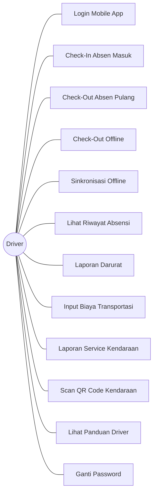
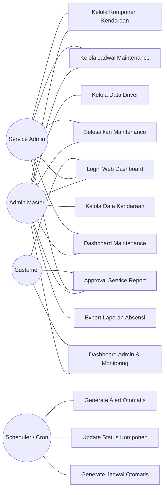
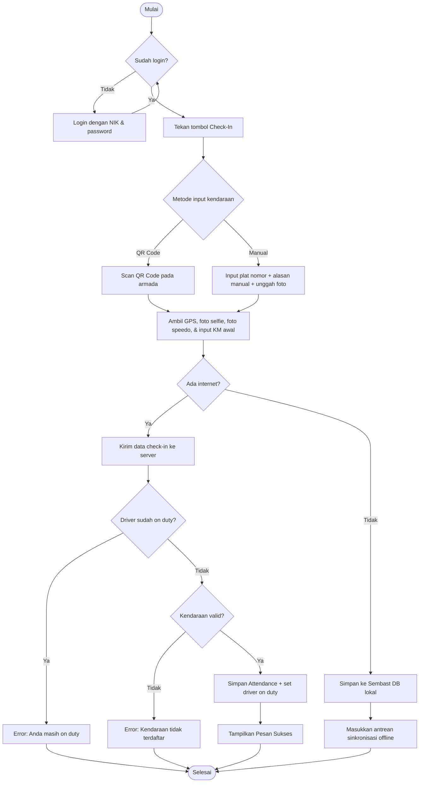
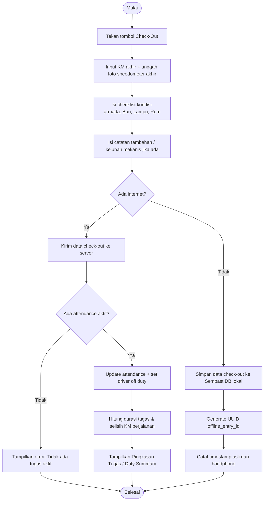
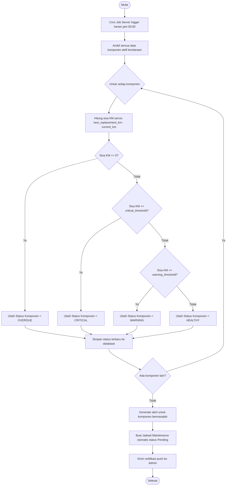
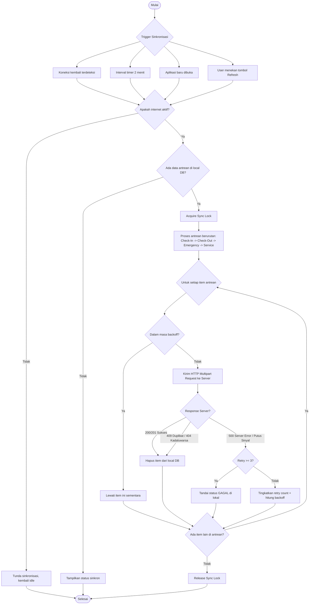
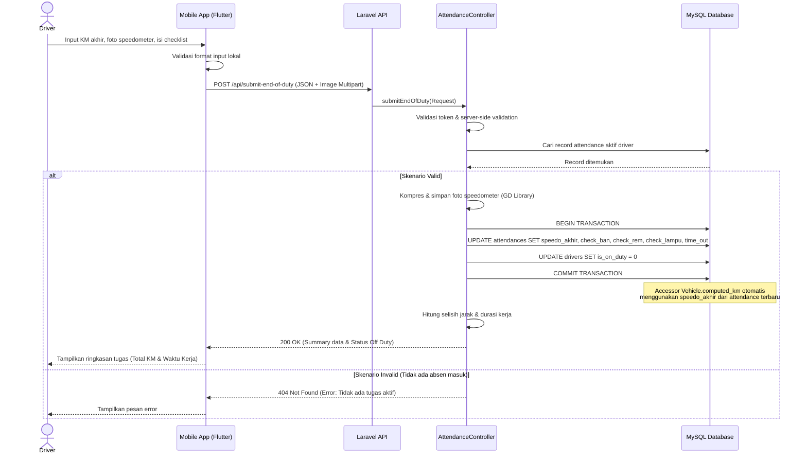
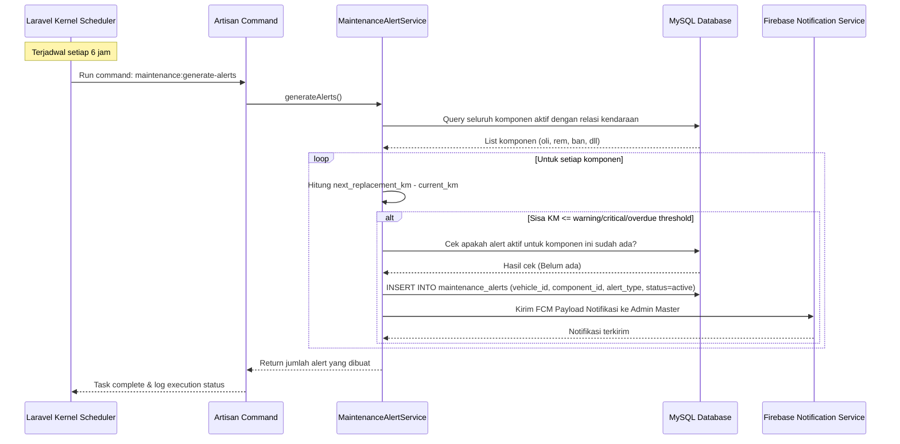
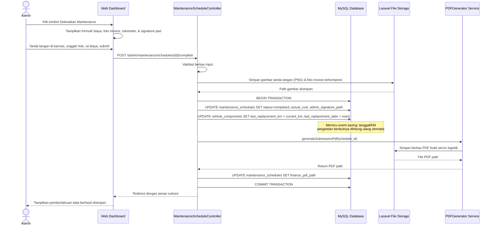
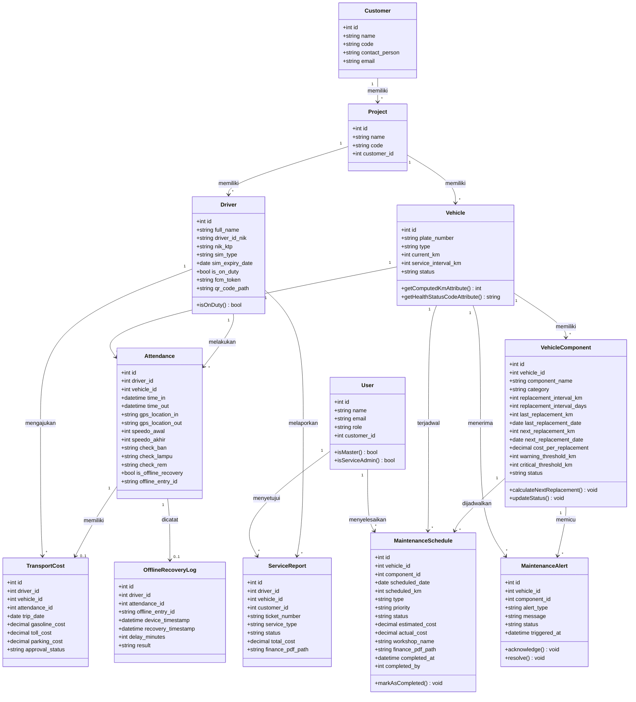

# BAB IV
# RANCANGAN SISTEM DAN PROGRAM

## 4.1 Rancangan Sistem Usulan

Perancangan sistem usulan ini disusun dengan tujuan menggantikan mekanisme pencatatan manual yang selama ini diterapkan di PT Hamada Global Jaya dengan suatu sistem terkomputerisasi yang mampu beroperasi secara otomatis dan real-time. Pada bagian ini, seluruh kebutuhan fungsional serta perilaku sistem dimodelkan menggunakan notasi Unified Modeling Language (UML) yang mencakup Use Case Diagram, Activity Diagram, Sequence Diagram, dan Class Diagram.

### 4.1.1 Use Case Diagram
Sistem usulan dikelompokkan ke dalam dua area Use Case utama agar lebih mudah dipahami serta menyesuaikan dengan tata letak pencetakan pada halaman dokumen berukuran A4.

#### A. Use Case Diagram - Sisi Driver
Diagram berikut memperlihatkan keseluruhan interaksi yang dapat dilaksanakan oleh aktor **Driver** melalui aplikasi mobile berbasis Flutter.



#### B. Use Case Diagram - Sisi Admin, Customer & Scheduler
Diagram berikut memperlihatkan interaksi yang dilaksanakan oleh aktor **Admin Master**, **Service Admin**, **Customer**, serta aktor otomasi sistem **Scheduler** melalui Web Dashboard.



#### C. Deskripsi Use Case Utama
Tabel berikut menyajikan penjelasan ringkas dari masing-masing Use Case utama pada sistem:

| No. Use Case | Nama Use Case | Aktor Utama | Deskripsi Singkat |
| :--- | :--- | :--- | :--- |
| UC-02 | Check-In Absen Masuk | Driver | Pengemudi mengawali tugas harian dengan memindai QR kendaraan, mengambil foto wajah, foto panel speedometer awal, dan memasukkan angka kilometer awal. |
| UC-03 | Check-Out Absen Pulang | Driver | Pengemudi menyelesaikan tugas harian dengan memasukkan angka kilometer akhir, mengambil foto panel speedometer akhir, serta mengisi daftar periksa kondisi kendaraan (rem, ban, lampu). |
| UC-04 | Check-Out Offline | Driver | Pengemudi menyimpan data check-out ke memori internal perangkat handphone dikarenakan tidak tersedianya sinyal internet pada saat itu. |
| UC-05 | Sinkronisasi Offline | Driver | Sistem secara otomatis mendeteksi ketersediaan koneksi internet dan mengirimkan seluruh data antrean absensi offline dari penyimpanan lokal ke server database Laravel. |
| UC-16 | Kelola Komponen Kendaraan | Admin Master, Service Admin | Tim pemeliharaan mengonfigurasi parameter interval penggantian suku cadang (berdasarkan KM atau hari) beserta ambang batas peringatan (*threshold*) untuk setiap unit armada. |
| UC-18 | Selesaikan Maintenance | Admin Master, Service Admin | Admin mendokumentasikan biaya perawatan aktual, mengunggah foto kuitansi bengkel, foto panel odometer terbaru, serta membubuhkan tanda tangan digital melalui kanvas untuk menandai selesainya tugas perawatan. |
| UC-20 | Approval Service Report | Customer, Admin | Customer mengevaluasi laporan perbaikan kendaraan dan membubuhkan tanda tangan digital pada dokumen persetujuan agar unit dapat kembali dioperasikan atau biayanya diajukan ke bagian keuangan. |
| UC-23 | Generate Alert Otomatis | Scheduler | Scheduler pada server melakukan pemeriksaan akumulasi kilometer kendaraan setiap 6 jam guna mengidentifikasi komponen yang telah memasuki status warning atau critical, kemudian menghasilkan notifikasi peringatan. |

---

### 4.1.2 Activity Diagram
Activity diagram digunakan untuk memodelkan alur kerja sistem secara menyeluruh dari titik awal hingga titik akhir, termasuk percabangan keputusan (*decisions*) serta proses yang berjalan secara paralel.

#### A. Activity Diagram Check-In Driver (Absen Masuk)
Diagram ini menguraikan rangkaian langkah yang dilalui pengemudi ketika mendaftarkan kendaraan dinasnya, baik dalam kondisi online maupun offline.



#### B. Activity Diagram Check-Out Driver (Absen Keluar)
Diagram ini menguraikan rangkaian langkah yang dilalui pengemudi ketika mengakhiri tugas harian dan melaporkan kondisi akhir armada.



#### C. Activity Diagram Scheduler Preventive Maintenance (Otomasi Server)
Diagram ini memperlihatkan alur proses otomatis yang dieksekusi oleh server di latar belakang untuk memperbarui status kesehatan komponen armada serta memicu pembuatan jadwal pemeliharaan.



#### D. Activity Diagram Sinkronisasi Offline
Diagram ini mengilustrasikan bagaimana aplikasi mobile secara berkala ataupun secara manual melakukan sinkronisasi data yang sebelumnya tertahan pengirimannya karena ketiadaan koneksi internet.



---

### 4.1.3 Sequence Diagram
Sequence diagram digunakan untuk memvisualisasikan interaksi antar-objek yang diorganisasikan berdasarkan urutan waktu, dengan titik fokus pada pertukaran pesan antara aktor dan antarmuka kelas dalam sistem.

#### A. Sequence Diagram Check-Out Driver dan Pembaruan Jarak Tempuh
Diagram ini mendeskripsikan interaksi yang terjadi saat pengemudi melaksanakan absensi pulang dinas, serta bagaimana server Laravel memproses transaksi tersebut dan melakukan pembaruan terhadap data jarak tempuh kendaraan.



#### B. Sequence Diagram Pengiriman Alert Maintenance Preventif
Diagram ini memperlihatkan interaksi antara scheduler dalam memicu proses deteksi suku cadang yang perlu diperhatikan, kemudian mengirimkan notifikasi kepada Admin.



#### C. Sequence Diagram Penyelesaian Jadwal Pemeliharaan
Diagram ini menunjukkan alur penutupan tugas servis oleh admin beserta proses pembaruan usia pakai suku cadang kembali ke titik awal.



---

### 4.1.4 Class Diagram
Class diagram berikut mendokumentasikan pemodelan struktur kelas pada entitas Eloquent ORM di Laravel, lengkap dengan relasi kardinalitas antar-kelas yang dikelompokkan berdasarkan domain fungsionalnya.



---

## 4.2 Rancangan Basis Data

Sistem usulan memanfaatkan basis data relasional (RDBMS) MySQL sebagai media penyimpanan data. Rancangan struktur basis data di bawah ini memetakan relasi antar entitas bisnis dalam sistem.

### 4.2.1 Entity Relationship Diagram (ERD)
ERD sistem terdiri atas entitas-entitas utama dengan hubungan relasi sebagai berikut:
1. **Customer (1) -> Project (N):** Satu customer dapat memiliki beberapa proyek logistik yang sedang berjalan.
2. **Project (1) -> Driver (N) & Vehicle (N):** Unit armada dan pengemudi dialokasikan secara eksklusif ke dalam satu proyek operasional.
3. **Driver (1) -> Attendance (N):** Pengemudi melaksanakan pencatatan absensi secara berkala pada setiap hari kerja.
4. **Vehicle (1) -> Attendance (N):** Setiap kendaraan terhubung dengan data absensi pengemudi yang mengoperasikannya.
5. **Vehicle (1) -> VehicleComponent (N):** Satu unit kendaraan terdiri atas sejumlah komponen suku cadang yang dipantau kesehatannya (meliputi oli mesin, rem, ban depan, dan ban belakang).
6. **VehicleComponent (1) -> MaintenanceSchedule (N):** Proses penggantian komponen yang terjadwal saling terhubung dengan riwayat pemeliharaannya.
7. **Attendance (1) -> TransportCost (0..1):** Setiap catatan absensi harian berpotensi memiliki klaim biaya perjalanan (bahan bakar, parkir, tol) yang memerlukan verifikasi.
8. **ServiceReport (1) -> VehicleReplacement (N):** Apabila proses penanganan service report membutuhkan waktu yang relatif lama, admin dapat mencatatkan unit kendaraan pengganti sementara (*replacement*) bagi pengemudi.

---

### 4.2.2 Logical Record Structure (LRS)
Logical Record Structure (LRS) menyajikan visualisasi tabel beserta *primary key* (PK), *foreign key* (FK), tipe kolom, serta kardinalitas relasi fisik antar-tabel di dalam database.

```text
+------------------------+        +------------------------+
|       CUSTOMERS        |        |        PROJECTS        |
+------------------------+        +------------------------+
| PK | id (INT)          |        | PK | id (INT)          |
|    | name (VARCHAR)    |        | FK | customer_id (INT) |<---+
|    | code (VARCHAR)    |        |    | name (VARCHAR)    |    |
|    | contact (VARCHAR) |<--+    |    | code (VARCHAR)    |    |
+------------------------+   |    +------------------------+    |
                             |                |                 |
+------------------------+   |                v                 |
|         USERS          |   |    +------------------------+    |
+------------------------+   |    |        DRIVERS         |    |
| PK | id (INT)          |   |    +------------------------+    |
| FK | customer_id (INT) |---+    | PK | id (INT)          |    |
|    | name (VARCHAR)    |        | FK | project_id (INT)  |----+
|    | email (VARCHAR)   |        |    | driver_id_nik(VAR)|    |
|    | role (VARCHAR)    |        |    | full_name(VARCHAR)|    |
+------------------------+        |    | is_on_duty(BOOL)  |    |
                                  +------------------------+    |
                                              |                 |
                                              v                 |
+------------------------+        +------------------------+    |
|      ATTENDANCES       |        |        VEHICLES        |    |
+------------------------+        +------------------------+    |
| PK | id (INT)          |        | PK | id (INT)          |    |
| FK | driver_id (INT)   |<-------| FK | project_id (INT)  |----+
| FK | vehicle_id (INT)  |=======>| FK | customer_id (INT) |----+
|    | time_in (DATETIME)|        |    | plate_number(VAR) |
|    | speedo_awal (INT) |        |    | current_km (INT)  |
|    | speedo_akhir(INT) |        |    | status (VARCHAR)  |
+------------------------+        +------------------------+
            |                                 ||
            v                                 |v
+------------------------+        +------------------------+
|    TRANSPORT_COSTS     |        |   VEHICLE_COMPONENTS   |
+------------------------+        +------------------------+
| PK | id (INT)          |        | PK | id (INT)          |
| FK | attendance_id(INT)|<---+   | FK | vehicle_id (INT)  |
| FK | driver_id (INT)   |    |   |    | component_name(VAR)|
|    | gasoline_cost(DEC)|    |   |    | next_rep_km (INT) |
|    | toll_cost (DEC)   |    |   |    | status (VARCHAR)  |
+------------------------+    |   +------------------------+
                              |               ||
+------------------------+    |               |v
| OFFLINE_RECOVERY_LOGS  |    |   +------------------------+
+------------------------+    |   | MAINTENANCE_SCHEDULES  |
| PK | id (INT)          |    |   +------------------------+
| FK | attendance_id(INT)|----+   | PK | id (INT)          |
| FK | driver_id (INT)   |        | FK | vehicle_id (INT)  |
|    | delay_minutes(INT)|        | FK | component_id (INT) |
+------------------------+        |    | scheduled_date(DAT)|
                                  |    | actual_cost (DEC)  |
                                  +------------------------+
```

---

### 4.2.3 Spesifikasi File / Tabel

Spesifikasi tabel berikut menguraikan secara terperinci metadata, tipe data, panjang field, kunci relasi, serta keterangan untuk 10 tabel utama sistem yang rancangannya bersumber dari file migrasi database pada framework Laravel.

#### 1. Spesifikasi Tabel `users`
Tabel ini berfungsi menyimpan data otentikasi bagi admin, service admin, dan perwakilan customer yang memiliki hak akses ke Web Dashboard.

* **Nama Database:** `absen_driver`
* **Nama Tabel:** `users`
* **Primary Key:** `id`

| No | Nama Field | Tipe Data | Size | Null | Key | Keterangan |
| :--- | :--- | :--- | :--- | :--- | :--- | :--- |
| 1 | `id` | Bigint | 20 | No | PK | Auto increment, ID User unik |
| 2 | `name` | Varchar | 255 | No | - | Nama lengkap user |
| 3 | `email` | Varchar | 255 | No | Unique | Alamat email otentikasi login |
| 4 | `password` | Varchar | 255 | No | - | Password ter-hash (bcrypt) |
| 5 | `role` | Varchar | 50 | No | - | Role: `master`, `service_admin`, `customer` |
| 6 | `customer_id` | Bigint | 20 | Yes | FK | Relasi ke tabel `customers.id` |
| 7 | `created_at` | Timestamp | - | Yes | - | Waktu pembuatan baris |
| 8 | `updated_at` | Timestamp | - | Yes | - | Waktu pembaruan baris |

#### 2. Spesifikasi Tabel `drivers`
Tabel ini memuat data pengemudi, status penugasan aktif (*on-duty*), NIK KTP, serta token notifikasi push Firebase.

* **Nama Database:** `absen_driver`
* **Nama Tabel:** `drivers`
* **Primary Key:** `id`

| No | Nama Field | Tipe Data | Size | Null | Key | Keterangan |
| :--- | :--- | :--- | :--- | :--- | :--- | :--- |
| 1 | `id` | Bigint | 20 | No | PK | Auto increment |
| 2 | `driver_id_nik` | Varchar | 255 | No | Unique | NIK Karyawan Driver / ID Driver |
| 3 | `full_name` | Varchar | 255 | No | - | Nama Lengkap Driver |
| 4 | `nik_ktp` | Varchar | 255 | No | Unique | NIK KTP Pengemudi |
| 5 | `sim_type` | Varchar | 50 | No | - | Tipe SIM (A, B1, B2 Umum) |
| 6 | `sim_expiry_date` | Date | - | No | - | Tanggal kedaluwarsa SIM |
| 7 | `password` | Varchar | 255 | No | - | Password login driver mobile |
| 8 | `project_id` | Bigint | 20 | Yes | FK | Relasi ke tabel `projects.id` |
| 9 | `is_on_duty` | Tinyint | 1 | No | - | Flag status dinas (0 = off, 1 = on) |
| 10 | `fcm_token` | Text | - | Yes | - | Firebase token untuk Push Notification |
| 11 | `qr_code_path` | Varchar | 255 | Yes | - | Path berkas QR Code Driver |
| 12 | `profile_photo` | Varchar | 255 | Yes | - | Path foto profil pengemudi |

#### 3. Spesifikasi Tabel `vehicles`
Tabel ini digunakan untuk mengelola data armada kendaraan, memantau akumulasi odometer, mencatat status kesehatan unit, serta memvalidasi kelayakan operasional kendaraan.

* **Nama Database:** `absen_driver`
* **Nama Tabel:** `vehicles`
* **Primary Key:** `id`

| No | Nama Field | Tipe Data | Size | Null | Key | Keterangan |
| :--- | :--- | :--- | :--- | :--- | :--- | :--- |
| 1 | `id` | Bigint | 20 | No | PK | Auto increment |
| 2 | `plate_number` | Varchar | 255 | No | Unique | Nomor plat kendaraan dinas |
| 3 | `type` | Varchar | 255 | Yes | - | Jenis armada (misalnya CDD, Fuso, Tronton) |
| 4 | `status` | Varchar | 50 | No | - | Status unit: `Aktif`, `Servis`, `Rusak` |
| 5 | `current_km` | Int | 11 | No | - | Akumulasi kilometer tempuh terkini |
| 6 | `service_interval_km`| Int | 11 | No | - | Batas kelipatan KM untuk servis rutin |
| 7 | `last_service_km` | Int | 11 | Yes | - | Posisi KM saat servis terakhir |
| 8 | `pajak_stnk_berlaku_sampai`| Date | - | Yes | - | Batas tanggal aktif STNK |
| 9 | `kir_berlaku_sampai`| Date | - | Yes | - | Batas tanggal aktif KIR DLLAJ |
| 10 | `project_id` | Bigint | 20 | Yes | FK | Relasi ke tabel `projects.id` |
| 11 | `customer_id` | Bigint | 20 | Yes | FK | Relasi ke tabel `customers.id` |
| 12 | `qr_code_path` | Varchar | 255 | Yes | - | Path berkas QR Code kendaraan |
| 13 | `is_verified` | Tinyint | 1 | No | - | Status verifikasi unit manual (0/1) |

#### 4. Spesifikasi Tabel `attendances`
Tabel transaksi utama yang berfungsi merekam seluruh riwayat absensi masuk dan pulang, foto odometer awal/akhir, koordinat GPS, hasil checklist kondisi ban/rem/lampu, serta data sinkronisasi offline.

* **Nama Database:** `absen_driver`
* **Nama Tabel:** `attendances`
* **Primary Key:** `id`

| No | Nama Field | Tipe Data | Size | Null | Key | Keterangan |
| :--- | :--- | :--- | :--- | :--- | :--- | :--- |
| 1 | `id` | Bigint | 20 | No | PK | Auto increment |
| 2 | `driver_id` | Bigint | 20 | No | FK | Relasi ke tabel `drivers.id` |
| 3 | `vehicle_id` | Bigint | 20 | No | FK | Relasi ke tabel `vehicles.id` |
| 4 | `time_in` | Datetime | - | No | - | Waktu absen masuk / Check-In |
| 5 | `time_out` | Datetime | - | Yes | - | Waktu absen pulang / Check-Out |
| 6 | `gps_location_in` | Varchar | 255 | No | - | Koordinat GPS Check-In (lat,long) |
| 7 | `gps_location_out` | Varchar | 255 | Yes | - | Koordinat GPS Check-Out (lat,long) |
| 8 | `speedo_awal` | Int | 11 | No | - | Kilometer awal odometer saat Check-In |
| 9 | `speedo_akhir` | Int | 11 | Yes | - | Kilometer akhir odometer saat Check-Out |
| 10 | `selfie_photo_path`| Varchar | 255 | No | - | Path foto selfie driver saat masuk |
| 11 | `speedo_photo_awal_path`| Varchar | 255 | No | - | Path foto speedometer awal |
| 12 | `speedo_photo_akhir_path`| Varchar | 255 | Yes | - | Path foto speedometer akhir |
| 13 | `check_ban` | Varchar | 50 | Yes | - | Hasil cek kondisi ban: `Aman`/`Bermasalah` |
| 14 | `check_lampu` | Varchar | 50 | Yes | - | Hasil cek kondisi lampu: `Aman`/`Bermasalah`|
| 15 | `check_rem` | Varchar | 50 | Yes | - | Hasil cek kondisi rem: `Aman`/`Bermasalah` |
| 16 | `catatan` | Text | - | Yes | - | Catatan kerusakan tambahan driver |
| 17 | `is_offline_recovery`| Tinyint | 1 | No | - | Flag apakah data disinkronkan secara offline |
| 18 | `offline_entry_id` | Varchar | 255 | Yes | Unique | UUID antrean offline dari device |

#### 5. Spesifikasi Tabel `vehicle_components`
Tabel ini berfungsi untuk memantau status kesehatan setiap suku cadang (seperti oli mesin, kampas rem, ban) pada masing-masing unit armada secara preventif.

* **Nama Database:** `absen_driver`
* **Nama Tabel:** `vehicle_components`
* **Primary Key:** `id`

| No | Nama Field | Tipe Data | Size | Null | Key | Keterangan |
| :--- | :--- | :--- | :--- | :--- | :--- | :--- |
| 1 | `id` | Bigint | 20 | No | PK | Auto increment |
| 2 | `vehicle_id` | Bigint | 20 | No | FK | Relasi ke tabel `vehicles.id` |
| 3 | `component_name` | Varchar | 100 | No | - | Nama komponen suku cadang |
| 4 | `category` | Varchar | 50 | No | - | Kategori: `mesin`, `transmisi`, `rem`, `ban` |
| 5 | `replacement_interval_km` | Int | 11 | Yes | - | Batas penggantian berdasarkan jarak KM |
| 6 | `replacement_interval_days` | Int | 11 | Yes | - | Batas penggantian berdasarkan hari/umur |
| 7 | `last_replacement_km` | Int | 11 | Yes | - | Angka KM ketika diganti terakhir kali |
| 8 | `last_replacement_date` | Date | - | Yes | - | Tanggal ketika diganti terakhir kali |
| 9 | `next_replacement_km` | Int | 11 | Yes | - | Estimasi KM servis berikutnya |
| 10 | `next_replacement_date` | Date | - | Yes | - | Estimasi tanggal servis berikutnya |
| 11 | `warning_threshold_km` | Int | 11 | No | - | Jarak aman sebelum alert Warning dipicu |
| 12 | `critical_threshold_km`| Int | 11 | No | - | Jarak aman sebelum alert Critical dipicu |
| 13 | `status` | Enum | - | No | - | Status: `healthy`, `warning`, `critical`, `overdue` |
| 14 | `cost_per_replacement`| Decimal | 10,2 | No | - | Estimasi biaya per pergantian unit |

#### 6. Spesifikasi Tabel `maintenance_schedules`
Tabel ini mengelola data pemeliharaan, baik yang bersifat rutin preventif maupun perbaikan korektif, termasuk pencatatan biaya, berkas PDF pengajuan keuangan, serta otorisasi tanda tangan digital penutupan tugas servis.

* **Nama Database:** `absen_driver`
* **Nama Tabel:** `maintenance_schedules`
* **Primary Key:** `id`

| No | Nama Field | Tipe Data | Size | Null | Key | Keterangan |
| :--- | :--- | :--- | :--- | :--- | :--- | :--- |
| 1 | `id` | Bigint | 20 | No | PK | Auto increment |
| 2 | `vehicle_id` | Bigint | 20 | No | FK | Relasi ke tabel `vehicles.id` |
| 3 | `component_id` | Bigint | 20 | Yes | FK | Relasi ke tabel `vehicle_components.id` |
| 4 | `scheduled_date` | Date | - | No | - | Tanggal rencana pemeliharaan |
| 5 | `scheduled_km` | Int | 11 | Yes | - | Target KM kendaraan saat harus masuk bengkel |
| 6 | `type` | Enum | - | No | - | Jenis: `preventive`, `corrective`, `predictive` |
| 7 | `priority` | Enum | - | No | - | Prioritas: `low`, `medium`, `high`, `critical` |
| 8 | `status` | Enum | - | No | - | Status: `pending`, `scheduled`, `in_progress`, `completed`, `cancelled` |
| 9 | `estimated_cost` | Decimal | 10,2 | No | - | Estimasi biaya awal |
| 10 | `actual_cost` | Decimal | 10,2 | Yes | - | Biaya riil/aktual setelah selesai perawatan |
| 11 | `workshop_name` | Varchar | 255 | Yes | - | Nama bengkel pengerjaan |
| 12 | `finance_pdf_path` | Varchar | 255 | Yes | - | Path berkas PDF pengajuan anggaran ke finance |
| 13 | `admin_signature_path`| Varchar | 255 | Yes | - | Path gambar tanda tangan digital admin penyelesai |
| 14 | `completed_at` | Timestamp | - | Yes | - | Waktu penyelesaian tugas servis |
| 15 | `completed_by` | Bigint | 20 | Yes | FK | Relasi ke tabel `users.id` (Admin penyelesai) |

#### 7. Spesifikasi Tabel `maintenance_alerts`
Tabel ini mencatat log peringatan (*alert*) komponen kendaraan yang terdeteksi secara otomatis oleh proses cron job.

* **Nama Database:** `absen_driver`
* **Nama Tabel:** `maintenance_alerts`
* **Primary Key:** `id`

| No | Nama Field | Tipe Data | Size | Null | Key | Keterangan |
| :--- | :--- | :--- | :--- | :--- | :--- | :--- |
| 1 | `id` | Bigint | 20 | No | PK | Auto increment |
| 2 | `vehicle_id` | Bigint | 20 | No | FK | Relasi ke tabel `vehicles.id` |
| 3 | `component_id` | Bigint | 20 | No | FK | Relasi ke `vehicle_components.id` |
| 4 | `alert_type` | Varchar | 50 | No | - | Jenis alert: `warning`, `critical`, `overdue` |
| 5 | `message` | Text | - | No | - | Detail pesan deskripsi alert |
| 6 | `status` | Varchar | 50 | No | - | Status alert: `active`, `acknowledged`, `resolved` |
| 7 | `triggered_at` | Timestamp | - | No | - | Waktu pembuatan alert otomatis |
| 8 | `acknowledged_at`| Timestamp | - | Yes | - | Waktu alert di-acknowledge oleh admin |
| 9 | `resolved_at` | Timestamp | - | Yes | - | Waktu alert diselesaikan/resolve |

#### 8. Spesifikasi Tabel `transport_costs`
Tabel ini merekam pengajuan uang jalan pengemudi yang mencakup biaya bahan bakar, tol, dan parkir, beserta status persetujuannya.

* **Nama Database:** `absen_driver`
* **Nama Tabel:** `transport_costs`
* **Primary Key:** `id`

| No | Nama Field | Tipe Data | Size | Null | Key | Keterangan |
| :--- | :--- | :--- | :--- | :--- | :--- | :--- |
| 1 | `id` | Bigint | 20 | No | PK | Auto increment |
| 2 | `driver_id` | Bigint | 20 | No | FK | Relasi ke tabel `drivers.id` |
| 3 | `vehicle_id` | Bigint | 20 | No | FK | Relasi ke tabel `vehicles.id` |
| 4 | `attendance_id` | Bigint | 20 | No | FK | Relasi ke tabel `attendances.id` |
| 5 | `trip_date` | Date | - | No | - | Tanggal pelaksanaan perjalanan |
| 6 | `gasoline_cost` | Decimal | 10,2 | No | - | Biaya konsumsi BBM |
| 7 | `toll_cost` | Decimal | 10,2 | No | - | Biaya penggunaan jalan tol |
| 8 | `parking_cost` | Decimal | 10,2 | No | - | Biaya parkir kendaraan |
| 9 | `approval_status` | Varchar | 50 | No | - | Status: `pending`, `approved`, `rejected` |

#### 9. Spesifikasi Tabel `offline_recovery_logs`
Tabel ini berfungsi sebagai metrik audit sinkronisasi guna mengukur efisiensi penanganan data offline yang dikirimkan dari aplikasi mobile.

* **Nama Database:** `absen_driver`
* **Nama Tabel:** `offline_recovery_logs`
* **Primary Key:** `id`

| No | Nama Field | Tipe Data | Size | Null | Key | Keterangan |
| :--- | :--- | :--- | :--- | :--- | :--- | :--- |
| 1 | `id` | Bigint | 20 | No | PK | Auto increment |
| 2 | `driver_id` | Bigint | 20 | No | FK | Relasi ke tabel `drivers.id` |
| 3 | `attendance_id` | Bigint | 20 | Yes | FK | Relasi ke tabel `attendances.id` |
| 4 | `offline_entry_id` | Varchar | 255 | No | - | UUID dari perangkat mobile |
| 5 | `device_timestamp` | Datetime | - | No | - | Waktu transaksi dilakukan di device supir |
| 6 | `recovery_timestamp`| Datetime | - | No | - | Waktu data diterima di server |
| 7 | `delay_minutes` | Int | 11 | No | - | Selisih waktu delay (dalam menit) |
| 8 | `result` | Varchar | 50 | No | - | Status sync: `success`, `failed`, `duplicate` |
| 9 | `retry_count` | Int | 11 | No | - | Jumlah percobaan pengiriman ulang |

#### 10. Spesifikasi Tabel `emergency_reports`
Tabel ini merekam laporan insiden darurat (seperti mogok mesin atau kecelakaan lalu lintas) yang dilaporkan oleh pengemudi ketika sedang dalam perjalanan.

* **Nama Database:** `absen_driver`
* **Nama Tabel:** `emergency_reports`
* **Primary Key:** `id`

| No | Nama Field | Tipe Data | Size | Null | Key | Keterangan |
| :--- | :--- | :--- | :--- | :--- | :--- | :--- |
| 1 | `id` | Bigint | 20 | No | PK | Auto increment |
| 2 | `driver_id` | Bigint | 20 | No | FK | Relasi ke tabel `drivers.id` |
| 3 | `vehicle_id` | Bigint | 20 | No | FK | Relasi ke tabel `vehicles.id` |
| 4 | `timestamp` | Datetime | - | No | - | Waktu terjadinya kejadian darurat |
| 5 | `gps_location` | Varchar | 255 | No | - | Titik koordinat lokasi darurat (lat,long) |
| 6 | `description` | Text | - | No | - | Narasi detail kejadian darurat |
| 7 | `proof_photo_path` | Varchar | 255 | No | - | Path foto bukti kondisi di lapangan |
| 8 | `follow_up_status` | Varchar | 50 | No | - | Status penanganan: `pending`, `processed`, `resolved` |

---

## 4.3 Rancangan Antarmuka

Rancangan antarmuka ini menyajikan tata letak serta struktur navigasi layar yang dirancang guna memudahkan pengguna dalam berinteraksi dengan sistem usulan.

### 4.3.1 Struktur Navigasi

#### A. Struktur Navigasi Aplikasi Mobile (Driver)
Aplikasi mobile menerapkan pola navigasi berbasis tab dan tumpukan (*stack navigation*) dengan hirarki alur sebagai berikut:

```text
[Splash Screen]
       │
       ▼ (Check Auth)
  [Login Screen]
       │
       ▼ (Sukses Login)
  [Home Dashboard (Main Tab)]
       ├── Tab 1: Home (Status tugas, Tombol Check-In / Check-Out)
       │     ├── Button Check-In ──► [Camera / QR Scanner Screen] ──► [Check-In Form]
       │     └── Button Check-Out ──► [Check-Out Form] ──► [Duty Summary Screen]
       ├── Tab 2: History (Riwayat absensi dan status sinkronisasi offline)
       │     └── Item Click ──► [Detail Attendance Screen]
       ├── Tab 3: Reports (Form Lapor Darurat & Service Report)
       │     ├── Button Emergency ──► [Form Lapor Darurat Screen]
       │     └── Button Service ──► [Form Service Report Screen]
       └── Tab 4: Profile (Data SIM, Ganti Password, Panduan, Logout)
```

#### B. Struktur Navigasi Web Dashboard (Admin & Customer)
Web Dashboard menerapkan pola navigasi Sidebar bertingkat yang disesuaikan berdasarkan otorisasi peran pengguna (*role-based redirection*):

```text
[Login Page]
       │
       ▼ (Redirection sesuai Role)
[Sidebar Menu]
       ├── Dashboard (Metrik armada aktif, komponen critical, alert terbaru)
       ├── Data Master (Hanya Role Master Admin)
       │     ├── Kelola Driver (Tambah, edit, cetak QR Driver)
       │     ├── Kelola Kendaraan (Tambah, edit, verifikasi unit manual, cetak QR Plat)
       │     ├── Kelola Project & Customer
       │     └── Kelola User System (Admin, Service Admin)
       ├── Monitoring Absensi
       │     ├── Log Absensi Real-time (Peta GPS, detail foto selfie & odometer)
       │     ├── Audit Sinkronisasi Offline (Log Delay recovery)
       │     └── Export Laporan (Excel & PDF)
       ├── Manajemen Pemeliharaan (Preventive Maintenance)
       │     ├── Status Kesehatan Komponen (Filter: Warning, Critical, Overdue)
       │     ├── Jadwal Servis (Buat SPK, Selesaikan tugas, upload invoice)
       │     └── Log Riwayat Servis Kendaraan
       └── Approval Alur Kerja
             ├── Approval Biaya Transport (Toll/Bensin)
             └── Approval Laporan Perbaikan (Ditujukan untuk Customer & Service Admin)
```

---

### 4.3.2 Desain Input dan Output (Mockup Layout)

#### A. Mockup Form Check-In Aplikasi Mobile
Formulir masukan digital pada perangkat handphone pengemudi dirancang dengan tata letak yang bersih (*clean layout*) serta dilengkapi panduan petunjuk visual yang jelas dan intuitif:

```text
+------------------------------------------+
|  <- ABSEN CHECK-IN (MULAI TUGAS)         |
+------------------------------------------+
|  [ FOTO SPEEDOMETER AWAL ]               |
|  +------------------------------------+  |
|  |             [Kamera]               |  |
|  |     Ambil foto fisik odometer      |  |
|  +------------------------------------+  |
|                                          |
|  [ FOTO SELFIE DENGAN UNIT ]             |
|  +------------------------------------+  |
|  |             [Kamera]               |  |
|  |        Ambil foto selfie           |  |
|  +------------------------------------+  |
|                                          |
|  PLAT KENDARAAN                          |
|  [ B-9243-UXX (Terdeteksi via QR Scan) ] |
|                                          |
|  ANGKA SPEEDOMETER MANUAL (KM)           |
|  [ 124500                              ] |
|                                          |
|  +------------------------------------+  |
|  |          SUBMIT CHECK-IN           |  |
|  +------------------------------------+  |
+------------------------------------------+
```

#### B. Mockup Monitoring Dashboard Web Admin
Tata letak antarmuka dashboard utama web admin yang dirancang untuk memantau kondisi kesehatan armada PT Hamada Global Jaya secara langsung:

```text
+-------------------------------------------------------------------------+
| [LOGO] PT HAMADA GLOBAL JAYA                               (Halo, Admin)|
+-------------------------------------------------------------------------+
| (Sidebar)  |  KESEHATAN ARMADA KENDARAAN (REAL-TIME)                    |
| > Dash     |  +-------------+  +-------------+  +-------------+         |
| > Drivers  |  | UNIT AKTIF  |  | ALERT KRITIS|  | SERVIS BULAN|         |
| > Vehicles |  |   124 Unit  |  |   8 Komponen|  |   14 Jadwal |         |
| > Absen    |  +-------------+  +-------------+  +-------------+         |
| > Servis   |                                                            |
| > Approval |  DAFTAR ANTRIAN ALERT TERBARU                              |
|            |  +------------+-----------------+----------+-------------+ |
|            |  | Plat No    | Komponen        | Status   | Aksi        | |
|            |  +------------+-----------------+----------+-------------+ |
|            |  | B-9211-TXX | Oli Mesin       | Overdue  | [Buat SPK]  | |
|            |  | B-1024-FXX | Kampas Rem Depan| Critical | [Bengkel]   | |
|            |  | B-8302-UXX | Ban Kiri Depan  | Warning  | [Pantau]    | |
|            |  +------------+-----------------+----------+-------------+ |
+-------------------------------------------------------------------------+
```

---

## 4.4 Spesifikasi Hardware dan Software

Guna menunjang proses pengembangan serta pengoperasian sistem usulan agar dapat berjalan secara optimal, diperlukan spesifikasi minimal perangkat keras (*hardware*) dan perangkat lunak (*software*) sebagai berikut:

### 4.4.1 Lingkungan Pengembangan (Development Environment)
Perangkat yang dipergunakan oleh pengembang untuk memprogram bagian backend dan aplikasi mobile:
* **Perangkat Keras (Hardware):**
  * Laptop atau PC dengan prosesor Intel Core i5 / AMD Ryzen 5 atau setara ke atas (minimum 4 Cores)
  * Kapasitas RAM minimum 16 GB (disarankan agar Emulator Android dan VS Code dapat berjalan bersamaan secara lancar)
  * Media penyimpanan berjenis SSD dengan kapasitas minimum 512 GB (untuk mempercepat pembacaan data SDK)
* **Perangkat Lunak (Software):**
  * Sistem Operasi: Windows 10/11 64-bit atau macOS Sequoia
  * IDE: Visual Studio Code (untuk Flutter & Laravel) dan Android Studio (untuk pengelolaan SDK)
  * Bahasa Pemrograman: PHP 8.2 (Backend Laravel) dan Dart 3.x (Frontend Flutter)
  * Framework: Laravel 11 dan Flutter SDK 3.22.x
  * Database Engine: MySQL / MariaDB (lingkungan pengembangan lokal melalui XAMPP/Laragon)

### 4.4.2 Lingkungan Server Produksi (Production Server Environment)
Perangkat server berbasis cloud yang menjadi tempat aplikasi di-deploy untuk digunakan oleh PT Hamada Global Jaya:
* **Perangkat Keras (Hardware VPS Cloud):**
  * Virtual Private Server (VPS) dengan minimum 2 vCPU
  * Kapasitas RAM 4 GB
  * Media penyimpanan SSD berkapasitas 80 GB (menyesuaikan dengan volume unggahan foto odometer harian)
  * Bandwidth tidak terbatas (*unmetered*) 100 Mbps
* **Perangkat Lunak (Software Server):**
  * Sistem Operasi: Linux Ubuntu Server 22.04 LTS 64-bit
  * Web Server: Nginx (berperan sebagai Reverse Proxy dan SSL Termination)
  * FastCGI Process Manager: PHP 8.2-FPM
  * Database Server: MySQL Server 8.0
  * Task Scheduler: Linux System Cron Utility (mengeksekusi perintah `php artisan schedule:run` setiap menit)
  * SSL Certificate: Let's Encrypt Certbot (untuk koneksi HTTPS yang aman)

### 4.4.3 Lingkungan Pengguna Akhir (Client Device Requirement)
Perangkat genggam yang digunakan oleh pengemudi armada di lapangan:
* **Aplikasi Driver Mobile (Client Android):**
  * Smartphone Android dengan Sistem Operasi Android 8.0 (Oreo) atau versi yang lebih baru
  * Kapasitas RAM minimum 3 GB
  * Dilengkapi sensor GPS (*Global Positioning System*) yang aktif
  * Dilengkapi kamera belakang minimum 8 MP dengan fitur autofokus (untuk keperluan pemindaian QR Code dan pengambilan foto speedometer)
  * Memiliki koneksi jaringan internet seluler (minimum 3G/HSPA, disarankan 4G LTE/5G)
