# 4.1.3 Unified Modeling Language (UML)

Semua diagram sudah disesuaikan untuk ukuran **Microsoft Word (A4)**. Diagram besar dipecah menjadi beberapa gambar.

> [!TIP]
> **Total: 13 gambar** — siap di-screenshot/export satu per satu ke Word.

---

## 4.1.3.1 Use Case Diagram

Dipecah menjadi **2 gambar** agar tidak terlalu lebar di Word.

### Gambar 4.1 — Use Case Diagram (Sisi Driver)

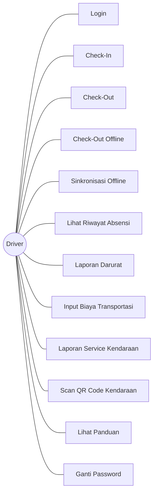

### Gambar 4.2 — Use Case Diagram (Sisi Admin, Customer & Scheduler)

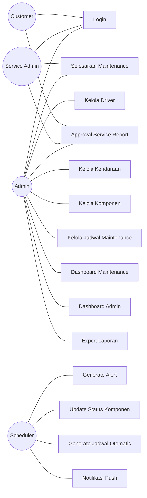

---

## 4.1.3.2 Activity Diagram Check-In dan Check-Out Driver

### Gambar 4.3 — Activity Diagram Check-In

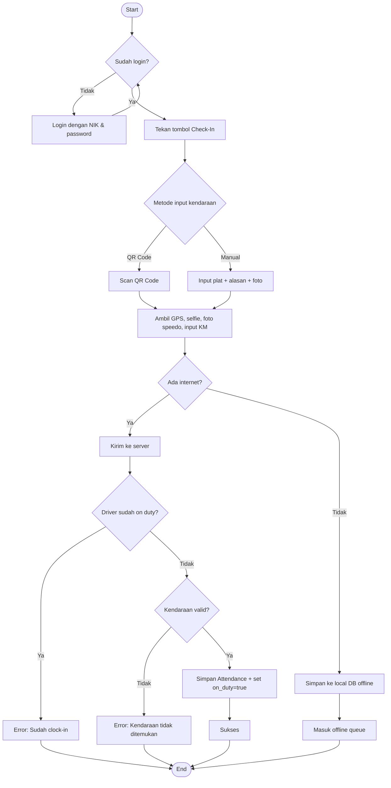

### Gambar 4.4 — Activity Diagram Check-Out

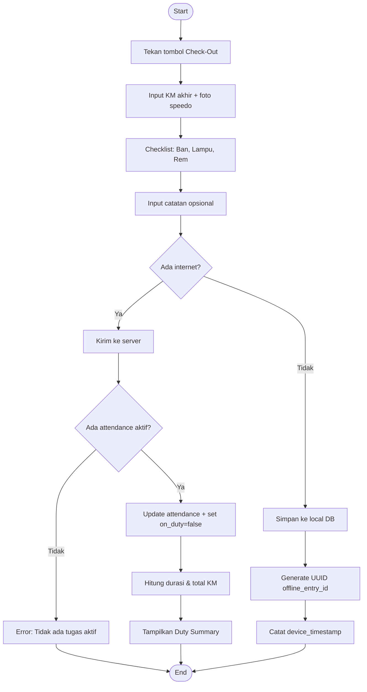

---

## 4.1.3.3 Activity Diagram Preventive Maintenance Armada

### Gambar 4.5 — Activity Diagram Preventive Maintenance

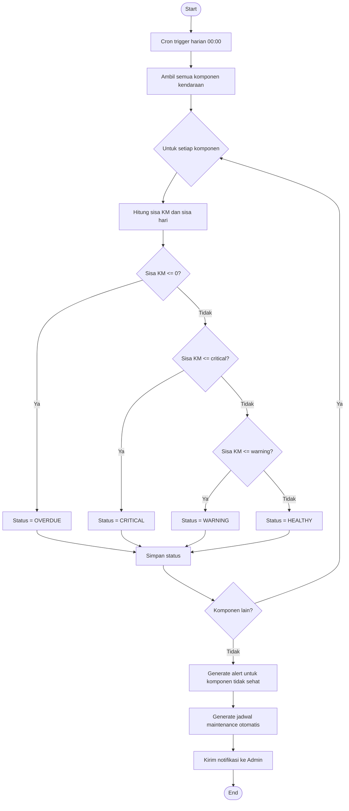

---

## 4.1.3.4 Activity Diagram Sinkronisasi Offline

### Gambar 4.6 — Activity Diagram Sinkronisasi Offline

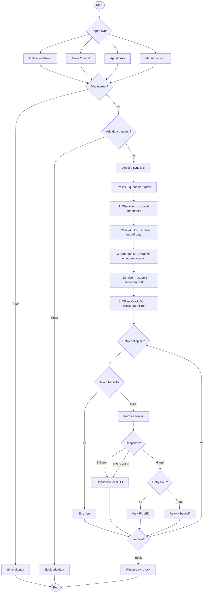

---

## 4.1.3.5 Sequence Diagram Check-Out sampai Update KM

### Gambar 4.7 — Sequence Diagram Check-Out & Update KM

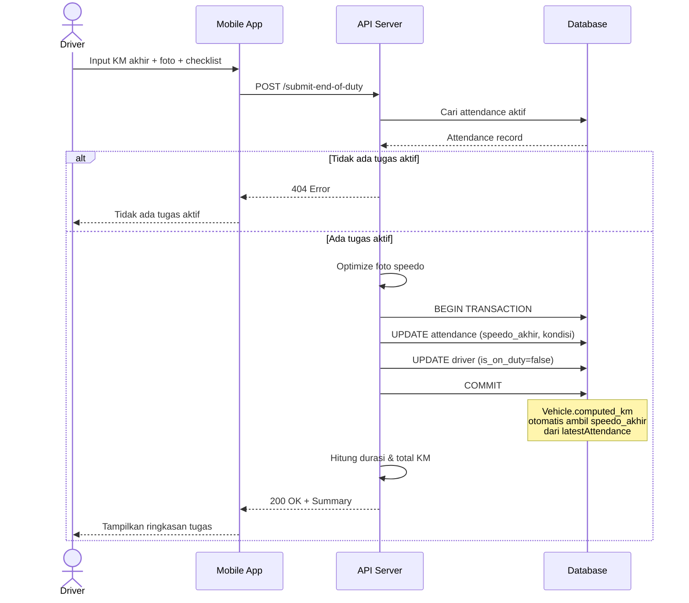

---

## 4.1.3.6 Sequence Diagram Generate Maintenance Alert

### Gambar 4.8 — Sequence Diagram Generate Maintenance Alert

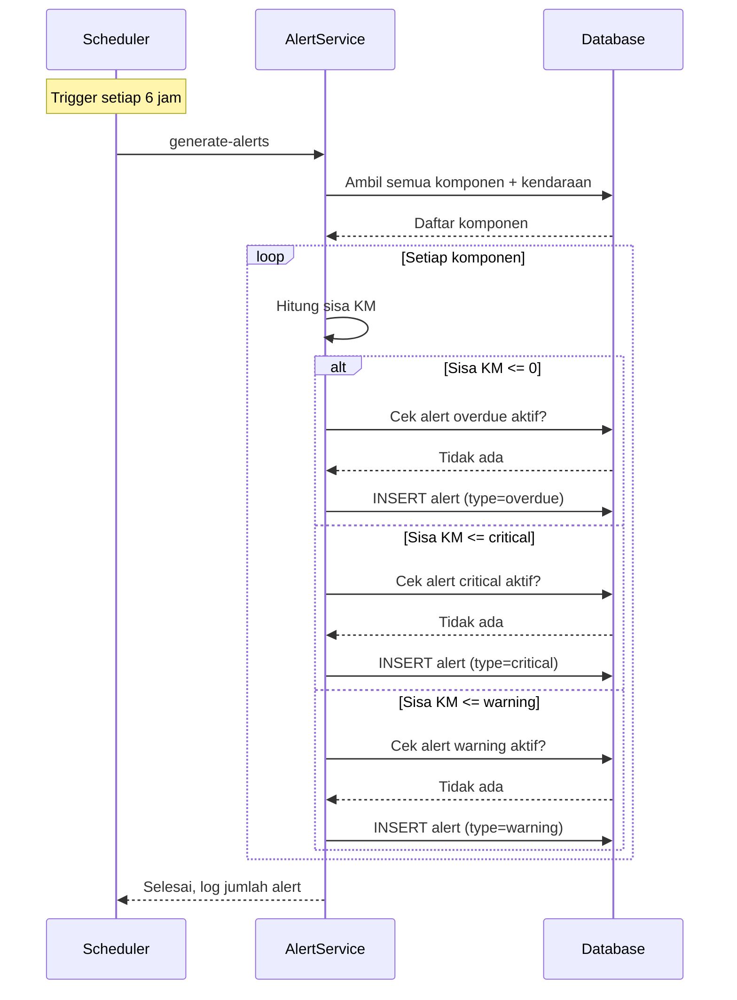

---

## 4.1.3.7 Sequence Diagram Penyelesaian Maintenance

### Gambar 4.9 — Sequence Diagram Penyelesaian Maintenance

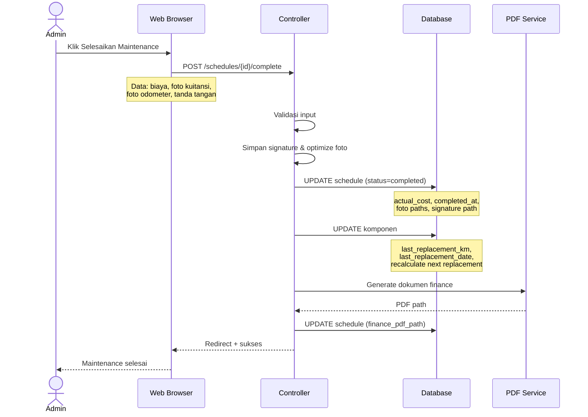

---

## 4.1.3.8 Class Diagram

Dipecah menjadi **3 gambar** berdasarkan domain.

### Gambar 4.10 — Class Diagram: Domain Absensi (Core)

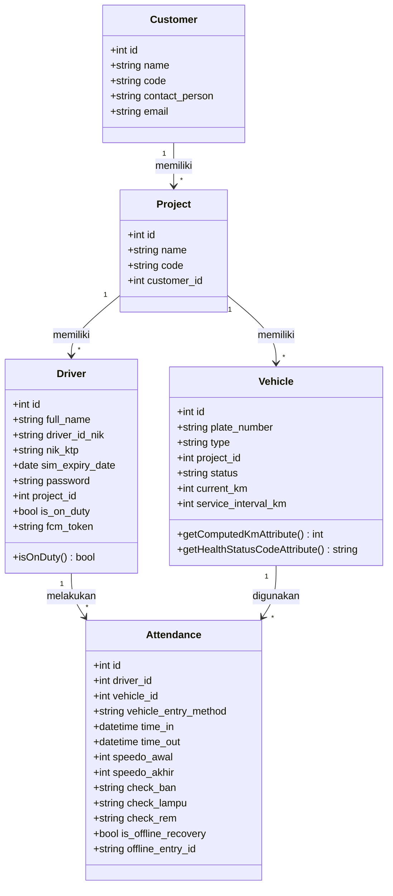

### Gambar 4.11 — Class Diagram: Domain Maintenance

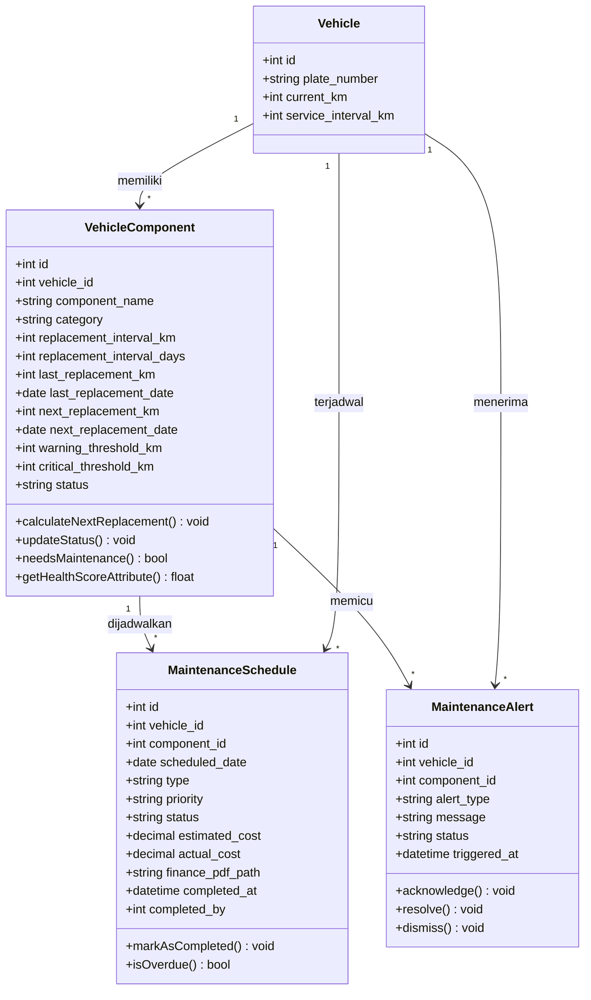

### Gambar 4.12 — Class Diagram: Domain Pendukung

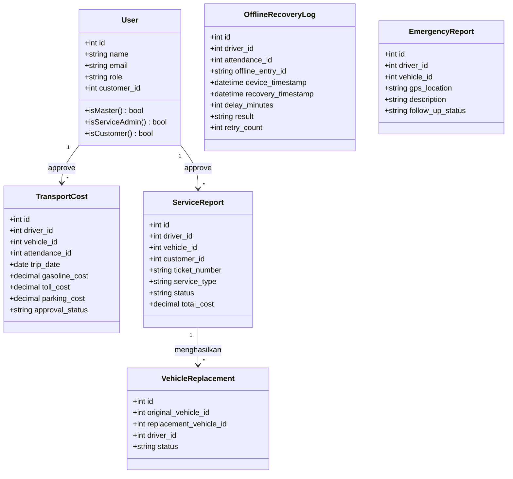

---

## 4.1.3.9 Deployment Diagram

### Gambar 4.13 — Deployment Diagram

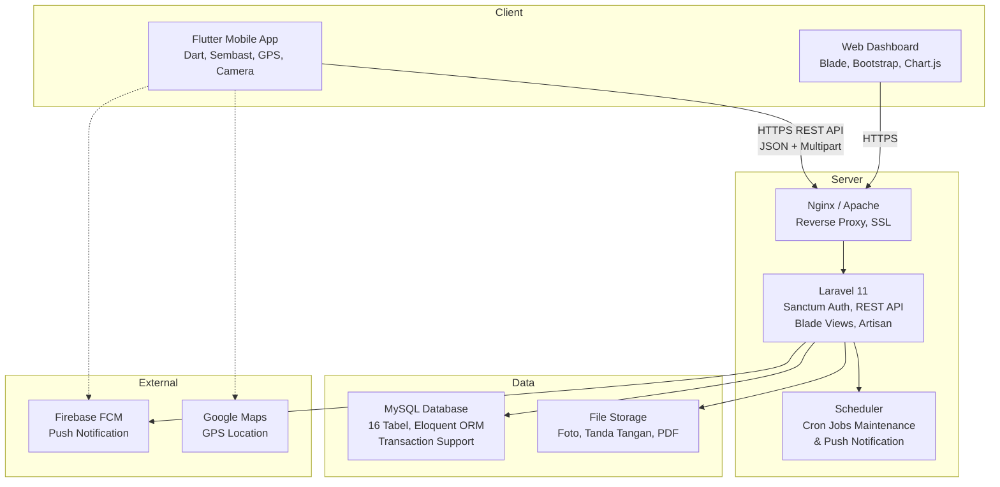

---

> [!IMPORTANT]
> **Panduan Penggunaan di Word:**
> - Setiap blok `mermaid` = **1 gambar terpisah** di Word
> - Judul gambar sudah disiapkan (Gambar 4.1 s/d Gambar 4.13)
> - Ukuran optimal di Word: **lebar 14–16 cm**, height auto
> - Untuk screenshot: gunakan browser zoom 100%, lalu snipping tool
> - Total: **13 gambar** yang pas di halaman A4

| No | Bagian | Jumlah Gambar | Keterangan |
|---|---|---|---|
| 4.1.3.1 | Use Case | 2 | Dipecah: Driver vs Admin/Customer/Scheduler |
| 4.1.3.2 | Activity Check-In/Out | 2 | Masing-masing 1 gambar |
| 4.1.3.3 | Activity Maintenance | 1 | Sudah ringkas |
| 4.1.3.4 | Activity Sinkronisasi | 1 | Sudah ringkas |
| 4.1.3.5 | Seq Check-Out → KM | 1 | 4 participant |
| 4.1.3.6 | Seq Generate Alert | 1 | 3 participant |
| 4.1.3.7 | Seq Penyelesaian | 1 | 5 participant |
| 4.1.3.8 | Class Diagram | 3 | Dipecah: Core, Maintenance, Pendukung |
| 4.1.3.9 | Deployment | 1 | Sudah ringkas |
| | **Total** | **13** | |
