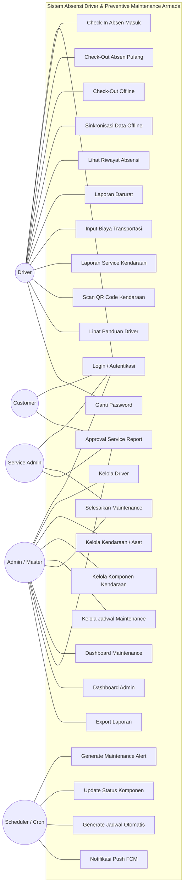
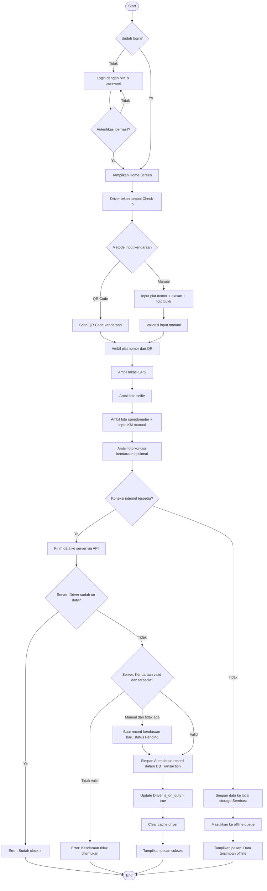
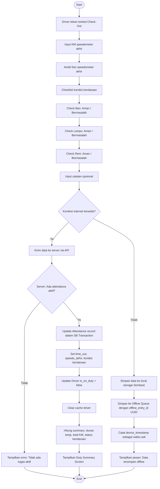
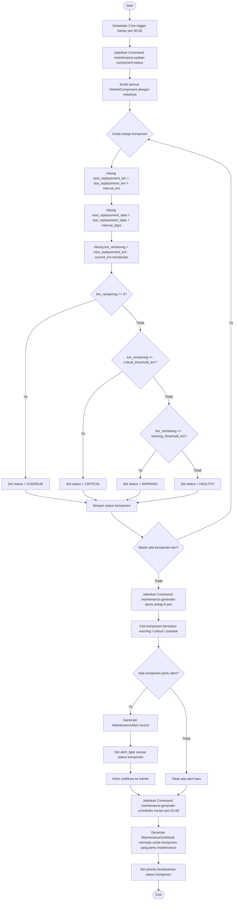
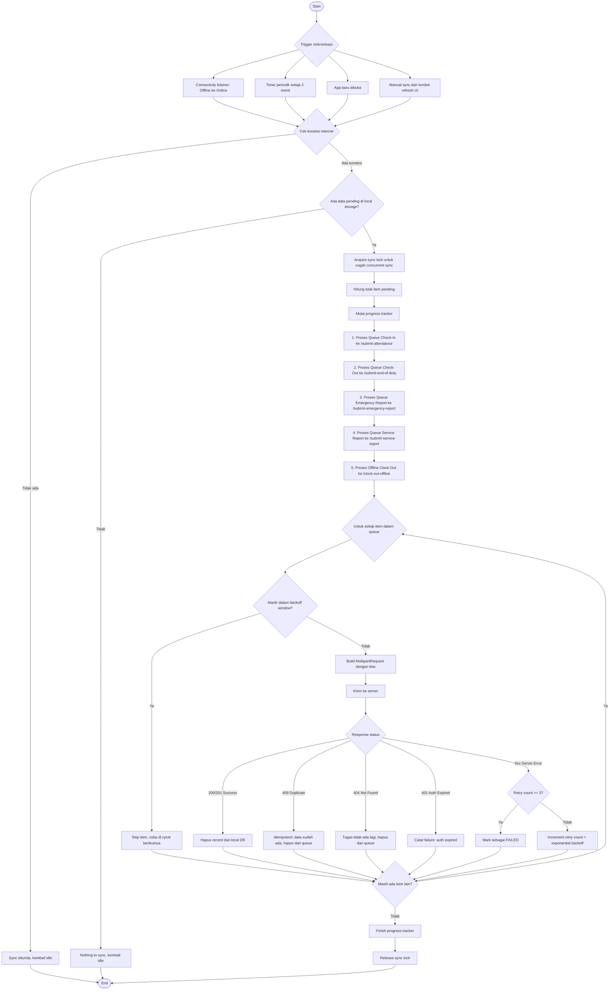
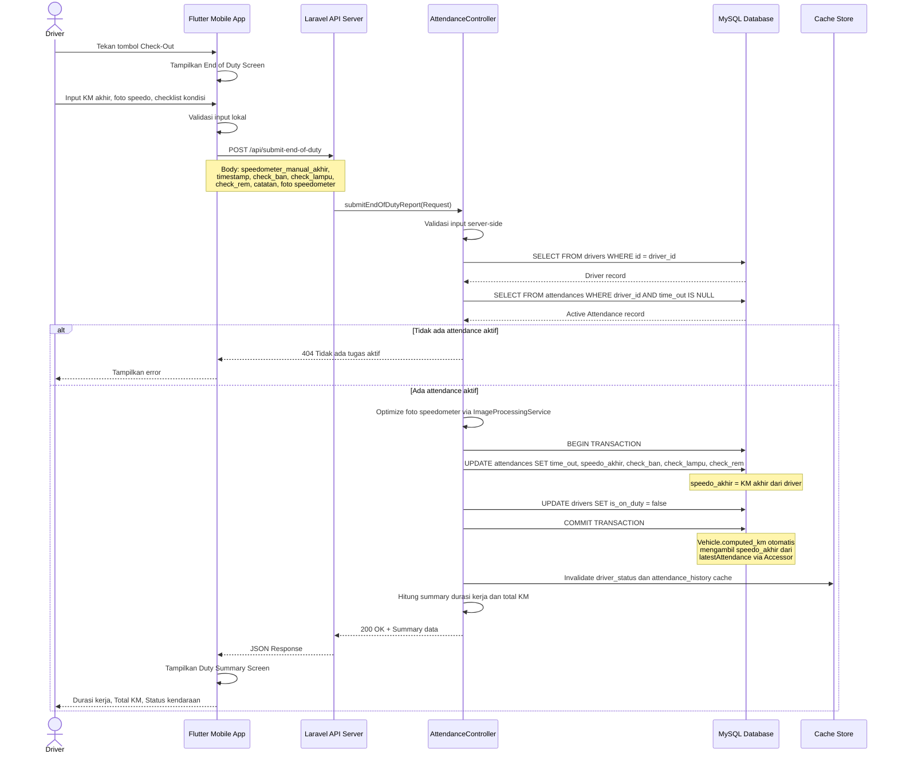
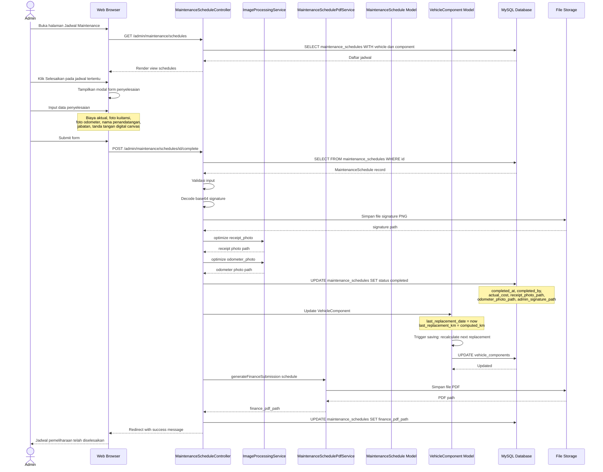
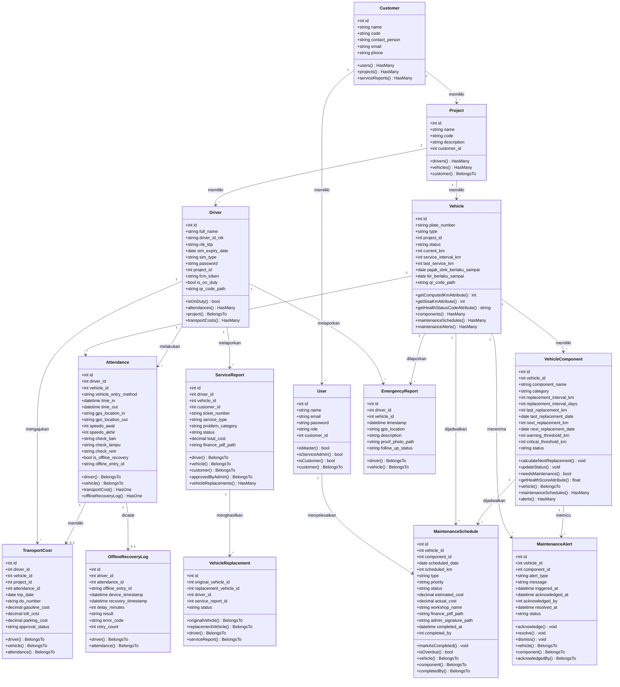
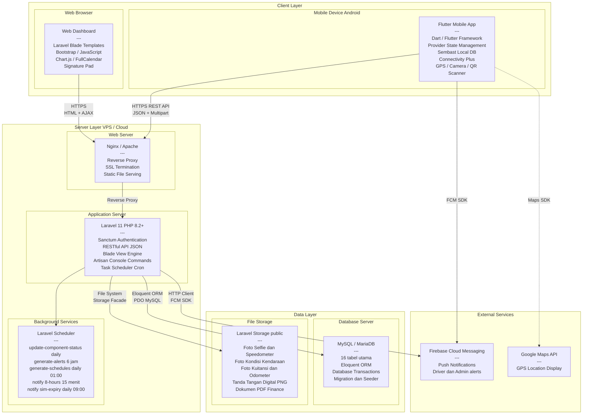

# 4.1.3 UML Diagrams (Versi Full / Tidak Dipisah)

---

## 4.1.3.1 Use Case Diagram

---

## 4.1.3.2 Activity Diagram Check-In dan Check-Out Driver

---

## 4.1.3.2b Activity Diagram Check-Out Driver

---

## 4.1.3.3 Activity Diagram Preventive Maintenance Armada

---

## 4.1.3.4 Activity Diagram Sinkronisasi Offline

---

## 4.1.3.5 Sequence Diagram Check-Out sampai Update KM

---

## 4.1.3.6 Sequence Diagram Generate Maintenance Alert

```mermaid
sequenceDiagram
    participant Cron as Laravel Scheduler Cron
    participant Cmd as Artisan Command
    participant AlertSvc as MaintenanceAlertService
    participant CompModel as VehicleComponent Model
    participant VehModel as Vehicle Model
    participant AlertModel as MaintenanceAlert Model
    participant DB as MySQL Database

    Note over Cron: Setiap 6 jam via console.php
    Cron->>Cmd: maintenance:generate-alerts

    Cmd->>AlertSvc: generateAlerts()
    AlertSvc->>DB: SELECT FROM vehicle_components WITH vehicle
    DB-->>AlertSvc: Daftar semua komponen kendaraan

    loop Untuk setiap VehicleComponent
        AlertSvc->>CompModel: Ambil data komponen
        CompModel->>VehModel: Ambil current_km kendaraan
        VehModel-->>CompModel: current_km

        CompModel->>CompModel: Hitung km_remaining = next_replacement_km - current_km

        alt km_remaining <= 0 yaitu Overdue
            AlertSvc->>DB: Cek apakah alert overdue sudah ada dan aktif
            DB-->>AlertSvc: Existing alert check

            alt Belum ada alert aktif
                AlertSvc->>AlertModel: Create MaintenanceAlert
                Note over AlertModel: alert_type = overdue<br/>status = active<br/>triggered_at = now()
                AlertModel->>DB: INSERT INTO maintenance_alerts
                DB-->>AlertModel: Alert ID
            end

        else km_remaining <= critical_threshold_km yaitu Critical
            AlertSvc->>DB: Cek apakah alert critical sudah ada
            DB-->>AlertSvc: Existing alert check

            alt Belum ada alert aktif
                AlertSvc->>AlertModel: Create MaintenanceAlert
                Note over AlertModel: alert_type = critical<br/>status = active
                AlertModel->>DB: INSERT INTO maintenance_alerts
            end

        else km_remaining <= warning_threshold_km yaitu Warning
            AlertSvc->>DB: Cek apakah alert warning sudah ada
            DB-->>AlertSvc: Existing alert check

            alt Belum ada alert aktif
                AlertSvc->>AlertModel: Create MaintenanceAlert
                Note over AlertModel: alert_type = warning<br/>status = active
                AlertModel->>DB: INSERT INTO maintenance_alerts
            end
        end
    end

    AlertSvc-->>Cmd: Proses selesai
    Cmd->>Cmd: Log jumlah alert baru yang digenerate
```

---

## 4.1.3.7 Sequence Diagram Penyelesaian Maintenance

---

## 4.1.3.8 Class Diagram

---

## 4.1.3.9 Deployment Diagram

