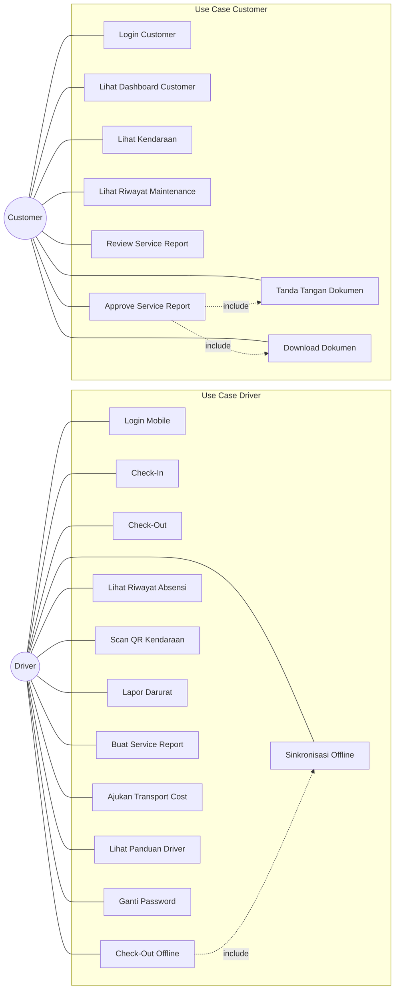
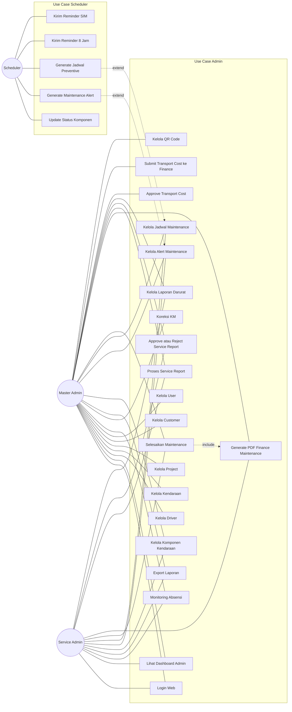

# Use Case Diagram Sistem Absensi dan Manajemen Armada

Dokumen ini berisi bahan use case untuk skripsi. Diagram dibuat terpisah agar mudah digambar ulang secara manual atau dirender dengan Mermaid.

## Aktor Sistem

| Aktor | Peran |
|---|---|
| Driver | Menggunakan aplikasi mobile untuk absensi, laporan, transport cost, dan QR scan |
| Master Admin | Mengelola seluruh data utama, monitoring absensi, maintenance, laporan, dan user |
| Service Admin | Memproses service report, maintenance, dan approval operasional |
| Customer | Melihat data kendaraan dan melakukan approval laporan service |
| Scheduler | Menjalankan proses otomatis seperti alert, jadwal maintenance, dan reminder |

## 1. Use Case Diagram Driver dan Customer



## 2. Use Case Diagram Admin dan Scheduler



## 3. Deskripsi Use Case Utama

| No | Use Case | Aktor | Deskripsi Singkat |
|---|---|---|---|
| 1 | Login Mobile | Driver | Driver masuk ke aplikasi menggunakan ID driver dan password |
| 2 | Check-In | Driver | Driver memulai tugas dengan input kendaraan, GPS, KM awal, selfie, dan foto speedometer |
| 3 | Check-Out | Driver | Driver mengakhiri tugas dengan input KM akhir, checklist kendaraan, catatan, dan foto speedometer |
| 4 | Check-Out Offline | Driver | Driver menyimpan data check-out di perangkat saat tidak ada koneksi |
| 5 | Sinkronisasi Offline | Driver | Sistem mengirim data offline ke server saat koneksi tersedia |
| 6 | Lapor Darurat | Driver | Driver membuat laporan darurat terkait kendaraan atau kondisi operasional |
| 7 | Buat Service Report | Driver | Driver membuat laporan kerusakan atau service kendaraan |
| 8 | Ajukan Transport Cost | Driver | Driver mengajukan biaya perjalanan berdasarkan attendance |
| 9 | Review Service Report | Customer | Customer memeriksa laporan service yang membutuhkan persetujuan |
| 10 | Approve Service Report | Customer | Customer menyetujui laporan service dan menandatangani dokumen |
| 11 | Kelola Driver | Master Admin | Admin menambah, mengubah, dan menghapus data driver |
| 12 | Kelola Kendaraan | Master Admin | Admin mengelola data aset kendaraan dan status unit |
| 13 | Monitoring Absensi | Master Admin, Service Admin | Admin melihat riwayat absensi, check-in, check-out, dan kondisi kendaraan |
| 14 | Kelola Komponen Kendaraan | Master Admin, Service Admin | Admin mengatur komponen kendaraan untuk preventive maintenance |
| 15 | Kelola Alert Maintenance | Master Admin, Service Admin | Admin melihat, acknowledge, dan resolve alert maintenance |
| 16 | Kelola Jadwal Maintenance | Master Admin, Service Admin | Admin membuat dan memantau jadwal preventive/corrective/predictive maintenance |
| 17 | Selesaikan Maintenance | Master Admin, Service Admin | Admin menyelesaikan jadwal maintenance, upload bukti, dan memperbarui data komponen |
| 18 | Proses Service Report | Master Admin, Service Admin | Admin memeriksa laporan service dan meneruskan ke approval |
| 19 | Approve Transport Cost | Master Admin | Admin menyetujui atau menolak pengajuan biaya transport |
| 20 | Generate Maintenance Alert | Scheduler | Sistem otomatis membuat alert jika komponen warning, critical, atau overdue |
| 21 | Generate Jadwal Preventive | Scheduler | Sistem otomatis membuat jadwal preventive untuk komponen yang membutuhkan maintenance |

## 4. Bahan Sketsa Manual

Jika digambar manual untuk skripsi, gunakan pembagian berikut.

### Sketsa 1 - Driver dan Customer

```text
                 +------------------------------+
                 |        SISTEM ABSENSI        |
                 |                              |
Driver --------- | Login Mobile                 |
Driver --------- | Check-In                     |
Driver --------- | Check-Out                    |
Driver --------- | Check-Out Offline            |
Driver --------- | Sinkronisasi Offline         |
Driver --------- | Lihat Riwayat Absensi        |
Driver --------- | Scan QR Kendaraan            |
Driver --------- | Lapor Darurat                |
Driver --------- | Buat Service Report          |
Driver --------- | Ajukan Transport Cost        |
                 |                              |
Customer ------- | Login Customer               |
Customer ------- | Lihat Dashboard Customer     |
Customer ------- | Review Service Report        |
Customer ------- | Approve Service Report       |
Customer ------- | Tanda Tangan Dokumen         |
                 +------------------------------+
```

### Sketsa 2 - Admin dan Scheduler

```text
                 +--------------------------------+
                 |         SISTEM ADMIN           |
                 |                                |
Master Admin --- | Kelola Driver                  |
Master Admin --- | Kelola Kendaraan               |
Master Admin --- | Kelola Project                 |
Master Admin --- | Kelola Customer                |
Master Admin --- | Kelola User                    |
Master Admin --- | Monitoring Absensi             |
Master Admin --- | Export Laporan                 |
Master Admin --- | Kelola Maintenance             |
Master Admin --- | Proses Service Report          |
Master Admin --- | Approve Transport Cost         |
                 |                                |
Service Admin -- | Kelola Maintenance             |
Service Admin -- | Proses Service Report          |
Service Admin -- | Kelola Laporan Darurat         |
                 |                                |
Scheduler ------ | Update Status Komponen         |
Scheduler ------ | Generate Maintenance Alert     |
Scheduler ------ | Generate Jadwal Preventive     |
Scheduler ------ | Kirim Reminder                 |
                 +--------------------------------+
```

## Catatan

- Untuk skripsi, cukup tampilkan use case yang benar-benar penting dan mudah dijelaskan.
- Use case detail seperti upload foto, validasi GPS, dan optimasi gambar tidak perlu dijadikan use case utama; itu cukup dijelaskan di activity atau sequence diagram.
- Jika diagram terlalu penuh, gunakan dua gambar: `Use Case Driver-Customer` dan `Use Case Admin-Scheduler`.
